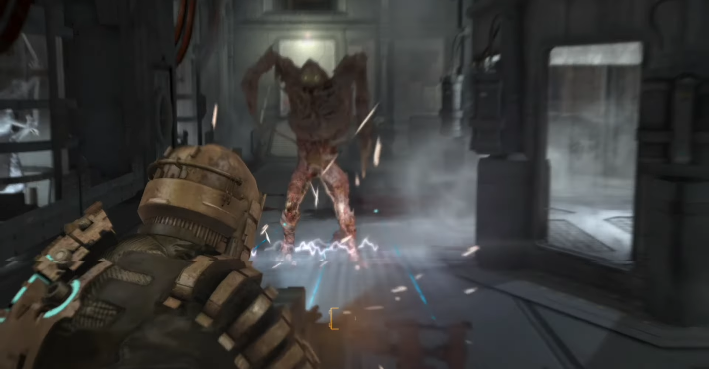

<figure>

</figure>

　僕が忘れられない1本に『DEAD SPACE』というゲームがある。

　『DEAD SPACE』は2008年にエレクトロニック・アーツから発売されたサードパーソンシューティングだ。

　ストーリーは、26世紀の資源が枯渇した地球から外宇宙へ資源を探すために旅に出て遭難した宇宙船USG Ishimuraを探索。その中で数々のエイリアンと戦い、Ishimuraが遭難した真相に迫っていくという内容だ。

　探索船の設定といい、敵の容姿といい、SF映画の金字塔『エイリアン』を思わせる部分と、当時すでに名作の呼び声高かった『バイオハザード4』にも似たゲームシステムを併せ持つ完璧なゲームだった。

　そこに、『DEAD SPACE』ならではのホラー感が加わって、SF的な硬質な舞台の中でも本当に恐ろしい演出がなされているところが好きだった。特に、発達した科学が生み出した宇宙船の中にいながら、未知の怪物に襲われる人々が独自の宗教観を作り出している不気味な世界観が凡百のホラーゲームには真似できない恐怖を生み出していた。

　『DEAD SPACE』のPC版は今でもPCでプレイできる。しかしながら、解像度やフレームレートに難がある場合もあり、あまり快適に遊べないこともあるのが実際のところだ。

　ところが、その『DEAD SPACE』がリメイクされて登場するというニュースが流れてきた。何という僥倖。オリジナルの『DEAD SPACE』は日本語版が発売されずに残念だったが、どうやら今回は日本語も対応するようである。

　今のところいつ発売と明言されてはいないが、いずれにしても発売が待ち遠しい1本である。あの暗くて深い闇を宿した宇宙の果に思いを致しつつ、首を長くして待ちたい。

[https://www.youtube.com/watch?v=wv-9jFocVQ4](https://www.youtube.com/watch?v=wv-9jFocVQ4)
