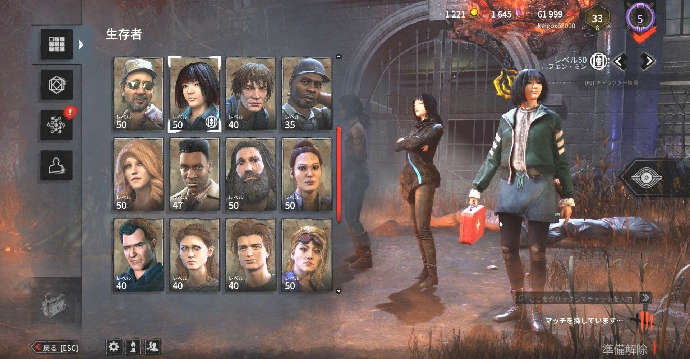

<figure>

</figure>

　少し前に『デッドバイデイライト』の同時接続数が10万人を超えたというニュースが流れていた。

[https://automaton-media.com/articles/newsjp/20210705-167665/](https://automaton-media.com/articles/newsjp/20210705-167665/)

　海の物とも山の物ともつかぬホラーゲームとして登場した『デッドバイデイライト』だが、ここに来てAAA並みの知名度を持つゲームに成長したと言えるだろう。

　しかし最近プレイヤーが増えたせいか、プレイスタイルに一定の特徴が見られるようになった。

　キラーは、サバイバーを吊った後にその場から離れずに、確実に1人のサバイバーをしとめる「キャンプ」という戦術が多用されるようになった。少し前までは、キャンプはあまり面白くない戦術として認識され、キラーをプレイする人もどちらかと言えばキャンプをしない感じだった。

　ただしこれは、気を遣ってプレイをするということでもなく、実際には、キラーもキャンプなしでサバイバーを倒せることが上手い証みたいなところがあったのだと思う。実際、開発側でも、キャンプをすると減点対象になるようにアップデートがなされている。

　しかし最近は、キャンプが当然というプレイスタイルに変わってきている。もちろんゲームシステムとしてやっていいことは、まったく使って構わないのだが、じゃあそれでゲームが面白いかというと、それは主観の問題ではあるが個人的にはあまり面白くない。

　Youtubeの動画などを見ても、「キャンプは戦術だから使っていい」とわざわざ表明するようなプレイヤーも見かけるようになって、それは間違ってはいないし、そういうプレイヤーを非難するつもりもないが、公言するってことはキャンプ自体が忌避される行為であることを認識しているということだ。

　それともうひとつ。ゲームも6年目に突入して、プレイヤーの技術も向上している。普通にサバイバーを追っても、みんな逃げるのが上手くて追いつけないということもあるのかもしれない。

　サバイバーを追いかけて、その挙げ句に逃げられるのはゲーム中の貴重な時間をロスすることになるが、それなら吊った人から離れず、一定時間居座って確実に倒してしまった方が効率がいい。そういう発想も生まれてくるだろう。

　こういう文章を書いたのは、『デッドバイデイライト』の現状を嘆いたり、キャンプという戦術を非難する意図ではない。ただ、同時接続数が増えて、以前と変化しているゲームのプレイスタイルを感じているということを書き留めておこうと思っただけである。

　さて、長くなりそうなのでつづきは後半で。

[https://www.youtube.com/watch?v=iiuR2spgLpM](https://www.youtube.com/watch?v=iiuR2spgLpM)
