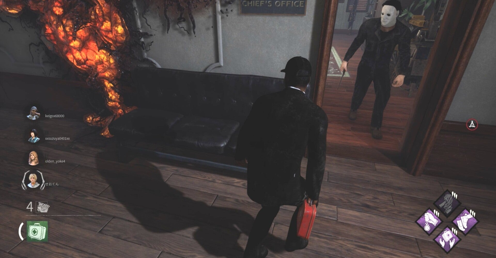

<figure>

</figure>

　さて、後編だ。前回の記事はこちら。

[https://note.com/keigox68000/n/n10f1de67c203](https://note.com/keigox68000/n/n10f1de67c203)

　前回はキャンプが多いキラーの話をしたが、今度はサバイバーに視点を移してみよう。

　主にYoutubeなどで動画を見て『デッドバイデイライト』に参入してきたプレイヤーには、どうもチェイス至上主義みたいなところがある。やはり、キラーから長時間逃げ回り、窓枠やパレット（板）を使って危機を回避し、華麗に立ち回る姿は見栄えがする。

　Youtubeに動画を上げるプレイヤーも、そういうプレイができた場合はここぞとばかりに動画をアップする。そうすると動画を見た未プレイのゲーマーたちの間には「『デッドバイデイライト』はかっこよくチェイスをするゲームである」という価値観が醸成される。

　しかし、この価値観の画一化が『デッドバイデイライト』というゲームのプレイスタイルの幅を狭め、チェイスだけに価値があるという実に苦しい空気を生み出してしまうのだ。

　確かに、チェイス巧者がいてキラーを引き寄せてくれるとゲーム展開が楽になるのは間違いない。しかし、あまりに視野が狭く、ゲーマーとして未熟な考えのプレイヤーは、ともすると「チェイスしないやつは許さない」という実に狭量な見方をするようになってしまうのだ。あろうことか、隠密はプレイの邪魔という意見まで見かけたことがある。

　本来ゲームをプレイするというのは自由だったはずである。それが、大勢の人間が画一的な動画を視聴してゲームに挑戦するため、いつの間にか自分たちで勝手に作り上げた価値観でルールを作り、一方的なプレイスタイルを押し付けるような雰囲気ができあがってしまう。ゲームに定石はあれど、こうしなければならないというルールは存在しないのだ。

　例えば、5周年イベント時のスタッフのメッセージに「堂々とセルフケアを使って恥じない」というものがあり、どうやら開発者の間にもセルフケアで自分を治療する（これにはすごく時間がかかる）ことは悪だという雰囲気ができあがってしまっていることがうかがえて、頭を抱えてしまった。

　僕自身はプレイの際には工夫して治療の時間を短縮し、ゲームを有利に運ぶように考えているが、開発からしてプレイスタイルの多様性を潰すような思想が蔓延しているのはどうかと思う。（ましてや、それをロード画面のメッセージとして表示してしまうのはあまりに迂闊であったと言わざるを得ない）

　ここまで読んでもらえばわかると思うが、これはもちろんチェイスが悪い、隠密が悪い、チェスト漁りが悪いということを言っているわけではない。様々なプレイスタイルのプレイヤーがいる中、その多様性を認めない雰囲気ができてしまっていることを危惧しているのだ。そして、その原因の一端が、Youtubeなどの動画共有サイトの存在と、多くのプレイヤーがゲームに参加したことにあるのだろうという話である。

　こんなことを書くと、後からゲームを始めた人がゲームの雰囲気を壊しているという受け取りをされるかもしれないが、これはそういう愚痴ではない。今後もゲームが発展していくためには、開発は現状のゲームを取り巻くアトモスフィアを敏感に感じ取り、それに対処していく必要があるだろうということだ。

　ゲームの中の、どのキラーが強いか、どのパークが使われているか、そういう数値に表れるものは、運営の持っているビッグデータから適切な分析が可能である。アップデートが入ると、弱体化・強化でいつも論争が起きるが、僕はそれ自体はデータから修正するのならば一定の妥当性があると思っている。しかし、実際に長い間ゲームを遊んできて、その雰囲気が変わってきていることがうまくデータから拾えればいいが、その辺りはどうなのだろうと疑問に思っているのも事実だ。開発には今後も素晴らしいアイデアを持ってアップデートをしてほしいと願っている。

　（個人的にはマッチングの際に、キラーのキャンプ時間とサバイバーのチェイス時間を表示してやればいいんじゃないかと思っている。そんなことしたら誰もマッチングしなくなるな。うん）

[https://www.youtube.com/watch?v=O1gHMSy\_I2Y&list=PLRaOuSqti\_z-kZL\_35jbtYtbUAl5vvkSv&index=35](https://www.youtube.com/watch?v=O1gHMSy_I2Y&list=PLRaOuSqti_z-kZL_35jbtYtbUAl5vvkSv&index=35)
