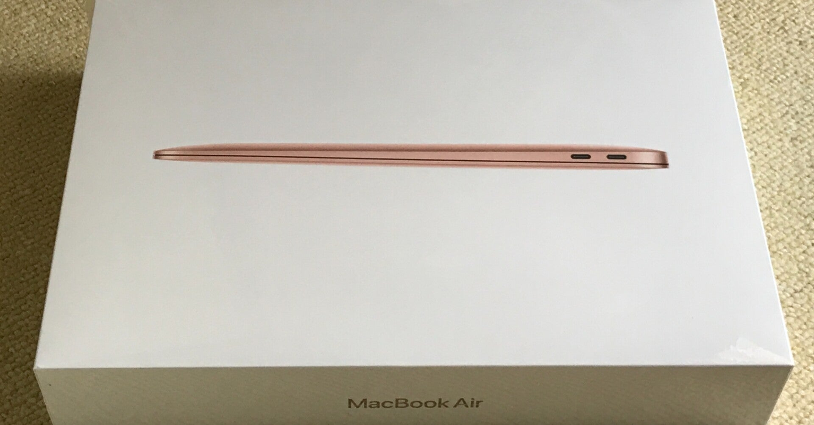
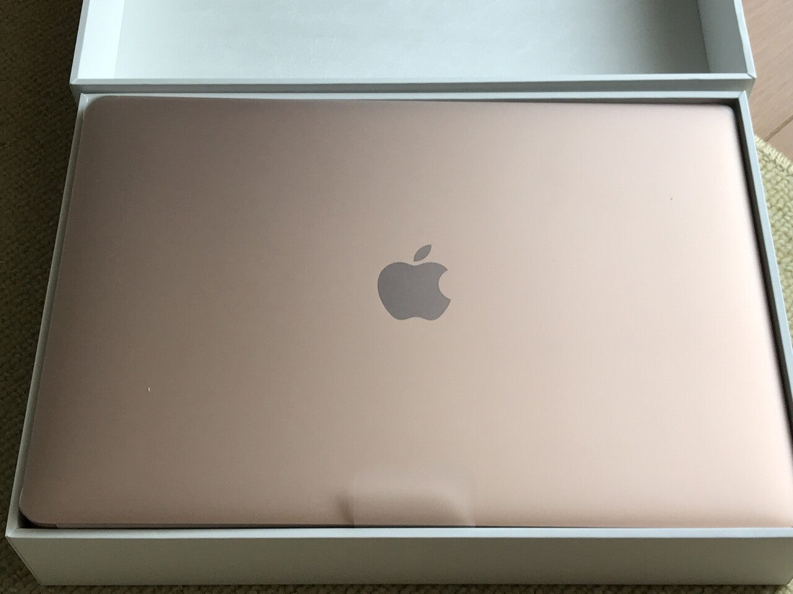
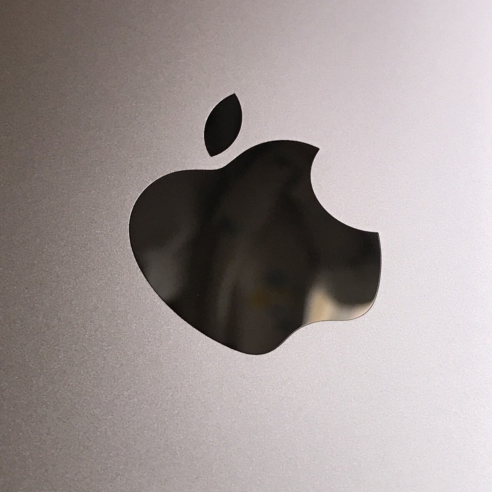

<figure>

</figure>

　さんざん気を揉ませたMacBook Airがようやく到着。なんと中国国内に１０日間。日本に届いてから1日で配達完了。日本の物流は優秀だなあ。

　早速開封して設定を始める。カラーはゴールドを選択したのだが、事前調査通りピンクに近い……というか、ピンクそのものの色だった。アップル製品では、それまでになかった色を選んでいるが、これはこれでいい色だ。

　MacやiPhoneの設定がお手軽なのはいつものことなのだが、今回はあまりがっつりとデスクトップまで同期させずに、なるべくまっさら状態から使っていくことにする。Mac歴も15年を超えてきているので、この辺の要領も心得たものだ。

　とりあえずまだネットを閲覧できるようになったぐらいだが、これからいろいろ整えていこう。それにしても7年の差は大きく、あれだけ美しかったRetinaディスプレイだったが、さらに美しさを増していて、一体どういう進化をしたらこうなるのかまったくもって不思議である。

　さらに、Touch IDなるボタンがついていて、これは指紋を記憶させると、パスワードの入力なしに、指紋でログインできる。何気にこれは便利だ。ただし、MacBook Airなので、あの派手なTouch Barはない。まあ、キーボードがシンプルでいいというものだ。

　そうそう、このカスタマイズのために配送遅延に遭ってしまったUSキーボードもシンプルでよい。やっぱりキーボードはすっきりしているのが好みだ。

　さて、本当にただの感想を書き連ねただけだが、今回最も感心したことのひとつが、パッケージの開けやすさである。全面をビニールで覆われたMacBook Airの箱は一見開けにくそうだが、梱包されていたダンボールを含めパッケージを開けるためのタブがついていて、楽に中身にアクセスできるのが気に入った。

　昔は日本のCDやゲームソフトもラッピングのビニールを開けるためのタブがついていたものだが、コストカットのためかいつの間にか無くなっていて、常日頃不便と感じていたのである。こういうところまで気を使うアップルは本当に偉い。

　少し前まで、アップル製品はやめてみようなんて思っていたのだが、どうやらまだしばらくアップル製品のお世話になりそうだ。そもそも、MacBook Air安くて薄いのが気に入っった。いいマシンだ。

