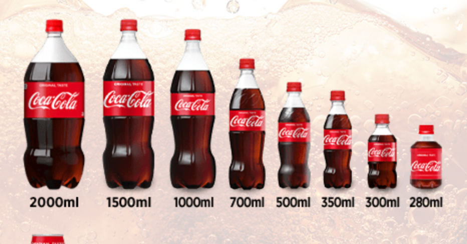

<figure>

</figure>

　最近スーパーにコカ・コーラの2リットルという巨大なペットボトルが並ぶようになった。前からあったのかもしれないが、近所のとあるスーパーでは1.5リットルは陳列棚から姿を消し、もう2リットルしか見かけない。

　さらに、あろうことか500ミリリットルも棚から消え、700ミリリットルという微妙にデカいサイズもずらっと並んでいる。

　僕はコカ・コーラゼロが好きでときどき飲むのだが、さすがに2リットルは飲めない。いや、もちろん蓋をして冷蔵庫に入れておけばいいのだが、炭酸が抜けてまずくなるのが嫌でその日のうちに飲んでしまう。

　それが2リットルではちょっと1日で飲むのはつらい。もしかして700ミリリットルを2本買えということなのか。それって単純に値上げってことだよね。

　そんな感じで、今まで愛用（愛飲？）していたサイズが突如消えると、消費者としては非常に迷ってしまうわけだ。でも、こういうのは慣れかもしれない。もしかしたら2リットルも1日で飲めるかもしれない。

　とは思うものの、やっぱりボトルのデカさにビビって買えない。仕方ないので、ペプシの1.5リットルを買っている。ペプシも美味しいよね。

　最近評判の悪い（？）コカ・コーラとしては大きいサイズに移行したいところなのかもしれないが、スーパーの店頭では、すでにコカ・コーラが余ってペプシが品切れなんてのも見かける。

　うーん、これはコカ・コーラの運命やいかに。そんな大げさな話でもないか。
