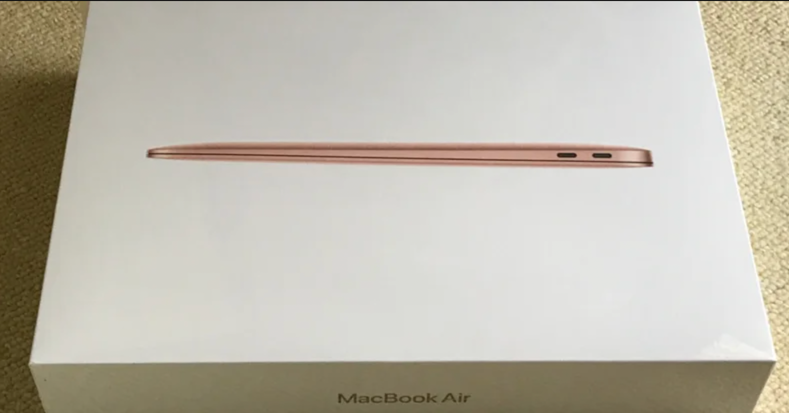

<figure>

</figure>

　お困り記って、そんな言葉あるのか。

　新しいMacBook Airは新しいM1プロセッサ搭載ということで、早速思うように動いてくれないところがいくつか出てきている。少しずつ解消したり、しなかったりなのだが、ここに書き留めておこう。何分素人かつ調査不足など多分にあると思うので、間違ってたらごめん！

## TensorFlowがうまく動かない

　うまく動かないというか、インストールすらエラーが出て怪しい。旧MBPから機械学習/ディープラーニングの環境を移行したかったので、これは致命的。結論から言うと、インストールする方法はある。M1に最適化されたTensorFlow for macOSというのがあることもわかった。以下のページがすごく参考になって、Homebrewで入れたPythonのアンインストールと、最新バージョンのPythonをアンインストールする羽目になった。Python3.9はだめなので、Python3.8環境にデグレードした。

[https://zenn.dev/karaage0703/articles/0ab9e654cfb0ec](https://zenn.dev/karaage0703/articles/0ab9e654cfb0ec)

## Microsoft Lobeがクラッシュする

　Lobeは、マイクロソフトが提供しているノーコードで機械学習ができるベータ版のソフトウェアだ。旧MBPでは、このLobeを使ってゲーム中のアイコン画像を学習させ、その数を数えるという作業をしていたのだが、これがまったく動かない。ネットを検索すると同じ症状の人がいるので、たぶんこれもM1 Mac特有の現象だろう。

[https://www.reddit.com/r/Lobe/comments/k4ebvi/lobe\_crashes\_on\_m1\_mac/](https://www.reddit.com/r/Lobe/comments/k4ebvi/lobe_crashes_on_m1_mac/)

## Lobe-APIがインストールできない

　Lobe-APIは上記のLobeをPythonから使うためのAPIだ。しかし、これがTensorFlowのバージョンに依存しているため、そのTensorFlowを入れられない（TensorFlow for macOSを入れている）環境ではインストールできないようだ。つまり、今のところLobeをM1 Macでいい感じに使う方法はないようだ。下記のページあたりにLobe-APIとTensorFlowのことは書いてある。

[https://qiita.com/PoodleMaster/items/af5630305df52bed0564](https://qiita.com/PoodleMaster/items/af5630305df52bed0564)

## USB type Cで接続しているSSDが突然切れる

　普段使っているバッファローのSSD-PGM240U3というSSDが、接続中に突然切断され、Macユーザーならよく見たことのある「不正な取り出し」メッセージが出てしまう。SSDが壊れたのかと思ったが、これも検索すると同様の症状の人がいるようだ。

[https://rainbow-sky-diary.com/macm1\_ssd\_trouble](https://rainbow-sky-diary.com/macm1_ssd_trouble)

[https://nenza.net/48012/](https://nenza.net/48012/)

　一応解決法はあるような、ないような感じだが、ちょっと試してみようと思う。

　他にもPythonのバージョンの関係でTcl/Tkが動かなかったりもあったけど、これはなんとかなった。主にはPython周りの環境をそのまま移行できなかったトラブルで困っている。SSDのトラブルだけはハード的な感じでちょっとなんとかしてほしい。あとはバージョンを重ねればなんとかなりそうではある。

　ディープラーニングできないのはせっかくのニューラルエンジンが活かせなくてちょっと残念だが仕方ない。それまでゲームでも作ってみようかな。

　昔、G4 Macからインテルに移行したときもこんな感じだったよ。早く解決するといいね。
