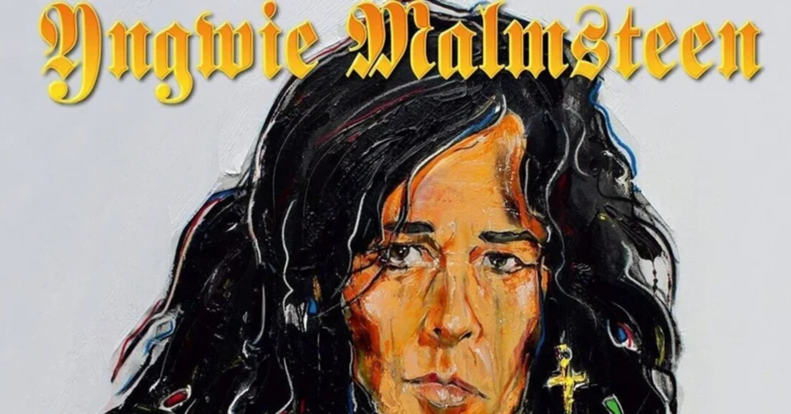

<figure>

</figure>

　上半期に聞いたアルバムまとめてたら大変だったので、やっぱり月に1回ぐらいはまとめたい。さて、7月だ。

## PARABELLUM / YNGWIE J.MALMSTEEN

　いつもの音といえばいつもの音。何やら巷では好評価気味だが、イングヴェイのかつてのポテンシャルを知る者としては全面的には認められない。認められないけどやっぱり好きだー。

[https://open.spotify.com/album/0w0kWBmluwVX5kqGwVHX4T?si=HrHJJRnNTr-N425G4lYiwg&dl\_branch=1](https://open.spotify.com/album/0w0kWBmluwVX5kqGwVHX4T?si=HrHJJRnNTr-N425G4lYiwg&dl_branch=1)

## COMMON GROUND / BIG BIG TRAIN

　上半期アルバムの中でも再発盤がランクインしてたBIG BIG TRAIN。現代でも通用するサウンドながら明確にプログレ的アプローチをしている楽曲が心地よい。

[https://open.spotify.com/album/7MOqfpvMDPMVBZjCH90Qzw?si=1dKItdLORdWM7rlfy1sb0w&dl\_branch=1](https://open.spotify.com/album/7MOqfpvMDPMVBZjCH90Qzw?si=1dKItdLORdWM7rlfy1sb0w&dl_branch=1)

## BRAVE NEW WORLD / CONSTANCIA

　北欧メタルなんて言葉はすっかり死語だけど、いかにも北欧らしいメロディが魅力的な、スウェーデン出身のメロディアスハードロック。シリアスに展開する曲調と美しいハーモニーが素晴らしい。まだこういうバンドが存在すること自体嬉しいよね。

[https://open.spotify.com/album/0G0k3zrmoZ7hmljZeKIGZO?si=vHfRC8Z8T-eiUgdhBuWZuw&dl\_branch=1](https://open.spotify.com/album/0G0k3zrmoZ7hmljZeKIGZO?si=vHfRC8Z8T-eiUgdhBuWZuw&dl_branch=1)

## LEAVE A SCAR / DEE SNIDER

　HATEBREEDのヴォーカルが一枚噛んでディー・スナイダーを現代のメタルシーンに引っ張り出した話題のアルバム。ディー・スナイダーというと、本当に"We're Not Gonna Take It"のイメージしかなかったけど、これだけクールなサウンドに仕上がっているのが驚き。

[https://open.spotify.com/album/0Oqp4tdVAFAMRdjdWNEoFD?si=fQiSiUVXTd6JyUxS2JN-Bw&dl\_branch=1](https://open.spotify.com/album/0Oqp4tdVAFAMRdjdWNEoFD?si=fQiSiUVXTd6JyUxS2JN-Bw&dl_branch=1)

## LOST NOT FORGOTTEN ARCHIVES: A DRAMATIC TOUR OF EVENTS -SELECT BOARD MIXES / DREM THEATER  

　ドリームシアターのオフィシャルブートレグシリーズ。2017年の『IMAGE AND WORDS』再現ツアーは自分でも見に行ったので思い入れが強い。

[https://open.spotify.com/album/1DQlnLP9i9XfOqRsxnTM9T?si=T1XlCqw9QzaVq9xzQhhZpQ&dl\_branch=1](https://open.spotify.com/album/1DQlnLP9i9XfOqRsxnTM9T?si=T1XlCqw9QzaVq9xzQhhZpQ&dl_branch=1)

## HEART, MIND AND SOUL / HARDLINE

　ジョニー・ジョエリは最も好きなヴォーカリストのひとり。アクセル・ルディ・ペルとやっていたり、ゲームミュージックのバンドで歌ったり、結構聞く機会はあったけど、やっぱりHARDLINEはいい。

[https://open.spotify.com/album/5UPsejN77wGpteoOtDHta7?si=9N1ni6UrSKKzgAGcfSDLDg&dl\_branch=1](https://open.spotify.com/album/5UPsejN77wGpteoOtDHta7?si=9N1ni6UrSKKzgAGcfSDLDg&dl_branch=1)

## TRAPPED / KING COMPANY

　フィンランド出身のメロディアスハードロック。ストレートながら憂いのあるメロディラインがその手のファンにはたまらないはず。最近こういうバンドが増えていて嬉しい。

[https://open.spotify.com/album/12ZAHaXvkMli2f2PxipTmK?si=g\_a-EmMcRjmcWBDqVtdIfw&dl\_branch=1](https://open.spotify.com/album/12ZAHaXvkMli2f2PxipTmK?si=g_a-EmMcRjmcWBDqVtdIfw&dl_branch=1)

## OF POETRY AND SILENT MASTERY / PLATENS  

　イタリアの一人メロディアスハードロックプロジェクト。イタリアと言うとシンフォニックと連想しがちだが、これはどちらかといえば正統派のメロディにあふれていて、哀愁のサウンドが堪能できる。

[https://open.spotify.com/album/5pBj5d1BByxUkR1gUuSlCP?si=sBP8tVloRAqxQMbFzLsUaw&dl\_branch=1](https://open.spotify.com/album/5pBj5d1BByxUkR1gUuSlCP?si=sBP8tVloRAqxQMbFzLsUaw&dl_branch=1)

## CALL OF THE WILD / POWERWOLF

　ドイツの男臭いパワーメタル。往年のジャーマンメタルっぽいメロディを現代に蘇らせるスタイルが聞く者に勇気を与えてくれる。重厚でパワフルなサウンドに心震える。

[https://open.spotify.com/album/4yt6KefVILaA6DqhjxmCP3?si=Vzn457m4QhKhhiWmzkczjA](https://open.spotify.com/album/4yt6KefVILaA6DqhjxmCP3?si=Vzn457m4QhKhhiWmzkczjA)

## SECOND ACT / PROUD

　1984年に1枚のアルバムをリリースして消えていった伝説の北欧メタルバンドPROUDが、37年の時を経てまさかの復活。当時の哀愁メロディと、線の細い感じそのままに、なかなかかっこいいハードロックを聞かせてくれる。

[https://open.spotify.com/album/1ZeCXBuaJ9S4vp2bibzZxV?si=7N2CsAThRUCywqmkFG\_4sg&dl\_branch=1](https://open.spotify.com/album/1ZeCXBuaJ9S4vp2bibzZxV?si=7N2CsAThRUCywqmkFG_4sg&dl_branch=1)

## STRYKENINE I / STRYKENINE  

　スウェーデン出身のハードロックバンド。サウンドは北欧メタルではなく、80年代LAメタルに北欧の豊かなメロディをミックスしましたという感じでこれまた耳にしっくり来るというか、馴染み深いというか。バンド名はYにウムラウトだけど、こういう名前は検索しにくくてよくないな。

[https://open.spotify.com/album/7lrs1hXY6QN9SVnUmbOsgT?si=qsTzuEZGRHOLmFEbp3oLng&dl\_branch=1](https://open.spotify.com/album/7lrs1hXY6QN9SVnUmbOsgT?si=qsTzuEZGRHOLmFEbp3oLng&dl_branch=1)
