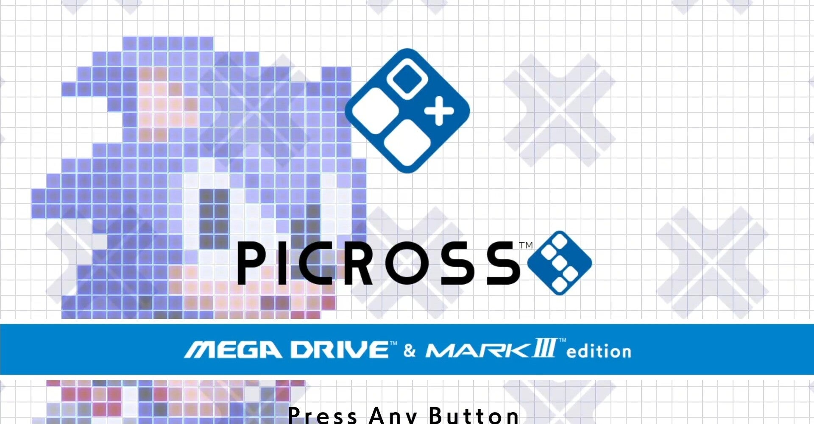
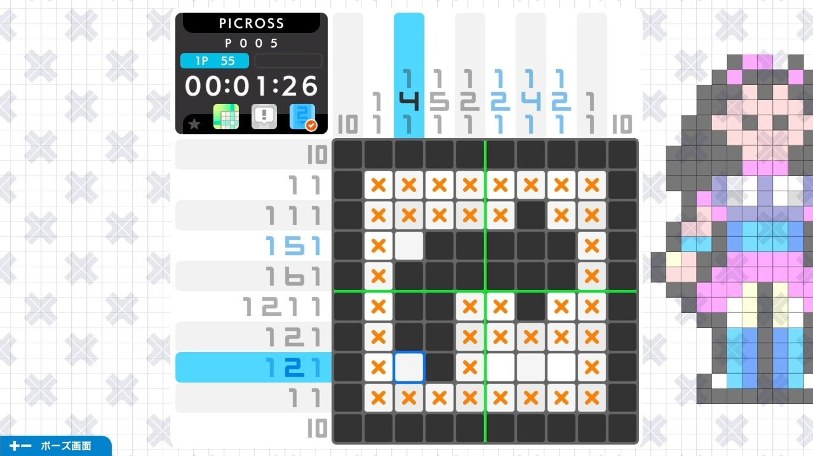
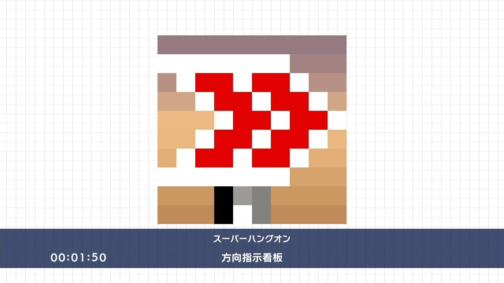
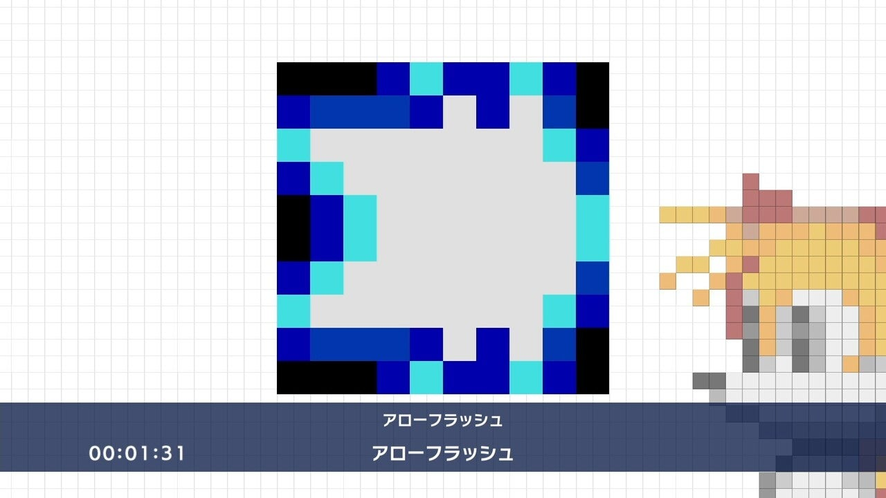

<figure>

</figure>

　任天堂スイッチ用に『PICROSS S MEGA DRIVE & MARK III edition』というゲームが発売された。

　数字を見つつルールに則って四角形を塗りつぶすいつものピクロスなのだが、そのお題にセガの（古めの）ゲームのキャラクタが使われている。

　また、BGMには懐かしいFM音源の時代ぐらいのセガのゲームミュージックが使われている。これだけで楽しくなる人もいるのではないだろうか。

　問題はすごく簡単なものから始まり、メガピロス、カラーピクロスといった拡張ルールの難問までバラエティに富んで用意されている。これは、長めにお盆休みが取れる人たちにじっくり腰を据えて遊んでほしいというメーカーの姿勢が表れているのかもしれない。

　一方、お題はマニアックというか、ゲームの隅っこにいるキャラクタを掘り出してきたようなものがあり、セガのファンならずとも思わず笑ってしまう。アローフラッシュのアローフラッシュと言われてみんなわかるのだろうか。当時メガドラで遊んだことがあればわかるかもしれない。

　僕はもともとピクロスが好きで、任天堂スイッチでも出たら買う、というほどではないが、ときどき買って遊んでいる。寝る前に遊ぶといい睡眠導入になったり、オンラインゲームのマッチング待ち時間にちょっと遊んだり。そんな気楽さも好きだ。

　もっともピクロスは必ず答えが出るように作られているので、順番に数字をあたっていけば必ず解ける作業的な要素が大きいかもしれない。そんなに頭を使うというほどのパズルではない。でもその分万人受けするルールだと思う。

　今年の夏は、そんなとっつきやすいピクロスにセガのキャラクターとBGMがコラボした楽しいパズルに挑戦するのもいいかもしれない。おすすめだ。

[https://www.youtube.com/watch?v=asEWQf5UwX0](https://www.youtube.com/watch?v=asEWQf5UwX0)
