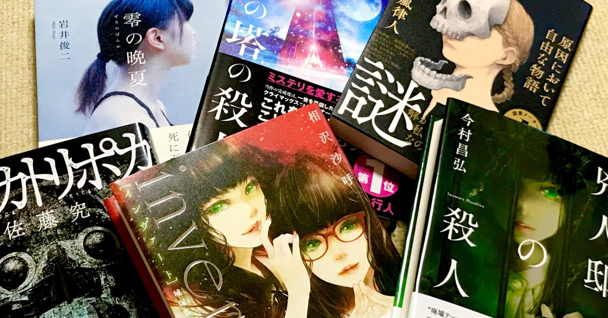

<figure>

</figure>

  

　もうゲームばかりやっていて読書は遅々として進まないわけだが。それでも読みたい本は買ってしまっているので読んでいこう。（9月いっぱいぐらいには読みたいなあ）

## 零の晩夏 / 岩井俊二

　絵画のモデルになった者が必ず死ぬという絵師の謎を追う美術ミステリ。

[https://www.amazon.co.jp/dp/4163913882](https://www.amazon.co.jp/dp/4163913882)

## 硝子の塔の殺人 / 知念実希人

　知念実希人作品は久しぶり。医療ミステリではないけど、医師が主人公みたい。

[https://www.amazon.co.jp/dp/440853787X](https://www.amazon.co.jp/dp/440853787X)

## 原因において自由な物語 / 五十嵐隼人

　作家が主人公のミステリ。前作『法定遊戯』がおもしろかったのでこちらも期待。

[https://www.amazon.co.jp/dp/406523400X](https://www.amazon.co.jp/dp/406523400X)

## テスカトリポカ / 佐藤究

　麻薬密売人と臓器ブローカーの話。以前から読もうと思いつつ、気づいたら直木賞。

[https://www.amazon.co.jp/dp/4041096987](https://www.amazon.co.jp/dp/4041096987)

## invert 城塚翡翠倒叙集 / 相沢沙呼

　『medium』の翡翠さんがよかったので続いてこちらも。中編集。

[https://www.amazon.co.jp/dp/4065237327](https://www.amazon.co.jp/dp/4065237327)

## 兇人邸の殺人 / 今村昌弘  

　『屍人荘の殺人』『魔眼の匣の殺人』に続く第三段。前情報なしで読むけどクローズド・サークルなのかな。楽しみ。

[https://www.amazon.co.jp/dp/4488028454](https://www.amazon.co.jp/dp/4488028454)

　と、これは単行本で買ったもの。他に文庫とか色々あるんだけど、それはおいおい。がんばろ。
