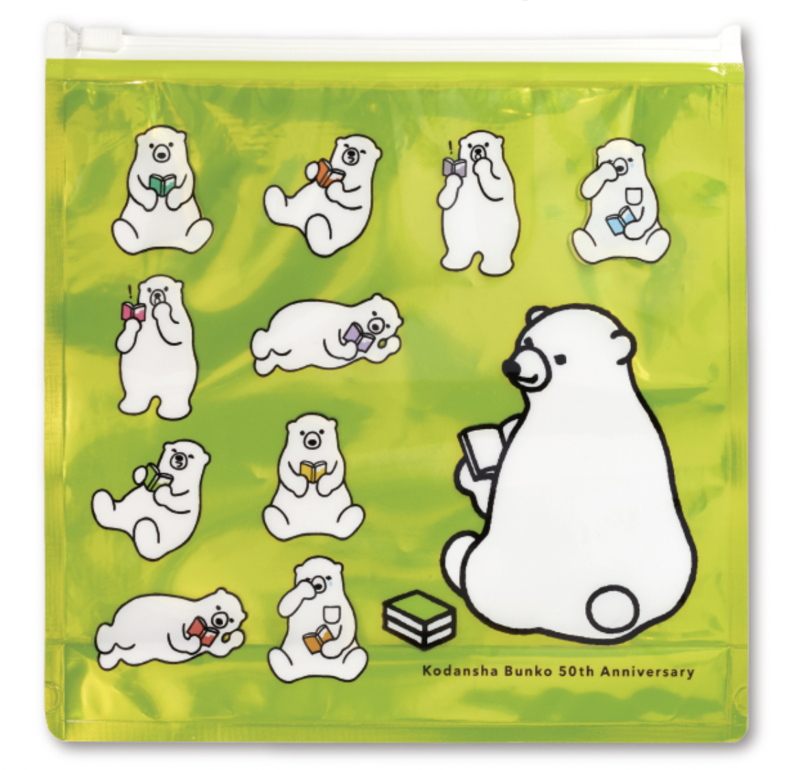

<figure>

</figure>

　お盆になると講談社ミステリーフェアという夏フェアが開催される。ところが、タイトルのとおりである。この講談社ミステリーフェアはあまり多くの書店で展開されていない。

　世の中の状況もあるのであまり大きな書店ではなく、近所の小さな書店で探してみたのだが、今のところ一軒で売り場が展開されているのを見ただけである。

　そもそも、フェアを展開している書店でもラインナップが少ない。講談社のサイトではおおよそ70点ほどの作品がラインナップされていて、決して少なくはないが、実際に店頭では10作品ほどが置かれているのみであった。さすがにこれでは選びにくい。しかも、自分的には微妙に持っている本が多くて、これも選びにくい原因になっている。

　ちなみにフェアの特典は『よむーく文庫ポーチ』という3種類のシロクマの絵柄のポーチだ。かわいらしい特典ではあるが、さすがにこれがすごく欲しい！　というほどではないので、今回はつい見送ってしまった。

　出版社のこういうフェアってどういう規模で行われて、どういう風に書店が取捨選択しているのかわからないが、もうちょっと展開しないと読み手にリーチしないんじゃないかt思っている。

　河出書房なんかも、ブックカバーやエコバッグがもらえるフェアをやっていることがあるが、こちらはもっと見かけない。

　出版社は本が売れないと、いろいろ工夫してフェアを行っているようだが、できれば地方の一般的な書店にもそういうのがリーチしてくれると嬉しい。特典につられてってわけじゃないが、積極的に買おうと思っているんだけどなあ。

　いや、それともこれは、もう電子書籍に移行しなさいと暗に言われているってことなんだろうか。うーん……
