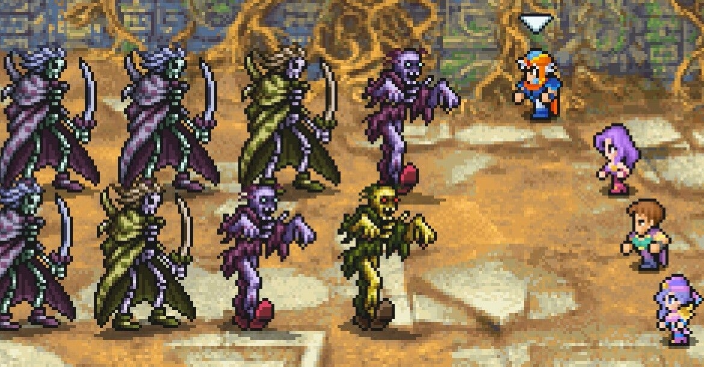

<figure>

</figure>

　気づいたら『ファイナルファンタジーIIピクセルリマスター』というゲームがリリースされていた。ファミコン用の『ファイナルファンタジーII』をもとにドット絵感を大事にリメイクされた作品らしい。

　しかし、プレイしてみるとこれが予想以上に快適でサクサクとゲームが進んでしまう。

　『ファイナルファンタジーII』はレベルの概念が存在しないことで有名なRPGだ。プレイヤーの操るキャラクターは、主に戦闘中の行動によって各パラメータが成長する。例えば、HPを失えばHPが上がるし、MPを使えばMPが上がるといった感じだ。

　そのため、ファミコン版の『ファイナルファンタジーII』では、戦闘が始まるとお互いのキャラクターが味方を殴って鍛えるというちょっと裏技というか、マニアックな鍛え方がオーソドックスな攻略法になっていた。

　『ピクセルリマスター』でもこの辺りのシステムはほぼ忠実に移植されているため、味方を殴って鍛えないと……と思っていたのだが、これがそうではなかった。

　『ファイナルファンタジーIIピクセルリマスター』にいは、非常に優秀なオート戦闘が搭載されていて、これで戦うとものすごいスピードで戦闘をこなすことができる。オート戦闘があまりに快適なため、味方同士で殴り合うより、適当に敵とエンカウントしてオート戦闘している方が時間的な効率が全然いいのだ。

　そんなわけで、序盤でパーティに加入する強い味方が仲間にいるうちに、ちょっと敵が強いところへ行ってオート戦闘をしまくっていた。雑誌を読みながらオートボタン押せば、あとは勝手に戦ってくれるの実に簡単だ。

　ところが、ほんの2時間も割と不毛なオート戦闘を繰り返していたらキャラクターが強くなりすぎてしまったのである。『ファイナルファンタジーII』は、4人パーティのうち1人がストーリーによって入れ替わっていくのだが、新しくパーティに加入したキャラクターが見劣りするぐらいレギュラーの3人が強いのだ。どれぐらい強いかと言うとキャラクターのHPが新たに加入してくる仲間の10倍ぐらいになっているのだ。さすがにこれはやりすぎた。

　その後、ちょっと育てすぎたキャラクターでシナリオを進めているのだが、笑っちゃうぐらいパーティが強くてほとんど負け知らず。眠りの剣という的に眠り属性を付加する武器もあいまって、登場するボスキャラは何もしないでただやられていく始末。うーん、無双できるのは快適だが、これゲームとして面白いのか……？

　そんな感じで、初代『ファイナルファンタジーII』の感覚でキャラクターを育ててから攻略を進めたらゲームバランスが完全に崩壊してしまった。まあ、今のゲームならこれぐらいヌルい方がいいのだろう。これから『ファイナルファンタジーIIピクセルリマスター』を遊ぼうか迷っている人ならば、その快適さを理由におすすめしたい。

　あと、音楽はファミコンのピコピコ音ではなく、アレンジされたBGMになっている。僕はピコピコ音に特別思い入れがあるほどではないので、アレンジBGMで十分だ。『ファイナルファンタジー』の音楽世界を十分に楽しんでいる。

　このゲーム、むしろファミコン版のちょっとつらかった思い出を持ってプレイする人の方が戸惑うバランス調整になっている。それだけ気をつければ、久々に遊んでも面白かった。固定キャラクターによるドラマティックなシナリオや、その後のFF的世界観の礎を築いた記念碑的作品である『ファイナルファンタジーII』をぜひ体験してみてほしい。　

[https://www.youtube.com/watch?v=CSXNH8oaeqw](https://www.youtube.com/watch?v=CSXNH8oaeqw)
