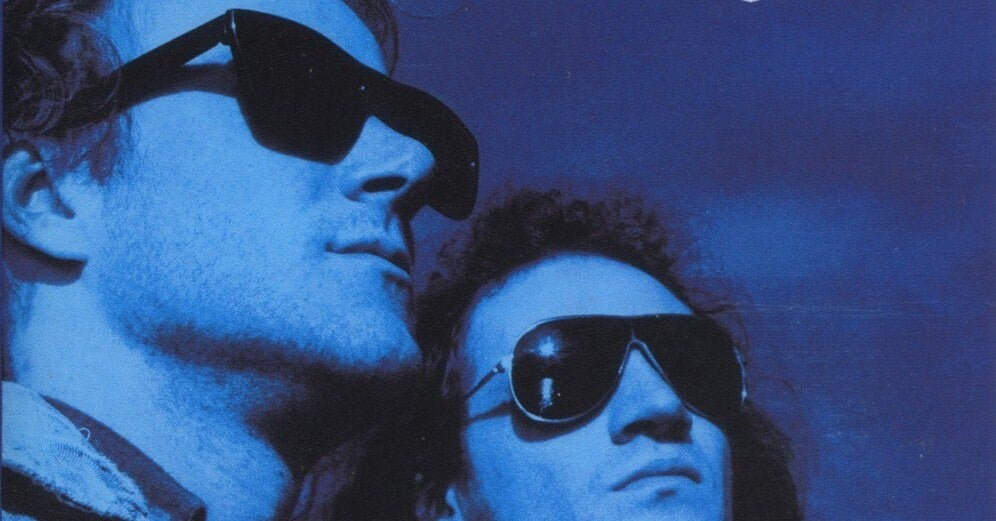

<figure>

</figure>

　ハロウィンのギタリストだったカイ・ハンセンがハロウィンを脱退して作ったバンドがガンマ・レイ。そのガンマ・レイの最初のアルバムで歌っていたのがラルフ・シーパーズである。最近ではマイケル・シェンカーのアルバムでも歌っていて、常にメタルシーンで活躍していたというイメージのあるヴォーカリストだ。

[https://www.youtube.com/watch?v=bcrU9ZS6CZA](https://www.youtube.com/watch?v=bcrU9ZS6CZA)

　で、そのラルフ・シーパーズがガンマ・レイの1stアルバムで歌っていた"Lust for Life"という曲が極めてかっこいいのだ。典型的なハロウィン型スピードメタルで、カイ・ハンセンのソングライティング能力が光りまくっている。

　ところが、その後ガンマ・レイからラルフ・シーパーズが脱退したことをきっかけに、当然ライブではカイ・ハンセンがこの歌を歌うことになる。残念ながらカイ・ハンセンの歌唱力ではあの1stアルバムのインパクトは出せないのが正直なところ。ライブでも何回か見たが、曲のかっこよさは失われていないものの、ヴォーカルの物足りなさに煮え切らない思いでいた。

　その後ガンマ・レイはベストアルバムをリリースするのだが、なんとそこにもカイ・ハンセンが歌っているバージョンが収録されてしまうこととなる。さらには、現在ストリーミングで配信されていいる同曲も、すべてカイ・ハンセンバージョンだ。ラルフ・シーパーズが歌っているバージョンを聞くには、中古CDを手に入れるしかない。

[https://open.spotify.com/album/6aqLflGln3ew1UsJZFZZ4w?si=C-3plhqfR3ee4Mty-DtoVQ&dl\_branch=1](https://open.spotify.com/album/6aqLflGln3ew1UsJZFZZ4w?si=C-3plhqfR3ee4Mty-DtoVQ&dl_branch=1)

　ライブでカイ・ハンセンが歌うのはともかく、かつての名曲がまるでこの世になかったかのように扱われているのは非常に残念だ。デビュー当時からのファンとしては忸怩たる思いである。

　ところがつい数日前、Youtubeにガンマ・レイの30周年ライブと銘打たれて、ラルフ・シーパーズが歌う"Lust for Life"がアップロードされているではないか。

[https://www.youtube.com/watch?v=ikbbZLdHHpI](https://www.youtube.com/watch?v=ikbbZLdHHpI)

　これには驚いた。ラルフ・シーパーズ脱退の裏にどんな物語があったかは知らない。しかし、30周年を節目にこういう復活劇があり得るのなら大歓迎だ。

　懐かしいラルフ・シーパースの声に感動もひとしおで聞き入っていたが、何か変だ。ああ、なんと無敵のハイトーンを誇ったラルフ・シーパースともあろう人が、キーを下げて歌っているではないか。加齢による声の衰えは仕方ないとは言え、ヘヴィメタルでヴォーカルがキーを下げるのは非常に残念なことだ。マイケル・シェンカーのアルバムでも感じていたこととは言え、ラルフ・シーパースも高音部は苦しくなっているようである。

　とは言え、やはりこうして昔のラインナップでパフォーマンスしてくれるのは嬉しいことではある。願わくば、せめてストリーミングに当時最初にリリースしたアルバム音源もラインナップしてほしい。それぐらいいはいいじゃないかと思う。

[https://www.youtube.com/watch?v=XqeEM4DjpVg](https://www.youtube.com/watch?v=XqeEM4DjpVg)
