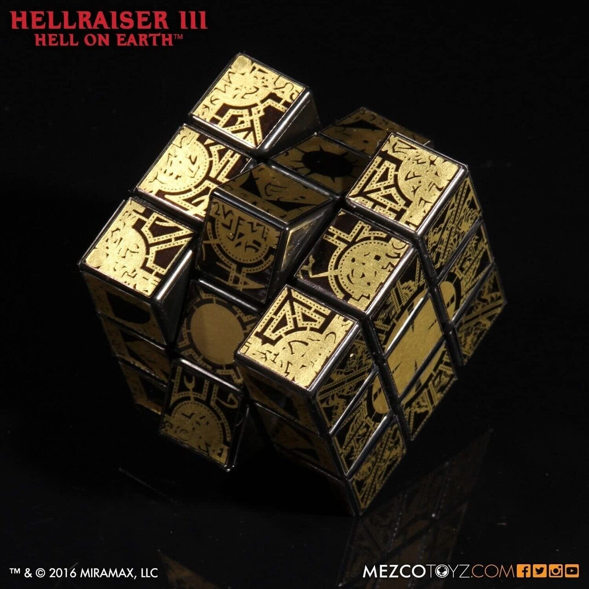

<figure>

</figure>

　『デッドバイデイライト』に映画『ヘルレイザー』のピンヘッドがやってきた！

　とりあえず、まだテストバージョンで稼働中だが、まさか『バイオハザード』コラボの後にすぐホラー映画のコラボが来るとは思わなかった。実に豪華だね。

　とは言え、11月にはデモゴルゴンを含むネットフリックス発のSFドラマコラボの『ストレンジャー・シングス』チャプターが契約終了でゲームから消え去るとのこと。コラボ増やしすぎて、将来次々にキャラクターが消えますということが無いといいのだが。

　さて、ピンヘッドことセノバイト（ゲーム中での呼称）は、組み替えることで究極の性的官能を体験できるというアーティファクト「ルマルシャンの箱」を組み替えたことで異世界から現れた魔道士だ。

　とか書いているが、実はその『ヘルレイザー』を見たことがない！　全部今Wikipedia見て書いた。学生時代にあれだけホラー映画を見ておきながら、なぜか未だに未見の映画『ヘルレイザー』。

　せっかく『デッドバイデイライト』とコラボするんだからこれを機に見てみよう、と意気込んでツタヤへ行ったが、そんな古い映画のDVDは置いてなかった。ネットで探すも、DVDもBDもとうの昔に売り切れ。動画配信も終わっている。そんな状態だった。いつも見ようと思うとこれだよ。

　そんなわけで、僕の中では行き過ぎた鍼治療の頭にしか見えないセノバイトであったが、こうなったらいつかなんとかして『ヘルレイザー』を見てやろう。

　それより、エロい体験をエサに、手に入れた者を魔界に誘い込むルマルシャンの箱、まるで現代のエロサイトのようだ。ルマルシャンの箱欲しくなってきたぞ。

　と、思ったら数年前にMEZCOから商品化されてた！

　って、ただのルービックキューブじゃん。
