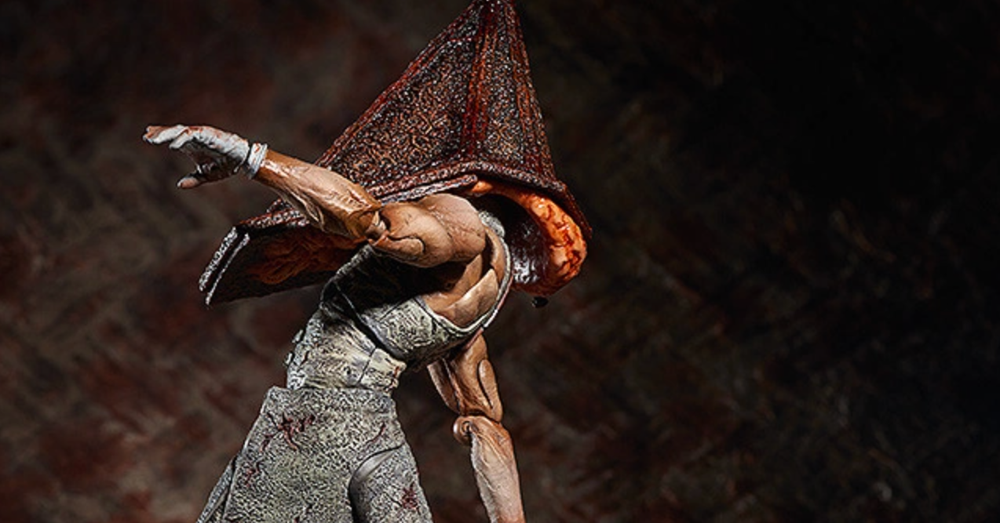
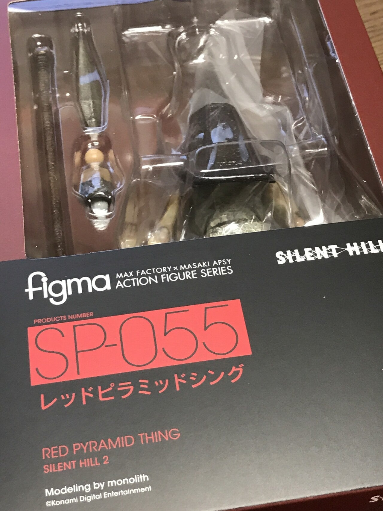

<figure>

</figure>

　以前noteに三角様が来た話を書いた。ゲーム『デッドバイデイライト』の話だ。

[https://note.com/keigox68000/n/n82dedf377797](https://note.com/keigox68000/n/n82dedf377797)

　今度は何かというと、可動関節でおなじみのフィギュアシリーズ『figma』の三角様だ。もうかなり前に発売された『サイレントヒル2』仕様の三角様が再々販売されたので、それを購入したのである。

　三角様は『サイレントヒル2』以降、シリーズに登場している名物クリーチャーであるが、筋骨隆々としたボディに、金属ないしは石造りのような硬質の三角頭を被った独特のフォルムを持つ。そのユニークさが受けて、ホラーゲーム界の有名人、人気者となっている。

　それにしても、実はこのクリーチャーには「三角様」とか「三角頭」とか「ピラミッド男」とか定まった名前がない。一応、今回購入した『サイレントヒル2』バージョンでは「レッドピラミッドシング」という呼称がつけられている。これだって、単に見た目を名前にしただけだ。

　このように、見た目をそのまま名前にしているのは、いかにもホラー映画／ゲーム然としていてよい。超常現象の真っ只中で未知のクリーチャーが人間を襲ってくるのは、冷静に名前をつけられるようなシチュエーションではない。見たまんまの名前がつけられている方がそれっぽいのである。

　さらに我々ホラーゲームファンは、ゲーム中でプレイヤーを苦しめるこのクリーチャーに、畏怖の念も込めて「三角様」と敬称をつけたりする。これはもうホラー映画／ゲーム好きなら誰にでも共通する心理であろう。

　あまりに人間を凌駕した存在。それでいて我々小さき人間に畏れと敬いの入り混じった感情を呼び起こさせる圧倒的な力と姿。そこには人間の触れてはいけないものを自然と崇めてしまうような感情が生まれるのだ。そして、ある意味その畏れるべきクリーチャーは美しくもある。それがこの「レッドピラミッドシング」こと「三角様」の容姿が持つ意味であろう。

　さてこの三角様。お手頃価格のfigmaが再販されて手に入れたわけだが、実は後々Geccoのお高いスタチューの発売も控えているようだ。40,000円程度と非常に高級なフィギュアなのだが、発売されたら買ってもいいかとさえ思い始めてしまった。まさに三角様の魔力である。

　お金貯めておかないと……
