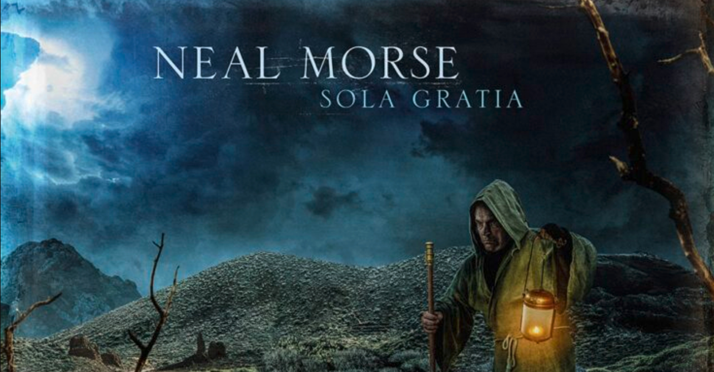

<figure>

</figure>

　暑さが戻ってきた夏の終わり。寝苦しい夜を爽やかなプログレとともに過ごそう。というわけで、定期的に現れるプログレ特集。

## ONE / NEAL MORSE

　兄のアラン・モーズとともにプログレバンドSPOCK'S BEARDを結成しているプログレマルチプレイヤーのソロアルバム。彼のソロはクリスチャンミュージック的な意味合いが強いが、メロディや曲の展開はスリリングなプログレを体現している。

[https://open.spotify.com/album/35eTIgI1SifdxvepD4UhMX?si=N2S9uzV2R\_aP-xHpWQSq4w&dl\_branch=1](https://open.spotify.com/album/35eTIgI1SifdxvepD4UhMX?si=N2S9uzV2R_aP-xHpWQSq4w&dl_branch=1)

## TERRAFORMER / THANK YOU SCIENTIST

　バイオリン、サックス、トランペットなどを取り入れた複雑かつソフィスティケイテッドなプログレバンド。ときにジャズ・ロックっぽくもあり、テクニカルでありながら決してマニアックにならずお洒落なサウンドが大人の雰囲気を醸し出す。

[https://open.spotify.com/album/1eStwpifoxHYRsCrPheX4l?si=490tBvwDQymXem3sJOjITQ&dl\_branch=1](https://open.spotify.com/album/1eStwpifoxHYRsCrPheX4l?si=490tBvwDQymXem3sJOjITQ&dl_branch=1)

## THIRD DEGREE / FLYING COLORS

　ギターがスティーヴ・モーズ、ドラムがマイク・ポートノイ、そしてキーボードが前出のニール・モーズという、ちょっとスーパーな感じのプログレバンド。いや、プログレと言うよりはオーソドックスなハードロックにプログレっぽいフレーズをふんだんに散りばめたキリリとスマートなバンド。

[https://open.spotify.com/album/2QXOXUqfh8iWRYohIoqtZx?si=AnG2iTybSC2JRZ8eqIDchg&dl\_branch=1](https://open.spotify.com/album/2QXOXUqfh8iWRYohIoqtZx?si=AnG2iTybSC2JRZ8eqIDchg&dl_branch=1)

## AMAZINGOUS / CHEETO'S MAGAZINE

　カラフルで楽しげなアルバムアートワークをそのまま音にしたようなサウンドが魅力的なバンド。QUEENに影響を受けたと公言する通り、コーラスワークを駆使した曲作りで、明るく爽やかな雰囲気を醸し出しつつ、時折テクニカルに緊張感溢れるフレーズを織り込んでくる技がなんとも言えない。

[https://open.spotify.com/album/2MTRjt1xIbYSnTYecbHQsO?si=lbGSJixGSvuu\_MCX9204Uw&dl\_branch=1](https://open.spotify.com/album/2MTRjt1xIbYSnTYecbHQsO?si=lbGSJixGSvuu_MCX9204Uw&dl_branch=1)

## TIARA / SEVENTH WONDER

　最後はメタル寄りな1枚。ヴォーカルにKAMELOTのトミー・カレヴィックを擁するプログレメタルバンド。バンドの拠点はスウェーデン。メロディアスかつ叙情的なメロディを、ドリームシアター的なキーボードサウンドで味付けした正統派メロディックメタルにプログレッシブな曲展開をブレンドしたような凝ったサウンドが身上。

[https://open.spotify.com/album/6sy0TfRMv2csBso3tf3amD?si=AipwcGTpTyynGPVj9QVHuQ&dl\_branch=1](https://open.spotify.com/album/6sy0TfRMv2csBso3tf3amD?si=AipwcGTpTyynGPVj9QVHuQ&dl_branch=1)

　みんなもテクニカルなプログレ世界に身を投じて、残暑の厳しさに耐え抜こう！

　それじゃあ、また秋の夜長のプログレ特集でお会いしましょう。（書くかどうかわからないけど）

　まとめてプレイリストでどうぞ。

[https://open.spotify.com/playlist/3hmYg5Kg1yv8yXhxvYOSKZ?si=1e1066ee73cf48e8](https://open.spotify.com/playlist/3hmYg5Kg1yv8yXhxvYOSKZ?si=1e1066ee73cf48e8)
