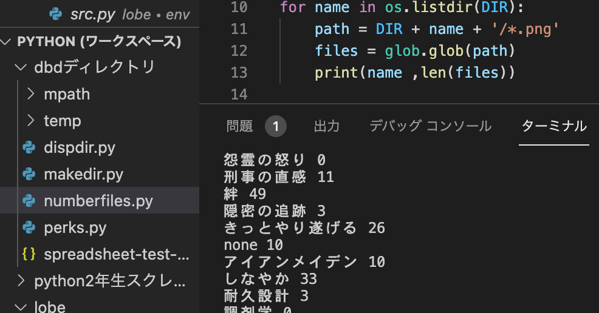

<figure>

</figure>

　以前noteに『デッドバイデイライト』で使われているパークの統計を取りたい話を書いた。

[https://note.com/keigox68000/n/n7188d8446ed9](https://note.com/keigox68000/n/n7188d8446ed9)

　その後pythonを使っていろいろと進捗したので、自分用にメモを残しておこう。

## １．やったこと

・OpenCVを使ってリザルト画面のパークを数える（その後この方法は時間がかかるのでやめた）  
・ゲームのリザルト画面のキャプチャから、パークとキラーのアイコンを切り出す（OpenCVを使用）  
・Microsoft LOBEを使って、アイコン画像を機械学習  
・フォルダに放り込んだアイコン画像を、LOBEでエクスポートした機械学習モデルを使って推論・分類  
・Googleスプレッドシートに書いたアイコン名を読み出し、その名称のフォルダを作る  
・分類したアイコン画像を、フォルダに振り分け  
・各フォルダに振り分けられたアイコン画像の数をカウント

[https://twitter.com/keigox68000/status/1412254900906467329](https://twitter.com/keigox68000/status/1412254900906467329)

[https://twitter.com/keigox68000/status/1425703943984717829](https://twitter.com/keigox68000/status/1425703943984717829)

## ２．やってみての課題など

・LOBEの機械学習で、あまり登場しない（サンプル数の少ない）アイコン画像の学習が不十分（推論で間違える）  
・上記の「画像の数がアンバランス」であることの解決のために、ネットをスクレイピングして収集した、くっきりキレイなアイコン画像を使って学習したところ、推論の精度がガタ落ちで使い物にならなかった  
・新しく買ったM1 MacでLOBEが動かない

[https://twitter.com/keigox68000/status/1419581784266743814](https://twitter.com/keigox68000/status/1419581784266743814)

[https://twitter.com/keigox68000/status/1429651735207813123](https://twitter.com/keigox68000/status/1429651735207813123)

## ３．今後やること

・アイコン画像の切り出し、機械学習モデルで推論、アイコン画像の数をカウントをそれぞれ別プログラムで処理していたので、一括して行う  
・アイコン画像のサンプルをさらに収集して、機械学習の精度を上げる（たぶんここが一番手間がかかりそう）  
・アイコン画像の数をカウントしたら、Googleスプレッドシートにその結果を書き出す  
・スプレッドシートに書き出す際に、そのフォーマットをどうするか検討（日付けで区切るのか…etc）

[https://twitter.com/keigox68000/status/1419581366165938177](https://twitter.com/keigox68000/status/1419581366165938177)

　と、まとめてみたら意外に早く目的のものが完成しそうな感じである。何より、こんなことを思いついたおかげで、pythonもだいぶ使えるようになったし、機械学習も（別ソフトを使いながらだけど）体験することができて自分的にはよかった。なんでも手を動かして作るのが大事だね。よし、がんばるぞ。
