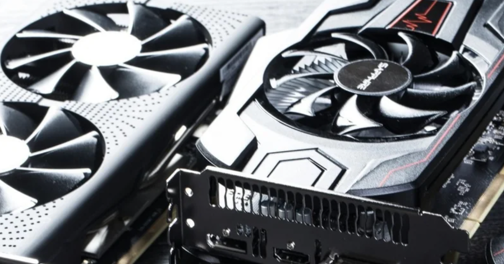

<figure>

</figure>

　ずっとグラボ買いたいと言い続けてきながら、今年に入ってからはビットコインの暴騰に煽られた、グラボの異常な高騰っぷりに悩まされてきた。

　しかし、ここに来てようやくグラボの供給が安定し、価格も下がり始めてきた。これにはいろいろな要因が絡んでいるのだろうが、ひとつにはビットコインの相場が少し下がったこと。それからもうひとつはLHR版という、ビットコインなど仮想通貨のマイニングで速度が出ないグラボが台頭してきたことなどが、大きな理由だ。

　グラボが高騰する以前は、価格とスペックを鑑みてRTX2070 Superをピンポイントで狙っていたのだが、その2070 Superも今はなくなってしまった。その後のラインナップと価格を見ていると、どうやら次に狙うのはRTX3060Ti辺りのようだ。

　そんなことを考えていたのはつい1ヶ月ほど前なのだが、この1ヶ月でグラボの価格は3割ほど落ちた機種もある。1ヶ月前は供給が安定せず、新しいグラボが店頭やオンラインショップに並びはするものの、すぐに売り切れていて価格もあまり下がらなかった。

　それがここに来て、かなり安定供給されるようになったためか、あっという間に価格が落ちたのである。これはPCゲーマーにとっては僥倖である。すぐにでも新しいグラボにして、4Kフルスペック超高精細グラフィックでゲームをしたい。

　ところが、今月は個人的な理由でちょっと出費が多かった。（MacBookとか買ったからね）そんな理由から、いつもの悪い癖でまた価格の動向を眺めている。

　今のところ引き続きいい感じで安定出荷が続いているグラボであるが、またどこかの車会社のCEOがビットコイン買うぞ！　とか、ネットショップ最大手が通貨にビットコイン使います！　とかやらないとも限らない。

　同時に、LHR版でマイニングとは無関係だったグラボも、明日にはLHRが突破されてマイニングに使えますよ！　となるかもしれない。とにかく、グラボの価格は今や生き馬の目を抜く投資対象だ。いつまでも呑気に構えてないで一気に買ってしまいたい。

　とか書いているうちにもさらに値段下がってる。うーん、RTX 3070Tiを目指すべきかな……
