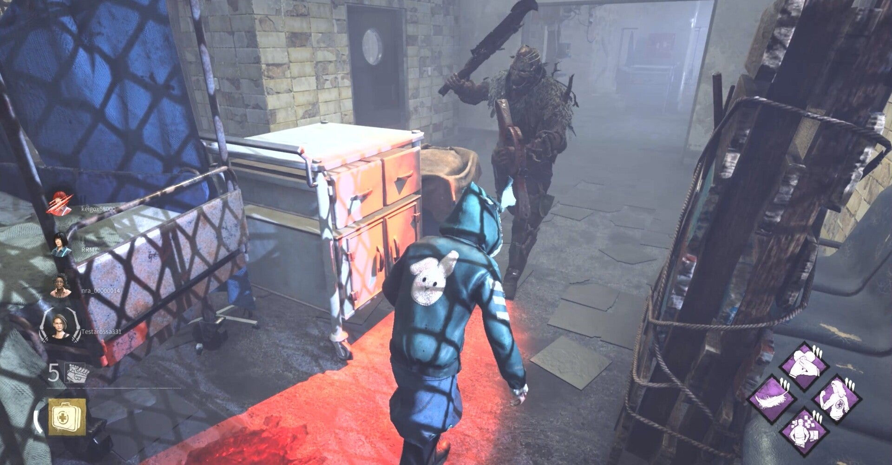

<figure>

</figure>

　『デッドバイデイライト』は人間5人でプレイするオンライン対戦ゲームだ。しかも敵味方で1対4に分かれる。いつでも1対4だ。

　この1対4というのが曲者で、組み合わせによっては一方的な試合になることもある。いや、度々ある。

　そうなったとき、ゲームの展開はいくつかのパターンに分かれるが、大きく分けて、①強いプレイヤーが一方的に勝利して終わる、②試合をあきらめた誰かが切断してゲームが終わったり勝負にならなくなったりする、③ゲーム本来のプレイをやめて遊び始める。

　おおよそこんなところであろう。できれば①のような一方的なゲームにしたくないが、これは技術的な差もあって仕方ない。②はもうオンラインゲームを遊んでほしくない類いの人だ。できればマッチングしたくない。

　問題は③である。本来なら『デッドバイデイライト』は、1人の殺人鬼が、4人の生存者血祭りに上げるゲームであるが、それをあきらめて、ただの追いかけっこキャッキャウフフ始めて遊び始めることがある。

　こうなるとゲーム展開は長いし、そもそもなんのためにゲームをプレイしているのかわからなくなり、非常につまらない。どうせやるなら一方的でも本気で戦いたい。

　これが例えば『エイペックスレジェンド』のような多人数でプレイするゲームだと、遊びになることはまず無い。いつでも本気のプレイが楽しめる。

　しかし、『デッドバイデイライト』のような1ゲームの人数が小規模の場合は、馴れ合い、お遊び、ゲームの中のストックホルム症候群みたいなことが得てして起こりがちなのだ。

　これは、ある程度試合が長引いて、ゲーム中に色々な行動が起きないとスコアにならない『デッドバイデイライト』のゲームシステムにも原因がある。一方的な試合ではどうしてもスコアが稼げないのだ。

　そんなわけで今日もお遊びを交えつつプレイする『デッドバイデイライト』。俺はいつでも本気の戦いを待っているぜ。

[https://www.youtube.com/watch?v=B74EGnPh6f0](https://www.youtube.com/watch?v=B74EGnPh6f0)
