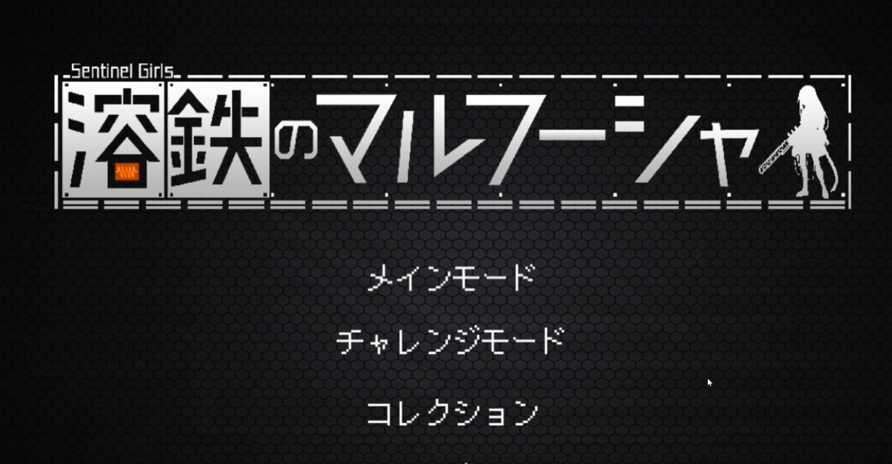
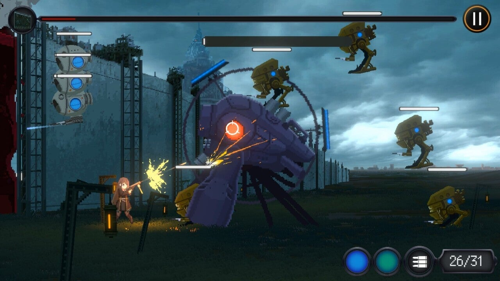
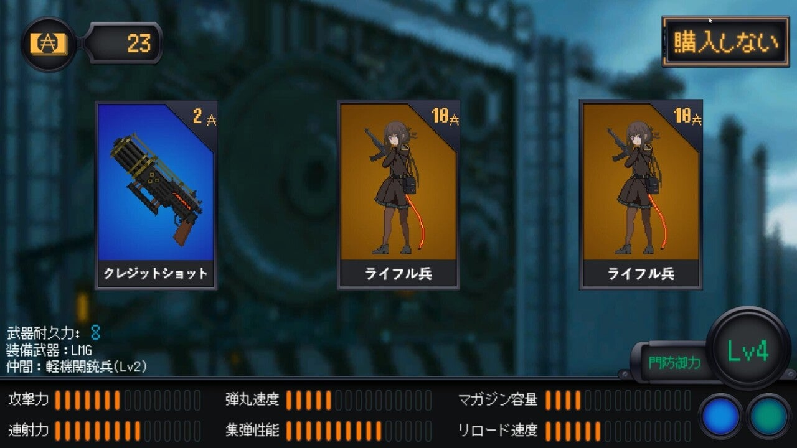
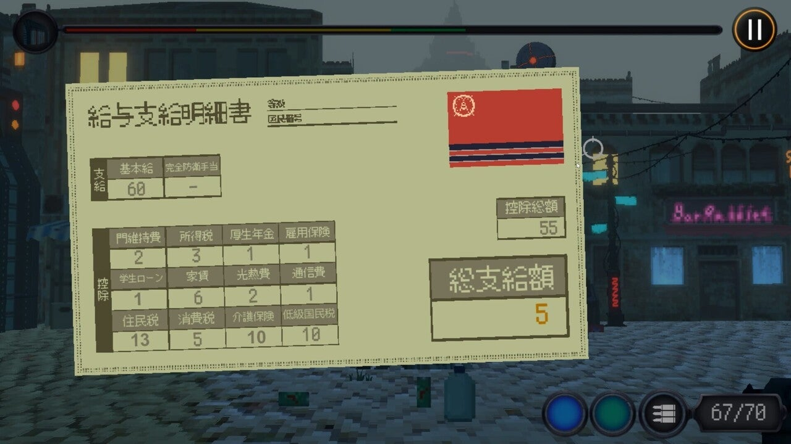
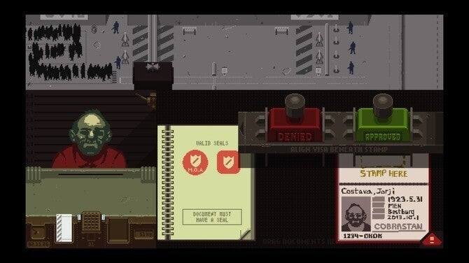
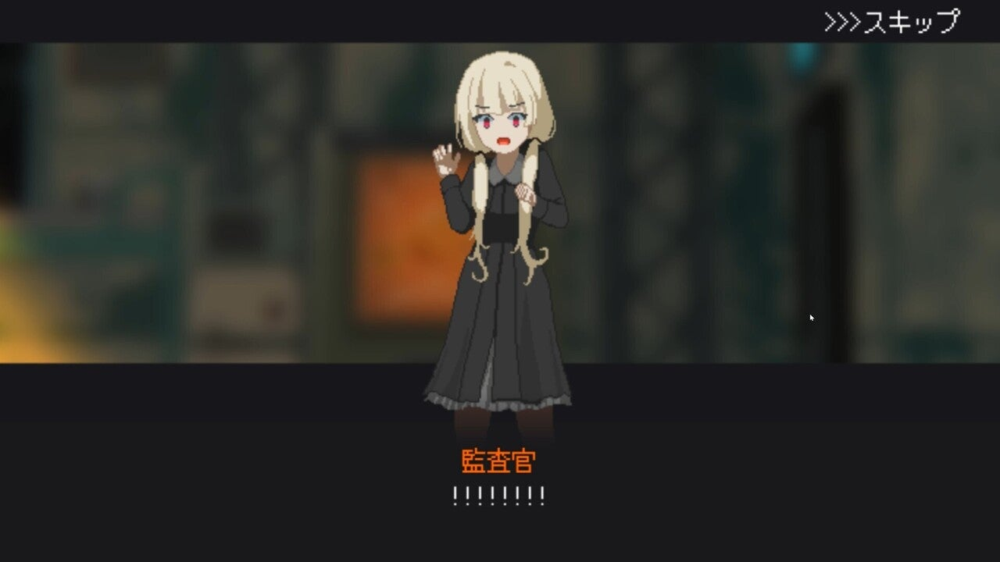
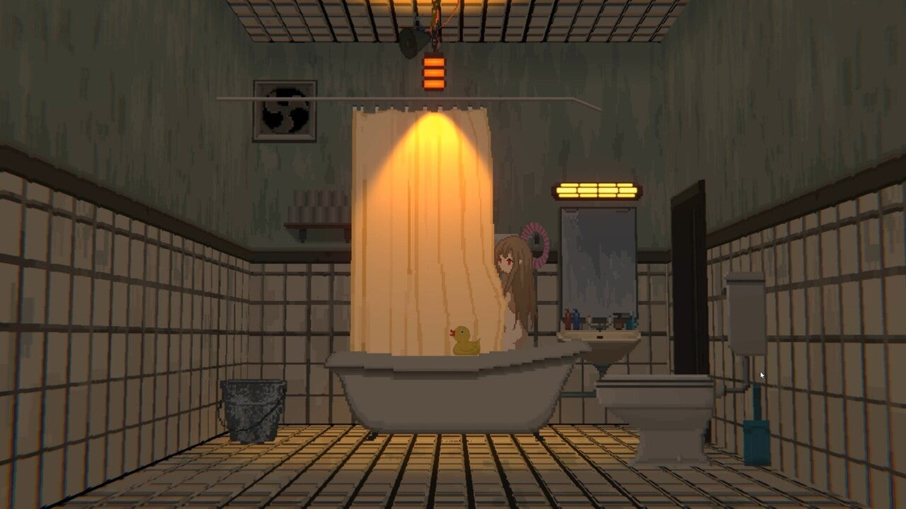

<figure>

</figure>

　『溶鉄のマルフーシャ』は昨日発売になったばかりの、日本人ゲーム開発者@hinyari9氏によるタワーディフェンス型ドット絵シューティングゲームだ。

[https://twitter.com/hinyari9/status/1431100113984757763](https://twitter.com/hinyari9/status/1431100113984757763)

　プレイヤーは主人公であるマルフーシャという少女を操作し、自国の防衛門を目指して迫りくる敵国のロボット兵を銃器で破壊して門を守るのが目的だ。

　ショートスパンで展開するステージをクリアすると、プレイヤーには3枚のカードが提示され、これを購入することでキャラクターや銃器、そして仲間を強化して次の戦いに備えることができる。

　また、戦いぶりによってマルフーシャには報酬が与えられる。しかし、作者も紹介している通り、共産主義国並みの搾取によってプレイヤーの手元に残る給与は雀の涙である。

　このわずかな報酬をやりくりしてキャラクターをパワーアップしなければならない。この辺りの自国がクソな設定、給与明細の演出、ロシア人っぽい名前の主人公、そしてドット絵など、ゲームジャンルは異なるが、どこか国境の入国審査をシミュレートした『Papers, Please』を思わせる世界観だ。

　一方で、ドット絵で描かれた少女たちはかわいらしく表現されている。軍服に身を包む可憐な少女という設定はオタク方面に絶大な支持を得ることができるのではないだろうか。

　日々戦いに身を投じる少女たちが住む、バラック同然の住居によるパワーアップの演出もあり、そんなちょっとしたことがストイックにゲームを続けるプレイヤーの心の癒やしになっていることも見逃せないポイントだ。

　一通りエンディングまでプレイしてみたが、自分でキャラクターを操作するタワーディフェンスとは言え、ゲームの重心はあまりアクション方向に振られておらず、マウスとキーボードの軽快操作で実に気楽にプレイできるところが好ましい。

　僕はコンティニューも含めて1時間ほどのプレイでエンディングを見ることができたが、仲間にするキャラクター、性能の異なる武器など、まだまだプレイを重ねたくなる仕掛けも含まれていて、さらに楽しめそうなところもグッドである。

　お手軽に遊べるゲームでありながら、興味深いストーリーもあり、ちょっとした時間に遊ぶのに向いた良作『溶鉄のマルフーシャ』。あなたも自分の稼いだ報酬から容赦なく徴収される税金にむかつきながら、鋼鉄の悪魔と戦い続ける日々を送ってみてはいかがだろう。

[https://www.youtube.com/watch?v=TNFcFcN9qyw](https://www.youtube.com/watch?v=TNFcFcN9qyw)
