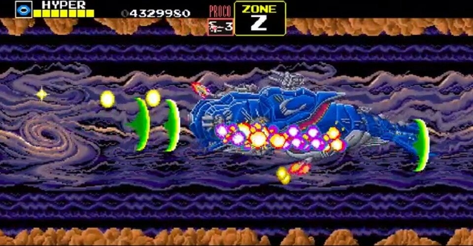

<figure>

</figure>

　アーケードアーカイブスは2014年の5月に配信を開始した、かつてゲーセンで稼働していたアーケードゲームを移植したシリーズである。当初はPS4向けに配信されていたが、後を追って任天堂スイッチやXbox One/Windowsにも配信されている。（機種によってリリースタイトル数が異なる）

　僕はこのアーケードアーカイブスのためにPS4を購入したのだが、まさかここまで継続してリリースし続けてくれるとは思わなかった。レトロゲームファンとしては非常に嬉しい話である。

　しかしアーケードアーカイブスも今や150タイトルを超えており、今から遊ぼうと思うと、そのタイトルをプレイしていいのかちょっと迷うところはある。そこで、これからアーケードアーカイブスでレトロゲームを遊ぶ人向けに、マストなタイトルを紹介してみよう。

## スターフォース

　ゼビウスフォロワーのような立ち位置で登場した『スターフォース』。地上物と空中物の撃ち分けが必要なくなり、とにかく撃ちまくるゲームになったことで爽快感が増している。パワーアップパーツと合体することで軽快なBGMとともに更に連射力がアップするフィーチャーや、隠し要素で高得点を狙えるゲームデザインも斬新だった。

[https://www.youtube.com/watch?v=fBXa4vVeMgY](https://www.youtube.com/watch?v=fBXa4vVeMgY)

## グラディウスII

　大ヒットした『グラディウス』の続編として全アーケードゲーマーの期待を背負って登場した『グラディウスII』。見事にその期待に応えた高い完成度が魅力だ。描き込まれたグラフィックやパワーアップゲージを選べる先進的なゲームシステム、FM音源とPCM音源を駆使した洗練のBGMは今プレイしてもゲーマー魂を熱くしてくれる。

[https://www.youtube.com/watch?v=LfwbEjwq2W4](https://www.youtube.com/watch?v=LfwbEjwq2W4)

## ダライアス

　ブラウン管を３台つなげて広大なゲームフィールドを作り上げた大胆な発想のシューティングゲーム。その大型筐体が『ダライアス』の魅力のひとつではあるが、まずは家庭でこの3画面のゲームがプレイできることを喜びたい。魚をモチーフにした巨大戦艦との戦いと、それを盛り上げるZUNTATAによる独創的な楽曲群。すべてが当時の興奮そのままだ。ちなみに55インチのテレビなら、当時の画面サイズを超えてしまう。

[https://www.youtube.com/watch?v=1ZXkOJRK3qk&list=PLRaOuSqti\_z9SzCBC14yin8JVxamnQ\_ix](https://www.youtube.com/watch?v=1ZXkOJRK3qk&list=PLRaOuSqti_z9SzCBC14yin8JVxamnQ_ix)

## イメージファイト

　アイレムが『R-TYPE』に続いて、より戦略性を全面に押し出してきたシューティングゲームが、この『イメージファイト』だ。単に敵を撃って弾を避けるだけでなく、自機に装備されたポッドと全9種類のパーツを駆使することで、プレイする人それぞれに多彩なプレイスタイルを生み出すことができる奥の深いゲーム性を楽しみたい。高難易度に挑戦する意義のあるゲームだ。

[https://www.youtube.com/watch?v=b0O0DEYv5zk](https://www.youtube.com/watch?v=b0O0DEYv5zk)

## ハレーズコメット

　ハレー彗星が地球に再接近した1986年に、それならハレー彗星をテーマにしたゲームを作ろう！　というある意味タイトーらしい安直さから登場したゲーム。しかしながら適当な企画と裏腹に、ド派手なパワーアップを実装したゲームは、爽快感あふれる弾丸ぶっ放しシューティングとして見事に完成されている。透明感あふれるBGMと、ネオンサインのような独特の色合いで表現されたグラフィックも個性的でよい。

[https://www.youtube.com/watch?v=QMUK5dphxFc](https://www.youtube.com/watch?v=QMUK5dphxFc)

## 雷電

　明確に東亜プランフォロワーとしてのスタイルを持って登場したボンバーシューティング『雷電』。シンプルなパワーアップと、容赦ない弾速で、撃って避けるというシューティングゲームの基本に立ち返ったようなゲームデザインが万人受けしてロングセラーの大人気作となる。パターンを覚え、わかっていてもやられる、その悔しさが繰り返しプレイしてしまう原動力となる。

[https://www.youtube.com/watch?v=bqZH3RxSYb0](https://www.youtube.com/watch?v=bqZH3RxSYb0)

## ドンキーコング３

　『ドンキーコング３』はシリーズ前2作から大幅にゲームのスタイルを変え、飛来する敵を撃ち落とすシューティングゲームとなった。自機である主人公スタンリーは左右移動に加えてジャンプすることも可能なため、このゲームをアクションシューティングと見る向きもあるが、『ギャラガ』のように美しい軌跡を描いて飛ぶ敵キャラを見ると純粋なシューティングゲームとして十分に成立していると言えるだろう。なお『ドンキーコング３』は、任天堂スイッチのみでのリリースとなっている。

[https://www.youtube.com/watch?v=Bhyv\_yi8CIc](https://www.youtube.com/watch?v=Bhyv_yi8CIc)

　以上、少し月並みな感はあるものの、初めてアーケードアーカイブスに触れるには、やはり外せないタイトルを選んでみた。

　また気が向いたら、別ジャンル編も書いてみたいと思う。それでは良きゲームライフを！
