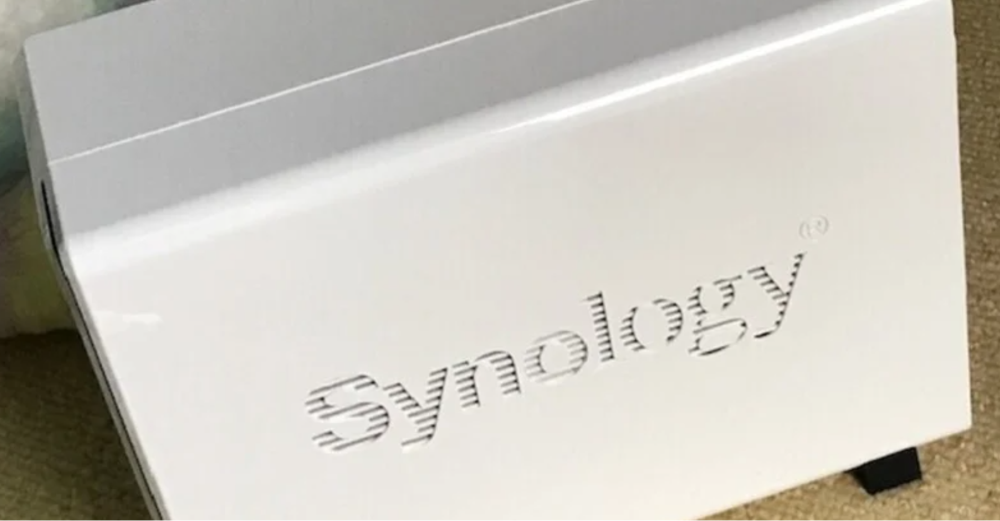

<figure>

</figure>

　以前noteにも書いたNASの話。設定が終わって快適に使っていたのだが、ちょっと困った感じになっている。

[https://note.com/keigox68000/n/n2c6272987248](https://note.com/keigox68000/n/n2c6272987248)

　実は7月の終わり頃に、NAS用のOS『DSM』がバージョン6からバージョン7にメジャーアップデートされていたのだ。

　しばらくはファイルサーバとしてだけ使っていたので、DSMのアップデートに気づかなかった僕は、早速DSM7を入れてみた。

　ところが、アップデート直後からNASの動作が重いのである。ブラウザからアクセスしてファイルをのぞいたり、各種アプリを動かしても重い。LAN内のPCからファイルサーバにアクセスしても重い。挙句の果てには、写真管理に使っていた写真用アプリも消えてしまったのだ。

　あまりのことに驚いて、早速ネットを調べてみた。どうやらDSM7からは、これまでの『Photo Station』は廃止され、新しくリリースされた『Synology Photo』というソフトに移行したらしい。そういうの早く言ってよ。

　仕方なく写真保存用のフォルダをアプリに対応した場所へ移すことにした。てか、アプリの方からフォルダ指定できないのかよ、おい。これにも動作の重さがたたって、ものすごく時間がかかった。

　ところが、写真を移行して『Synology Photo』に移行しても動作は激重。写真1枚削除するのに数分かかる始末だ。

　どうやら、DSM7は今のところかなり動作が重いというのが、ユーザー共通の認識らしく、国内外の掲示板などでもその問題点が報告されている。中には、仕方なくDSMをダウングレードした人もいるようだ。

　やむを得ないので、僕もDSMをダウングレードすることにした。しかし、NAS自体のバックアップがまだだったので、中にはいっているデータを丸ごと移すことができる外付けHDDを買うところから始めることにした。

　どうやら、NASの中身を削除せずにダウングレードする方法もあるらしいが、telnetで設定用ファイルを書き換える必要もあり、それなら一度HDDをフォーマットして最初からOSをインストールする方がいいかなという結論に達したのだ。

　とりあえずまだHDDが届いていないのだが、NASにファイルを移すときも3日ぐらいかけていたので、また今度も3日かけてHDDにファイルを移動するつもりだ。それからさらにNASの設定……先は長い。

　まあ、こんなしくじりもNAS導入のあれこれ。楽しみながらやっていくとしよう。

　やれやれ……
