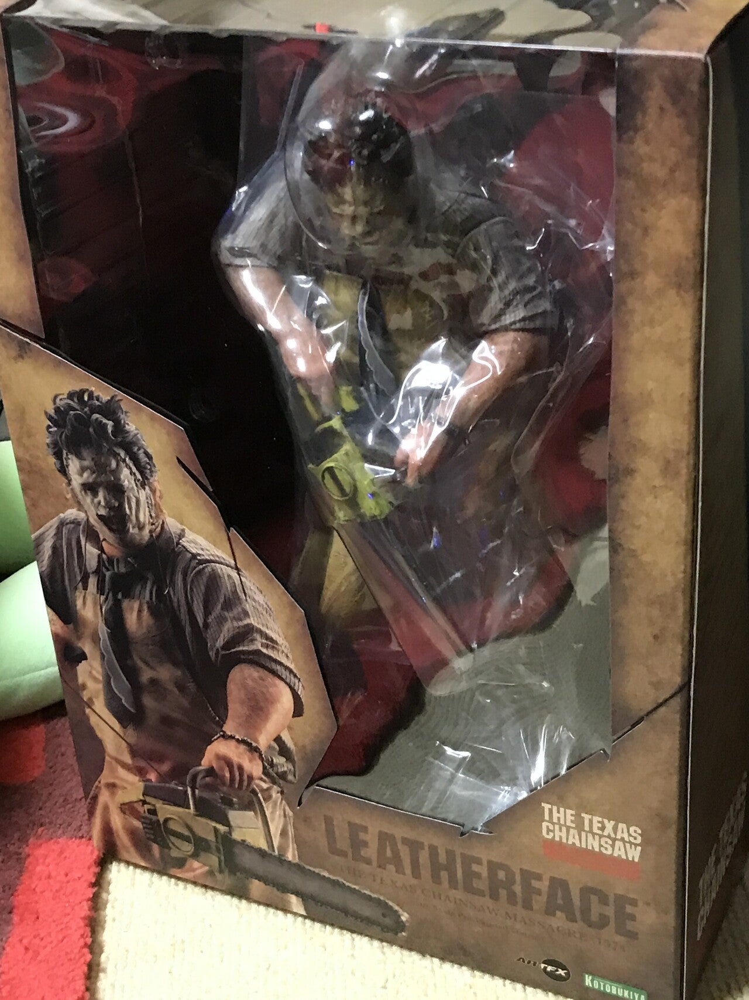

<figure>

</figure>

　[コトブキヤのARTFXシリーズ](https://www.kotobukiya.co.jp/product-series/artfx/)。1/6スケールの巨大なレザーフェイスのフィギュアが届いた。

　最近どうもこの手のフィギュアを買ってしまいがちである。狭い我が家では置き場にも困るほどのサイズである1/6スケールは、実サイズで全高32cmにもなり、精細な造形とも相まってかなりの迫力だ。

　あまりの巨大さに、届いてから1週間ほど置き場を考えつつ箱に入れたまま放置してあったのだが、いざ開梱して手に持ってみると、ずっしりと重いボディに驚かされる。

　ちょっとスマートな感じで映画『悪魔のいけにえ』の原題『The Texas Chain Saw Massacre』の文字があしらわれたディスプレイプレートに立たせてみると、なんとレザーフェイスの足の裏にマグネットが内蔵されており、スチール製のプレートにピタッと張り付くようになっている。

　よくあるフィギュアのディスプレイスタンドは、スタンド自体がフィギュアを支える構造になっていることが多いが、このレザーフェイスはバランスと重心が秀逸で、簡単に自立することができる。ディスプレイ用のプレートはあくまで安定感を増すための部材のようだ。

　まだ試していないのだが、頭部と左肘は関節により稼働可能で、チェーンソーのスターターロープを引っ張っているようなポージングも可能らしい。また試してみよう。

　映画『悪魔のいけにえ』では、恐怖の館に踏み入った無軌道な若者たちを容赦なく恐怖のどん底に陥れる役目を担っていたレザーフェイス。なぜかその造形に惹かれ、こんな手の混んだフィギュアまで買ってしまう。ホラー映画にはそういう魔力があると思わずにはいられない。

　さて、我が家のホラーフィギュア組も映画、ゲーム入り乱れて徐々に面子が揃ってきた感じである。次はどんな恐ろしいやつが仲間入りするのかちょっと楽しみになってきた。

[https://www.kotobukiya.co.jp/product/product-0000004032/](https://www.kotobukiya.co.jp/product/product-0000004032/)
