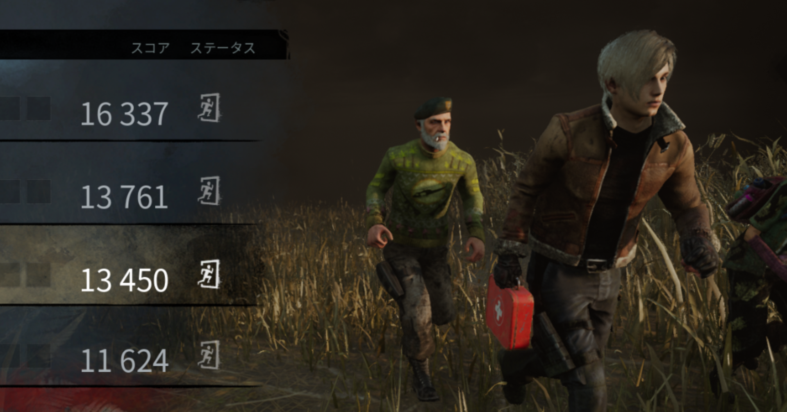
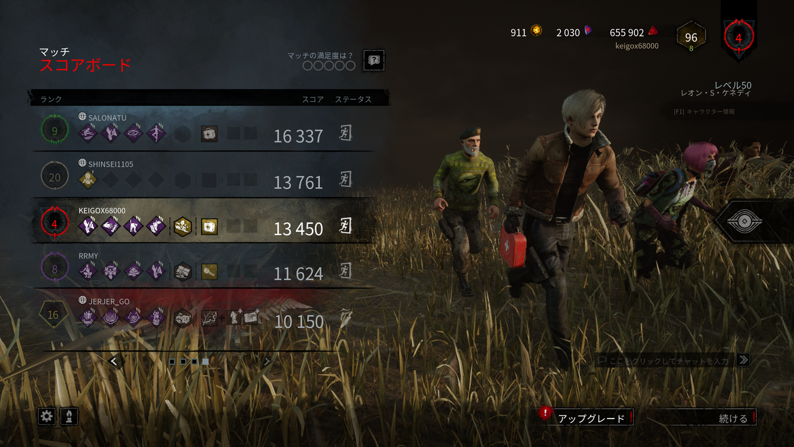
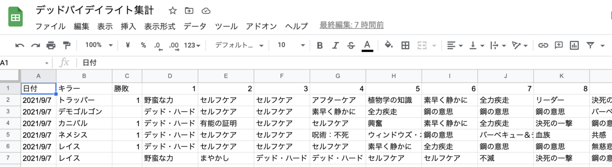

<figure>

</figure>

　以前『デッドバイデイライト』で、あれこれを記録して統計を取っている話をnoteに書いた。

[https://note.com/keigox68000/n/n7188d8446ed9](https://note.com/keigox68000/n/n7188d8446ed9)

　最初の頃はGoogleスプレッドシートを開いたノートPCを目の前に置いて、1ゲーム終わるたびに手入力でゲームの記録を残していた。しかし、この度ようやく（半）自動化した統計プログラムが完成したので、昨日から早速運用している。

　このプログラムはpythonで書いている。ゲームのデータとして収集しているものは大きく4つあって、①生存者の装備しているパーク、②キラーの装備しているパーク、③対戦したキラー、④生存者としてプレイしたときに脱出状況、となっている。

　これらの情報はゲーム終了時にリザルト画面に表示されるため、その画面を画像解析してデータに残していこうというわけだ。なお、データの保存先はGoogleスプレッドシートである。

　プログラムはPコマンドラインから実行する（実際にはVS Codeから実行しているけど）わけだが、そのプログラム自体を2つに分けてある。

　ひとつ目のプログラムは、リザルト画面から必要なパークアイコンの画像をトリミングして保存→保存した画像を機械学習モデルに通して類推→種類ごとにフォルダに振り分け。

　ふたつ目のプログラムは、フォルダに振り分けられた画像の数を数える→Googleスプレッドシートに書き込み。という流れである。

　なぜプログラムを2つに分けてあるかというと、膨大な数のパーク画像の機械学習が十分でなく、今のところ数パーセントの確率で間違いがあるので、一応人間の目で画像を確かめてから数をカウントするためである。それで（半）自動というわけである。

　パーク画像の機械学習はマイクロソフトが提供しているLOBEというソフトを使用している。ベータ版だが無料で使用でき、GUIで画像を読み込ませるだけで簡単に機械学習ができる。

[https://www.lobe.ai/](https://www.lobe.ai/)

　LOBEで学習した結果は、機械学習モデルとしてエクスポートして各種プログラムから利用できる優れもので、今回のプログラムでもこれを利用して画像の推論を行っている。

　で、冒頭に書いたようにようやくGoogleスプレッドシートにデータを記録するところまでできたわけだ。いろいろ苦戦もしたんだけど、その話はまた機会があれば書こうかと思う。

　Googleスプレッドシートに書き込みできれば、あとは表計算の魔術師の本領発揮で集計もグラフ化も自由自在なので、これからデータの解析も行っていこうと思う。

[https://twitter.com/keigox68000/status/1435157644956737537](https://twitter.com/keigox68000/status/1435157644956737537)
