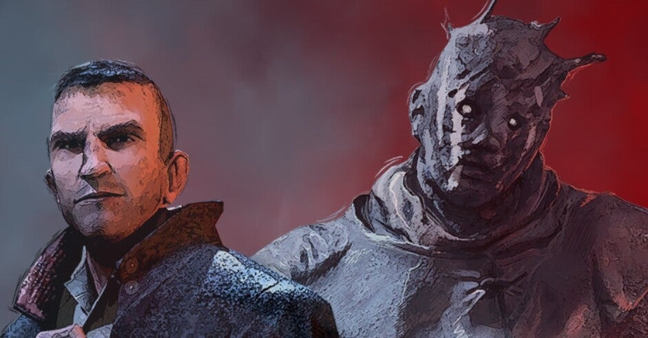
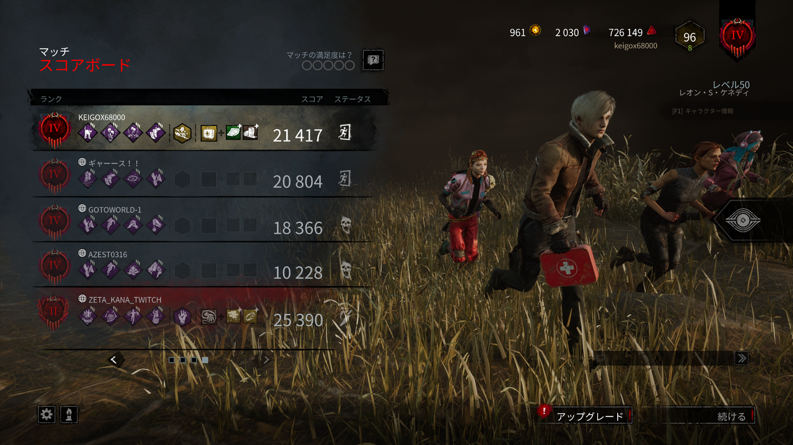
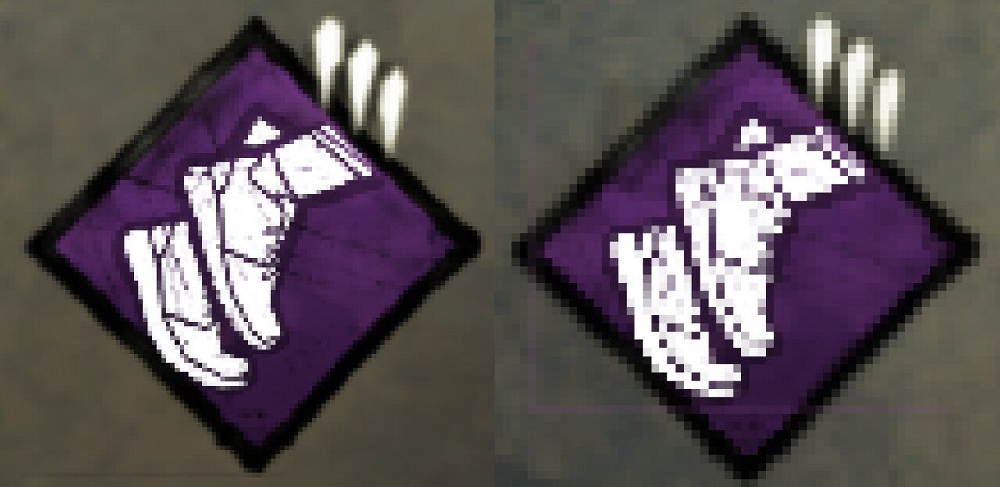

<figure>

</figure>

　朝イチでアップデート直後の『デッドバイデイライト』を遊んでみた。新キラーのセノバイトことピンヘッドに会えるかと思ったからだ。結局セノバイトは来なかったのだが、いきなりゲームの解像度が変わっていて驚いた。（それは後でわかったのだけど）

　ゲームを始めてすぐに、視点を動かす際に少し遅延しているのがわかった。明らかに操作が重い感じがする。アップデートでコントローラーの感度が変わったのかとも思ったが、ゲーム中で確認できない。本当はアップデートで感度の設定とか変わっちゃいけないと思うんだけど、『デッドバイデイライト』は往々にしてそんなトラブルがあるので、そういうこともあり得るかなと思った。

　発電機の修理を始めてみると、スキルチェックがいつもより滑る（思ったところでタイマーの針が止まらない）感じがする。これは、モニターやコントローラーの遅延が大きいと顕著になる現象だ。そもそも我が家の4Kモニターは若干遅延が大きいのだが、それにしてもいつもより滑る感じがする。アップデートでゲーム自体が重くなったのだろうか。

　そんなことを思いつつ、統計を取るためにリザルト画面をキャプチャした。統計プログラムを走らせると、なんとエラーが出る。あ、これは画面描画の何か（デザインとかフォントとか）が変わったなと思った。

　リザルト画面では自分の装備をデータとしてカウントしないために、画面に表示された自分の名前（keigox68000）の場所を画像解析で探しているのだが、これがプログラムで発見できない。もちろん画面に自分の名前は表示されている。

　フォントが変わったのかな？　と思って画像編集ソフトで自分の名前の部分を拡大して見てみる。なんと、明らかに解像度が違うではないか。いつものリザルト画面より、アカウント名の文字がくっきりしているのだ。

　ここに至って解像度が変わっていることに気づいた。我が家のPCは少し力不足で、4Kでゲームをプレイすると重くなるため、設定で少し軽めのグラフィック描画にしてある。これがアップデート後に完全に4Kのフルパワー設定に変わってしまったようだ。

　『デッドバイデイライト』は解像度がいくつ、という風にゲーム内の設定では明示的に指定できない（裏技的に起動オプションからは指定できる）。そのため、ゲームの方でPCのスペックに合わせて適切な解像度に設定してくれる。実は我が家の環境では、なぜか2192 × 1234という中途半端な解像度になっていたのだが、それが今回のアップデートでいきなり4Kに引き上げられていたようだ。

　結局これが、視点移動やスキルチェックで遅延が感じられた理由だった。解像度が上がってゲームが重くなっていたのである。

　原因はわかったのだが、4Kで遊ぶとなるとキャプチャした画像を解析するプログラムは、座標指定の数値を変更しなければならない。いずれそういう日も来るだろうと、4Kになった際の座標にも対応可能なようにプログラムは書いていたのだが、いずれにしても手直しは必要だ。

　もうひとつ。これまで莫大な数のパーク画像を機械学習で認識してきたのだが、コンピュータ的には解像度が変わると別画像として認識するようである。以前に4K解像度のくっきり画像で機械学習したら、低い解像度の画像はほとんど認識できなかった。もし4Kでゲームを続けるなら、あるいはグラボをアップグレードして4K環境が当たり前になったら機械学習はやり直しである。AI判定は本当に前準備が大変だ。

[https://twitter.com/keigox68000/status/1429651735207813123](https://twitter.com/keigox68000/status/1429651735207813123)

　いずれにしても4Kはちょっと重くて快適にゲームができないので、設定でなんとかなるのか見直してみたい。これ直らないと少し厄介だ。

　ゲームの方はアップデートでまたバグが出ているみたいだけど、負けずに遊んでみよう。
