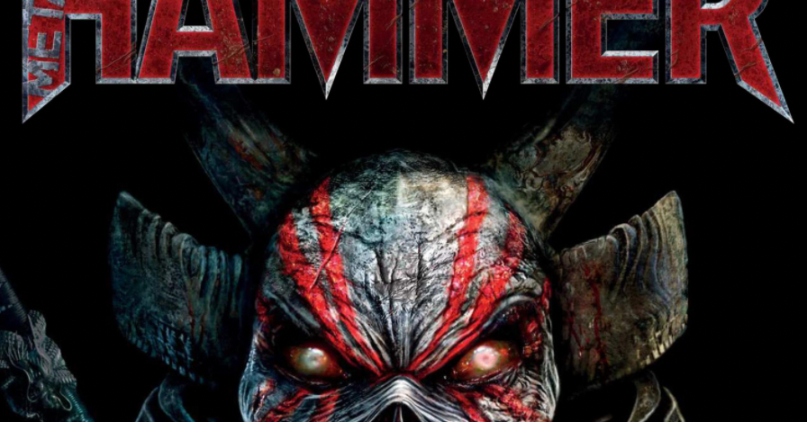

<figure>

</figure>

　少し前に、1年間の予定で『METAL HAMMER』の電子書籍を購読しているのが終わらないという話を書いた。

[https://note.com/keigox68000/n/n1b71d2adda96](https://note.com/keigox68000/n/n1b71d2adda96)

　結論から言うと、その後2ヶ月ほどで定期購読は終わったようだ。余分な支払いも発生していない。一安心だ。

　しかし、定期購読をやめてみると日々のメタル要素がなんか足りないような気がしてくる。実は今年から『BURRN！』誌の定期購読（こっちは紙の雑誌）なんてものも始めてみたりしているのだったが、どうもメタル誌が1種類だと、知識が偏って寂しい気がする。

　特に『METAL HAMMER』は日本人メタルファンの間隔からすると、まったく違う世界のバンドや音楽を紹介しているので、いつも新鮮な気持ちで読めていたのだ。やっぱりまた『METAL HAMMER』を購読したい。そこで、再度『METAL HAMMER』を購入することにした。

　ところが、僕が1年間『METAL HAMMER』を購読している間に、以前『METAL HAMMER』を購入したサイトは閉鎖され、雑誌購読の権利などは別会社のサイトへ移行されることになっていた。（これは冒頭の記事にも書いた）

　雑誌を読むためのアプリには、依然として購読済みの雑誌が届けられていたので問題はなかったのだが、困ったのは新サイトへの移行である。アカウントを新しいサイトで継続して使うためのフォームに必要事項を入力していくと、「以前の購読時にメールに記載されていた8桁のコードを入力しなさい」という箇所が現れる。しかし、そのときのメールは削除してしまったらしく見当たらない。ここで詰まってしまった。どうしよう。

　もうこういうときは仕方ないので、とりあえず先に雑誌を買ってしまえ！　と強引に先に進むことにした。すると、なんと新サイトでは雑誌を読むためのアプリが別のものに更新されていて、それをダウンロードすることで無事に新しく購読を始めた雑誌を入手することができた。

　結果として、同じ雑誌を読むために2種類のアプリを使うこととなってしまったのだが、まあまた読みたかった『METAL HAMMER』を購読できたのでよしとしよう。

　ちなみに『METAL HAMMER』を13冊購読で28ドル。これが実に安いのである。もしかしたら、52ドル出して2年分購読してもよかったかななんて思ってしまった。

　これでしばらくはまた、日本ではあまり情報を得ることができない音楽と出会えそうで嬉しい限りだ。
