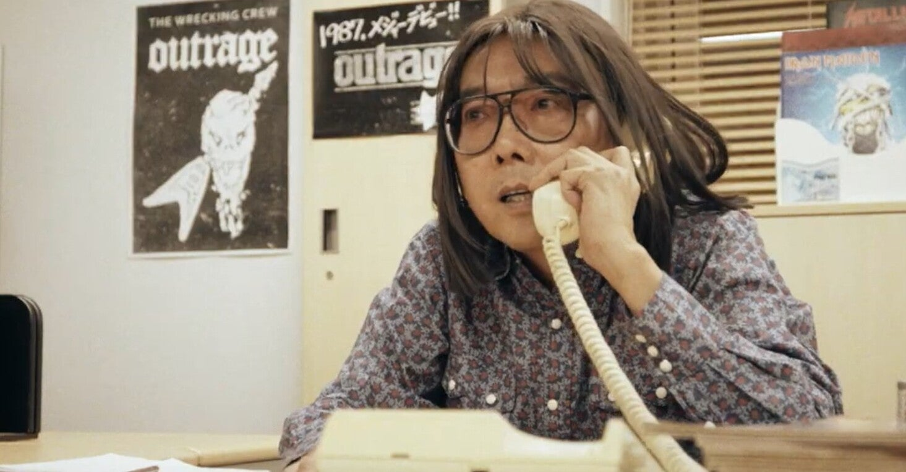
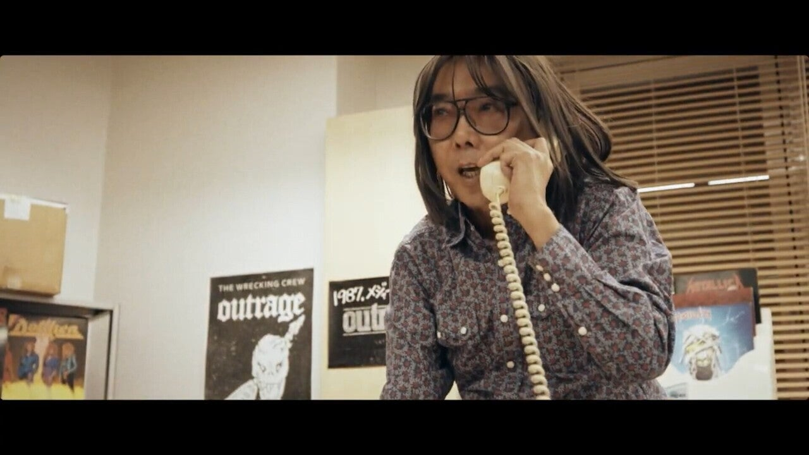

<figure>

</figure>

　OUTRAGEの名盤『The Final Day』。このアルバムが今年で30周年を迎える。

[https://open.spotify.com/album/3SUAR7zSvCZdIXO3DyoywV?si=DE0S8DrLRsyj2GXSKXjJDQ&dl\_branch=1](https://open.spotify.com/album/3SUAR7zSvCZdIXO3DyoywV?si=DE0S8DrLRsyj2GXSKXjJDQ&dl_branch=1)

　もう各種メディアでも情報が流れているが、このアルバムの30周年を記念して『RE:prise〜The Final Day 30th Anniversary』という記念アルバムがリリースされる。

　CD2枚+DVD+ブックレットという豪華な内容の商品だが、CD1枚目の『The Final Day Remix 2021』が素晴らしい。なんとオリジナルアルバムのプロデューサーを務めたステファン・カウフマンによる新リミックスで、あの"My Final Day"をはじめとするヘヴィ＆アグレッシブなサウンドが蘇るのだ。

　YouTubeにその"My Fnal Day"のショートバージョンがアップされていたので早速視聴してみた。

[https://www.youtube.com/watch?v=NbWNRcEEazg](https://www.youtube.com/watch?v=NbWNRcEEazg)

　本当に素晴らしい。原題のテクノロジーで新たにミックスされた同曲は各パートの音がエッジの立ったサウンドに引き上げられ、なおかつそれぞれの楽器とヴォーカルの音は各個に解像感が増してくっきりとした輪郭でその存在を主張してくる。そのおかげで曲全体の生々しさが際立ち、よりライブ感の増したプロデュースになっているようだ。これはアルバム全体を通して聞くのが楽しみである。

　なおCD2は、この『The Final Day』の名曲たちをフルオーケストラで演奏するという、ヘヴィメタルバンドとしては極めて珍しいアプローチの企画盤となっている。いや、名古屋のメタリカと呼ばれるOUTRAGEなら当然の流れと言えるのか。それも地元名古屋の交響楽団が演奏というあたりが実にOUTRAGEらしい。

　そして、ライブ音源をリミックスして初映像化したDVDや、マネージャーによる迫真のレコーディング日記など貴重なブックレット。これだけ豪華な内容で30周年盤を出されると否が応でも期待は高まる。

　発売は少し先になって、10月27日。これはメタルファンとして、OUTRAGEファンとして刮目して待ちたい。同時に、OUTRAGEの歴史を振り返る映画『鋼音色の空の彼方へ』の公開も楽しみだ。（2022年公開）

[https://twitter.com/OUTRAGE\_JAPAN/status/1414419322051522562](https://twitter.com/OUTRAGE_JAPAN/status/1414419322051522562)

　それにしても、"My Fnal Day"ショートバージョンで流れる前述の映画に登場する伊藤政則役がいつ見ても笑いを誘う。

