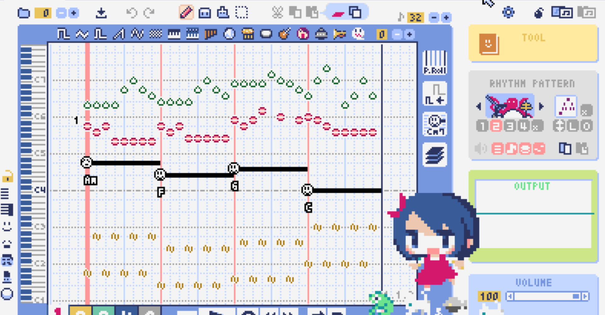

<figure>

</figure>

　『LovelyComposer』は[いちまるまるゲームズ](https://twitter.com/1oo_games)開発の、音楽作成ツールだ。かつて『デザエモン』というゲームを作るソフトがあったが、そんなゲーム機向けのゲームクリエイトソフトに搭載されていた音楽作成ツールにも似た、楽しげなソフトである。

[https://1oogames.itch.io/lovely-composer](https://1oogames.itch.io/lovely-composer)

　開発履歴を見ると、今年の初めぐらいに初期バージョンがichi.toに登場しているようだが、僕がその存在に気づいたのはつい先日である。

　このゲームライクな音楽作成ツールには、いわゆるチップチューン的な音が詰め込まれていて、誰でも簡単に初期の8bitゲーム機のような曲が作れるようになっている。

　自分でもMMLで曲を書いていたのでわかるのだが、後年聞くようになった凝った出音のチップチューンというのは意外に作るのが難しい。PSGのような音を鳴らせばそれでコンテンポラリーなチップチューンサウンドになるかと言えばそんなことはなく、ほどよいテクニックと[DPCM](https://ja.wikipedia.org/wiki/%E5%B7%AE%E5%88%86%E3%83%91%E3%83%AB%E3%82%B9%E7%AC%A6%E5%8F%B7%E5%A4%89%E8%AA%BF)のようなテクノロジーが必要となる。

　そういう小難しいことを取っ払って、あっという間に軽快なチップチューン環境を誰にでも提供してくれるのが、この『LovelyComposer』というわけだ。

[https://twitter.com/keigox68000/status/1436571385657057282](https://twitter.com/keigox68000/status/1436571385657057282)

　『LovelyComposer』はPythonと、そのライブラリであるPyxelで作られている。Pyxelは昨今流行りのドット絵風のゲーム等を作るのに向いたモジュールで、なるほど『LovelyComposer』もそういう8bit風の画面作りになっている。往年のドット絵ゲームを愛するユーザーには、この画面を見ているだけでアピールしてくるものがあるだろう。

[https://note.com/keigox68000/n/n9668c855dffa](https://note.com/keigox68000/n/n9668c855dffa)

　画面を見て分かるが、音楽作成ツールではあるもののただ単に音符を並べる機能を装備しているだけでなく、演奏中には可愛らしいドット絵で描かれたキャラクターが踊っていたり、演奏画面をグリーンバックにして動画編集で映像を合成できたりするような機能も実装されている。

[https://twitter.com/keigox68000/status/1436618316995432448](https://twitter.com/keigox68000/status/1436618316995432448)

　音楽的な機能に目を向けてみると、音色エディタなどはなく、その代わりにシンボリックなアイコンで特徴的な音がすぐ選べるようになっていて、音作りに悩まされることなどなく極めて手軽にサウンドメイキングできる。

　また、音符として発声する以外に、コードとリズムを選択できる専用のパートがあり、これによって簡単にチップチューンっぽいバッキングを鳴らしてくれる。これが秀逸で、コード進行から作曲することが多い僕などは、実にありがたい機能である。リズムの種類やアルペジオのパターンも豊富で、これを選ぶだけでも楽しい。

　早速、ゲームミュージックなどを打ち込んで楽しんでいるが、ツイッター上には「[#LovelyComposer](https://twitter.com/hashtag/LovelyComposer?src=hashtag_click)」のハッシュタグで、ユーザーたちの作った曲が流れてきていて、これを聞くのもまた楽しい。同じソフトを使いながら、作る人によって全然違うサウンドが飛び出てくるのもまた興味深い。

　そんな『LovelyComposer』はBOOTHとitch.toで購入できる。今日現在、前者は980円、後者は9.99USドルだ。僕はitch.toを使っていて、いちまるまるゲームズのゲームがバンドルになっていたのでそちらで購入したが、どちらも同じ内容である。

[https://booth.pm/ja/items/3006558](https://booth.pm/ja/items/3006558)

　DTM的なものをいじるのも久々であったが、DAWが高度化した現在、こういう操作も音作りもお手軽なツールってあまりないため、曲作りへの敷居がすごく低く感じられて好印象だ。曲を作り始めるまでのお手軽さゆえに、ユーザーとしては創作活動そのものに注力できるツールといった印象が持てるソフトである。

　使っていると、便利なショートカット機能などもわかってきて、より軽快な操作感で使えるようになる『LovelyComposer』。ソフトのアップデートも頻繁に行われているようなので、これからも曲を作って遊んでみたいところである。
