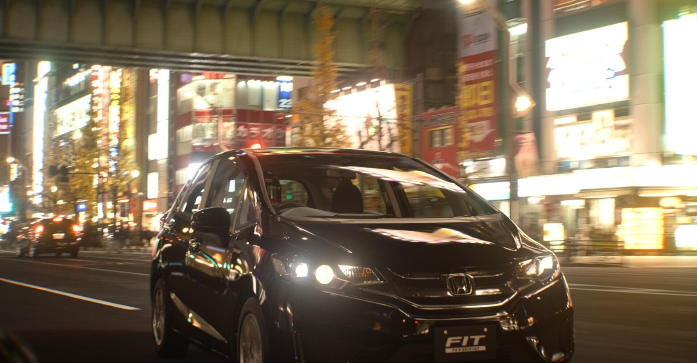

<figure>

</figure>

　今さら『グランツーリスモスポーツ』で遊んでいる。PS4のゲームだがPS5で遊んでいる。

　『グランツーリスモ』はシミュレーションすぎてゲームとして面白くないなんてことを言われるが、そんなことはない。レースあり、ドライビングスクールあり、写真モードありでなかなか楽しめる。

　それでいて、FFとFRの違いなんか画面を通してでもわかるぐらいのリアルな作り込みで本当に面白い。特に、スーパーパワーのレーシングカーではなく、100ps～300psぐらいの身近にある車でそれが試せるのが楽しい。

　個人的にはBGMに配信モードが設定でき、YouTubeなどに動画をアップする際に、ゲームBGMから版権曲を除外してくれるモードがあるのが現代風だなと感じた。

[https://twitter.com/keigox68000/status/1433976429956399106](https://twitter.com/keigox68000/status/1433976429956399106)

　また、世界の美麗な風景をバックに自車の写真を撮影できるスケープスというモードも楽しい。ただ単に写真を撮るだけなのだが、レンズの絞りやシャッター速度、画角と言ったカメラ小僧ならおなじみの要素を指定して撮影できるのがマニアックでいいのだ。

　内容も盛りだくさんで長く楽しめそうな『グランツーリスモスポーツ』なのだが、ひとつだけ困ったことがある。

　それは前述したドライビングスクールが結構難しいのだ。ドライビングスクールでは、設定された課題に沿って、ショートスパンのレーシングテストを行う。ひとつひとつの課題はごく短い時間でクリアできる単純なものだが、その制限時間設定が凄くシビアなのだ。

[https://twitter.com/keigox68000/status/1434418709121028100](https://twitter.com/keigox68000/status/1434418709121028100)

　最初の方の課題こそ調子よくクリアしていたものの、最後の方ではひとつのカーブを曲って十数秒でゴールしろという一見簡単そうなお題も、時間設定のシビアさでクリアできない。

　各課題にはお手本の動画もついていて、いわば答えは明示されているようなものなのだが、動画を見てもそのとおりにはしれない。結果、いつまで経ってもクリアできない状況に陥ってしまうのだ。

　プロの走りは1/1000秒を削り取っていく凄まじいテクニックだと実感させられるのと同時に、あまりに思ったとおりに走れない自分に嫌気が差してきてやがてあきらめてしまう。

　もちろん、ドライビングスクールがクリアできないようでは、この先スーパーパワーのレーシングカーを入手しても自在に操ることはできないのだが、この辺りのシビアさが『グランツーリスモスポーツ』、あるいはシリーズ全体を敷居の高いものとしていると思う。

　そう考えると、『フォルツァホライズン』などは、適当に走らせてくれるので、誰でも景色を楽しみながら車を飛ばすことができるゲームになっていて親しみやすいのかもしれない。

　さて、それでも少しずつ自分のドライビングテクニックを向上させるために今日もドライビングスクールに挑戦してみようか。

[https://www.youtube.com/watch?v=y4GONUknE8A](https://www.youtube.com/watch?v=y4GONUknE8A)
