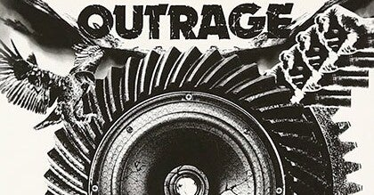

<figure>

</figure>

　僕がメタルを聞き出したのが1989年〜1990年頃。L.A.メタルのバカ騒ぎも去り、MTVでメタルブームの残滓のようなPVがちらほらと流れている。そんな時代であった。

　やがて時代はニルヴァーナの『NEVERMIND』やメタリカの『METALLICA』といったアルバムに牽引され、グランジ、ヘヴィネス、グルーヴといったキーワードが支配するダークな音楽観が支配的になっていく。

　そんな中で僕はアウトレイジというバンドに出会う。初めて体験した彼らのアルバムは2nd『BLIND TO REALITY』。1stアルバムとも合わせて聞いたが、正直ピンと来なかった。もともとイングヴェイ・マルムスティーンやレインボーからメタルに入ったメロディ＆クラシカル至上主義の僕は、スラッシュメタルにまったくの適性がなかったのだ。

[https://open.spotify.com/album/2DNDxgW8rs0tzqgkOZ3r5X?si=KMVQrYoiTAebid9xWlMzzg&dl\_branch=1](https://open.spotify.com/album/2DNDxgW8rs0tzqgkOZ3r5X?si=KMVQrYoiTAebid9xWlMzzg&dl_branch=1)

　もちろん今聞けばアウトレイジのサウンドが純然たるスラッシュメタル以外にもNWOBHMなどの影響下にあることは理解できるのだが、いかんせん経験を積んでいない僕の耳では、アウトレイジのよさを理解することができなかった。それでそのときはあまり聴き込むこともなく、それ以上このバンドについて掘り下げることもなく終わってしまった。

　その後、2009年に開催されたラウドパークで、本物のアウトレイジを間近に見る機会ができる。20年近くずっと興味を持っていなかったアウトレイジの演奏を実際に聞いてぶっ飛んだ。こんなかっこいいバンドだったんだ！　"My Final Day"すごい曲じゃないか！　実に単純である。

[https://keigox68000.hatenablog.com/entry/20091018/p1](https://keigox68000.hatenablog.com/entry/20091018/p1)

　しかしこれは、アウトレイジというバンドが本物のライブバンドであることの証であろう。演奏を聞いてぶっ飛んでファンになるというのは、ロックにおいては、バンドとリスナーのある意味理想的な出会いである。

　自分自身について言えば（その当時）20年間飽きもせず、メタルを探求してきた結果経験値が積み重なり、いいタイミングでアウトレイジのライブ演奏と出会えたということだ。まさに僥倖。

　そんな感じで大いに僕のメタル脳を刺激したアウトレイジであるが、昨年リリースしたアルバム『RUN RIOT』が極めてメタル純度の高い傑作アルバムであったことはすでにnoteにも書いた。

[https://note.com/keigox68000/n/n24084a873873](https://note.com/keigox68000/n/n24084a873873)

　アウトレイジのデビューから20年経ってようやくそのよさを理解し、そしてさらにまたそこから10年を経てニューアルバムに打ちのめされる。こんな風に何十年もかけて再評価できるバンドというのはなかなかに稀なのではないだろうか。

　バンドとリスナーの出会いというのは実に微妙で繊細なものだ。バンドの目指す音楽性と、ファンの求めるサウンドの形が理想的なタイミングでエンカウントしなければそのバンドの音楽に入れ込むことはできない。

　で、最近『RE:prise〜The Final Day 30th Anniversary』がリリースされるということで、初心に帰ってアウトレイジのアルバムを聞き返そうと思っている。早速試しに1stを聞いてみたのだが……かっこいいじゃん！

[https://open.spotify.com/album/48aoLFGVREcNahFQ6WG6jf?si=Wscliu3vQHuV1stGwelvzg&dl\_branch=1](https://open.spotify.com/album/48aoLFGVREcNahFQ6WG6jf?si=Wscliu3vQHuV1stGwelvzg&dl_branch=1)

　今さらながら、1stアルバムでこの完成度はすごいじゃないか。タイトな演奏と叩きつけるようなアグレッシブさ。そしてどこかメタリカを思わせるようなバッキングとヴォーカルのコンビネーション。確かにこれは高い評価を受けるのはわかる気がする。しかしこれはメタリカじゃない。アウトレイジだ。

　かくして、これからアウトレイジのアルバムを聞き返す日々が始まるのである。
