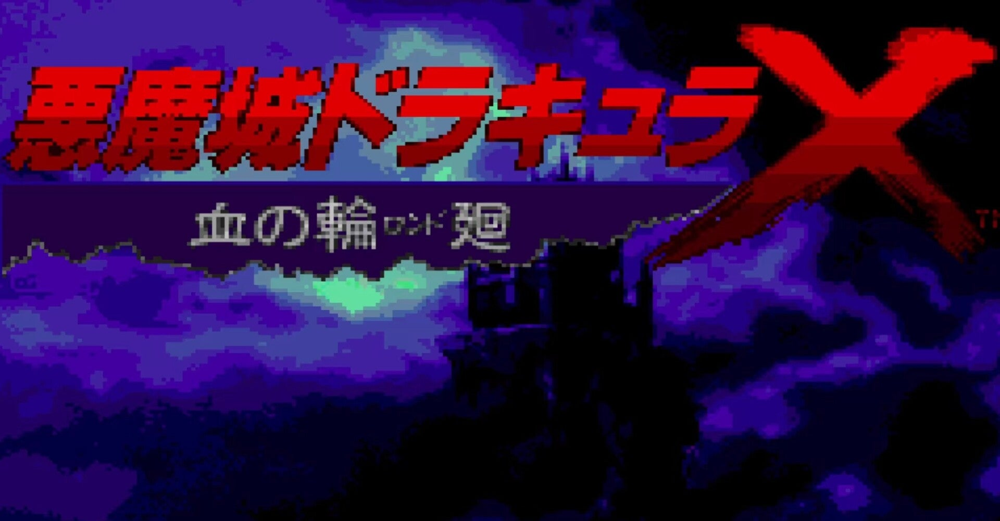
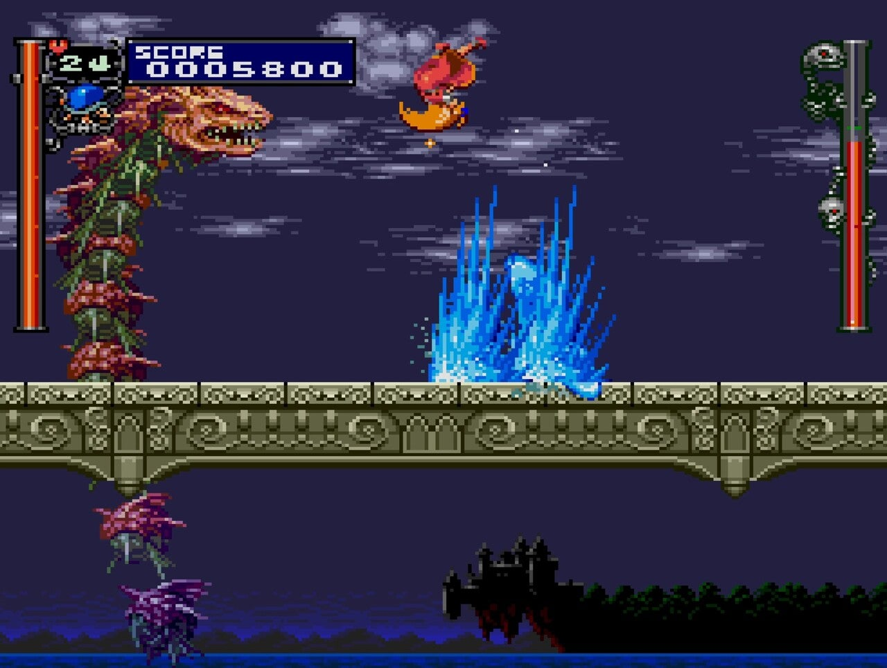
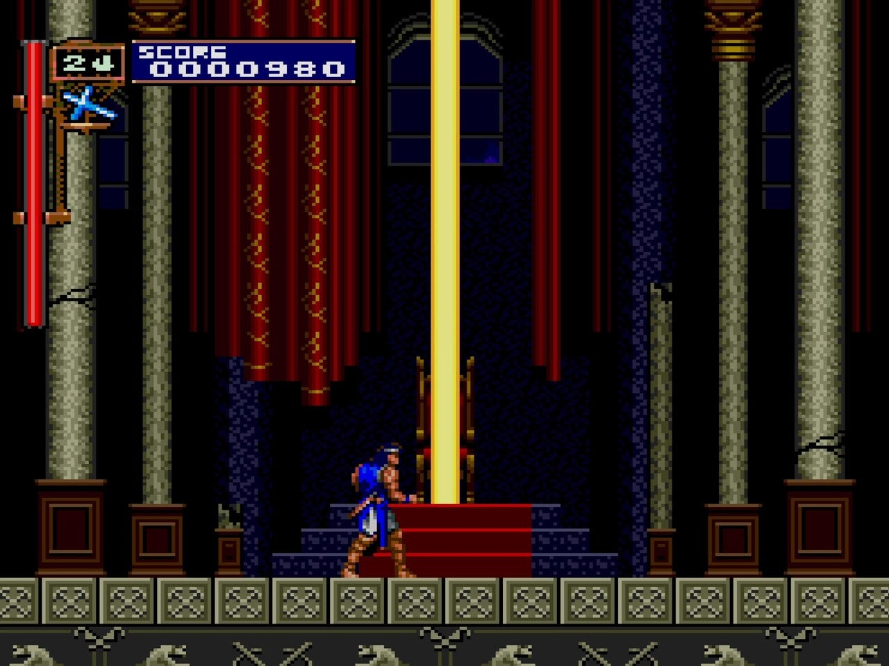

<figure>

</figure>

　この連休は『悪魔城ドラキュラX 血の輪廻』を遊んでいた。PS4用に発売されているソフトで、PCエンジンの表題作と、PSなどでリリースされていた『月下の夜想曲』がセットになっている移植版だ。

[https://www.konami.com/games/castlevania/jp/ja/page/history\_2018\_x\_son\_rob](https://www.konami.com/games/castlevania/jp/ja/page/history_2018_x_son_rob)

　PCエンジン版の『ドラキュラX』はPCエンジン後期に発売されたせいなのか、出荷本数が少なかったのかわからないが、長らく幻のソフトとして扱われていた。中古市場でも高い価格がつけられていた。

　それがPSPやWiiのバーチャルコンソールに移植されたことで遊びやすくなった。今では、こうしてPS4版も出ているためPS5でも遊ぶことができる。

　『悪魔城ドラキュラ』シリーズは、「メトロイドヴァニア」などというゲームジャンルを生み出したように、ファミコンの『ドラキュラII』辺りから広大な悪魔城を探索するタイプのゲームに進化した。

　しかし、そんなシリーズの中で『悪魔城ドラキュラX』は初代『悪魔城ドラキュラ』のステージクリア型の精神を受け継いだ、今となってはシリーズの中でも貴重なタイプの作品である。ゲーム中に簡単なコース分岐があるものの、基本は道中の敵の配置を覚え、ボスの攻略法を見つけて撃破する、反復練習が有効なゲーム性になっている。

　個人的には探索型の莫大な時間のかかるタイプの『悪魔城ドラキュラ』シリーズより、こちらのステージクリア型の方が好きだ。もともとアーケードゲームで育った僕としては、こういう自分のスキルを上げてクリアするようなゲームシステムが好きなのだ。この手のステージクリア型悪魔城ドラキュラとしては、メガドラ用の『ヴァンパイアキラー』があるが、あちらも名作の呼び声高いゲームである。　

　さて、『悪魔城ドラキュラX』であるが、自分操作するキャラクターはリヒターとマリアという2人が用意されている。リヒターは、初代『悪魔城ドラキュラ』の主人公シモンと同じく、ムチを装備したヴァンパイアハンターだ。操作もファミコン版とほぼ同じである。

　一方マリアは、ゲーム中で捉えられているのも助けないと使えるようにならない。姿かたちはかわいらしい女の子のデザインとなっているキャラクターだが、実は2段ジャンプ、2発撃てる鳩攻撃、爆速スライディングと、リヒターよりずっと性能の優れたキャラクターなのだ。

　つまり、リヒターでクリアが難しいときはマリアを使うとゲーム自体がイージーモードになるという仕掛けである。この辺り、PCエンジンらしいアニメーションが搭載された『悪魔城ドラキュラX』のデザインと合わせて、当時のアニメ等メディアの影響下にあるゲームデザインと言えるだろう。

　PCエンジンではCD-ROM媒体で供給されていたゲームゆえ、BGMも過去作のアレンジ等を織り交ぜてシンセサイザー演奏による豪華な音源が使われている。同時に、前述したようにアニメーションによる演出がふんだんに取り入れられていて、PCエンジンらしいというか、当時の時代性を感じさせる。

　しかし、それでいてゲーム自体は純粋なアクションゲームとして優れていて、どんなに困難と思われる局面も、繰り返しプレイすることでその打開策が見えてきて、やがてクリアできるようになるという理想的なアクションゲームのレベルデザインがなされている。

　冒頭にも書いたように、このゲーム自体がレアな存在だったため、僕がプレイしたのもだいぶ時間が経ってからだったが、当時その完成度の高さに驚かされたものだ。そして、今プレイしてもそのプレイ感にはなんら遜色ない。昔のコナミのゲーム開発力には舌を巻くばかりである。

　さて、連休を使って一応クリアした『悪魔城ドラキュラX』だが、もう少し遊んで1CCを目指してみたい。そう思わせる魅力がこのゲームにはあることを再確認したというわけだ。

　発売から30年が経とうとしている『悪魔城ドラキュラX』だが、今だにこの高い完成度を誇るゲームがプレイできることに感謝したい。

[https://www.youtube.com/watch?v=Qn6rtECF4fM](https://www.youtube.com/watch?v=Qn6rtECF4fM)
