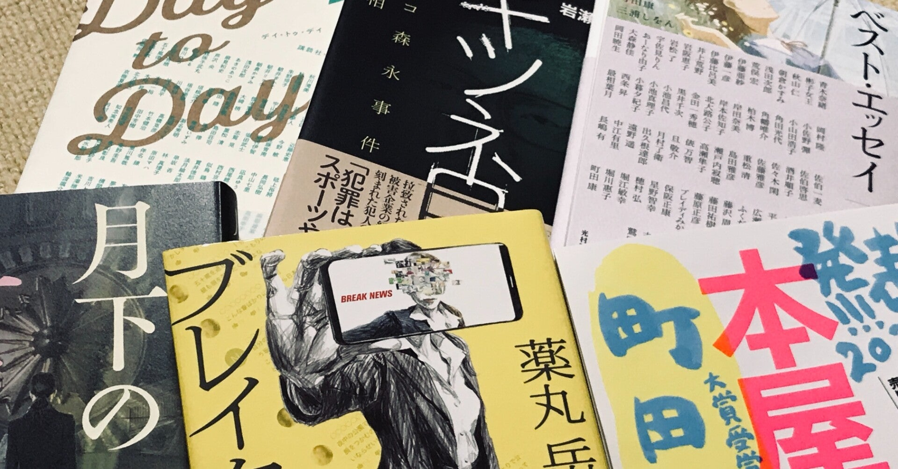

<figure>

</figure>

　久々に本を買ってきた……久々？　まあ、いいか。

　この前買った本もあるし、電子書籍で買っている本もあるのだけど例によって読むのは追いついていない。いや、そんなことは気にしない。今回買った本を紹介していこう。

## Day to Day / 講談社 (編集)

　2020年からの大変な状況の中で100人の作家がそれぞれの思いを胸に書き上げた物語とエッセイ。コミック版（上下巻）もあって、そちらとセットの豪華版も魅力的だけど漫画は読まないかな……と思って文章だけ。

[https://www.amazon.co.jp/dp/406521842X](https://www.amazon.co.jp/dp/406521842X)

## キツネ目　グリコ森永事件全真相 / 岩瀬達哉 (著) 

　1984年〜85年に日本を騒がせた食品会社脅迫事件を描いたドキュメント作品。今思うとすごい事件だった。

[https://www.amazon.co.jp/dp/B08Y8N97DJ](https://www.amazon.co.jp/dp/B08Y8N97DJ)

## ベスト・エッセイ2021 / 日本文藝家協会 (著)

　ここ数年毎年買っているエッセイ集。多岐にわたる作家の、バラエティに富んだ随筆作品が読めるのがすごく楽しいのだ。今年は表紙も美しくていい。

[https://www.amazon.co.jp/dp/4813803709](https://www.amazon.co.jp/dp/4813803709)

## 月下のサクラ / 柚月裕子 (著)

　柚月裕子の警察小説には真実に肉薄する力があると思う。今作はどんな緊張感あふれる作品に仕上がっているのか。読むのが楽しみ。

[https://www.amazon.co.jp/dp/B092J6B84X](https://www.amazon.co.jp/dp/B092J6B84X)

## ブレイクニュース / 薬丸 岳 (著)

　ユーチューブで最新ニュース、社会問題を扱ったチャンネルの配信者を中心とした物語。世の中にあふれるコンテンポラリーな話題を盛り込んでリアリティーを持って語られる現代風社会派小説。

[https://www.amazon.co.jp/dp/4087717526](https://www.amazon.co.jp/dp/4087717526)

## 本屋大賞2021 (本の雑誌増刊) / 本の雑誌編集部 (編集)

　本屋大賞にはあまり積極的な興味関心はないのだが（読まないわけではない）、結局今年の本屋大賞ってどんな感じだったの？　という辺りをリサーチしたくて購入。

[https://www.amazon.co.jp/dp/4860114582](https://www.amazon.co.jp/dp/4860114582)

　さて、読書の秋。がんばって読むぞ！
