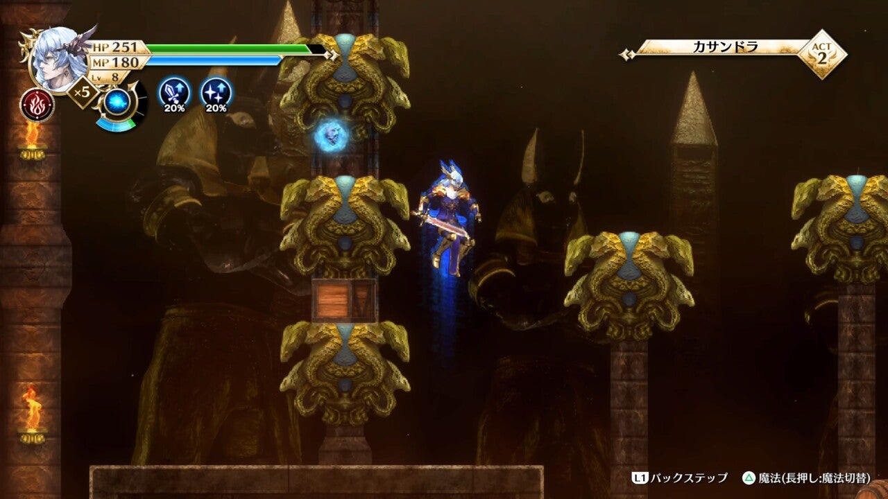

<figure>

</figure>

　朝起きたら『アクトレイザー』の新作、いやリメイクが発売になっていた。そんな感じの1日の始まりであった。

　寝耳に水という感じで発表された『アクトレイザー・ルネサンス』。第一印象は、『Getting Over It』みたいな質感のアクトレイザーが出てきちゃったなーという感じだった。正直グラフィックのクォリティはあまり高い感じではない。

　しかしそれでもオフィシャルサイトを調べてみると、古代祐三自らアレンジしたというBGMは悪くない。最初のステージのBGM"フィルモア"はやっぱりオケアレンジよりギターだよなという感じで、この辺のニュアンスが作曲者自らアレンジした強みか。

　実はもうこの辺りで買う気満々だったのだが、一応落ち着いてゲーム内容も調べてみた。オリジナルのゲーム性を極力尊重しながら、プレイヤーが操作する「神」は新たなアクションが加わって、より攻略の幅が広がったようだ。

　さらに街を育成するクリエイションパートでは、ときおり魔物の大群が攻め込んできて、これを砦で迎え撃つタワーディフェンス要素が取り入れられているようだ。

　よし、買ってみよう。鬼が出るか蛇が出るか。

　早速プレイしてみると、なるほど「神」の操作にジャンプ上方攻撃、飛び降りからの下方攻撃、バックステップ、三連コンボなどが加わり、極めて軽快な操作感だ。しかも当たり判定が強く、あれだけノックバックにイライラさせられた『アクトレイザー』はほぼ皆無であった。

　マップも敵もオリジナルに準じた作りなのだが、圧倒的に「神」当たり判定が強力で、適当に攻撃に行ってもだいたいはこちらが勝てる。はっきり言って爽快だ。『アクトレイザー』のアクションパートは敵との当たり判定が渋くて、無駄な動きが即ダメージにつながっていたのだが、それがほとんどない。

　しかも、アクションパートの中盤とボス前（なんと2ヶ所も！）には体力が回復するチェックポイントもあり、もういたれりつくせりだ。ほとんど接待に近い作りになっている。

　ついでに言えば、オリジナルでもそれなりに強かった（でも使い方が難しい）魔法が、これまた超強力になっていて、まさに神の軌跡という感じにグレードアップしているのである。しかも、ボスへたどり着くまでの道中にゴロゴロ落ちている宝石みたいなのを集めまくると、攻撃力も魔法もパワーアップして、最後には死んだときにその場復活のおまけ付きだ。こんなにサービスよくていいのかね。

　それじゃあゲームが簡単になってつまらないだろう、という意見もあるかもしれないが、さにあらず。あの単調で作業的だったクリエイションパートには、いかにも現代的ゲームらしい会話イベントが豊富に盛り込まれ、なかなか楽しめるストーリーが展開される。

　あわせて、おまけ的なタワーディフェンスである。実はこれが今回の『アクトレイザー』で一番手強いのかもしれない。天使を操作して、魔物を倒す単調な作業は残されているが、定期的に現れる魔物の大群を、砦と仲間にしたキャラクターで迎撃するモードは一筋縄ではいかない。アクションパートのボスはすべて初見（厳密には昔戦っているから初見ではないんだけど）で倒せるのに、タワーディフェンス部分は何回もゲームオーバーになる始末だ。

　という感じで、古くて新しい『アクトレイザー』は、総合的に見て面白い。ついつい熱中してまる1日遊んでしまった。スマホ用にもリリースされると聞いたのと、前述したちょっとチープなグラフィックで、勝手にしょうもないレトロブーム乗った移植と思ってしまうところだったが、プレイしてみると昔の『アクトレイザー』をお手軽に楽しめる感じで良移植だった。

　久々に古代祐三節を楽しみながら「神」プレイに興じるのもいいものだ。

[https://www.youtube.com/watch?v=t3ii56nUEFQ&list=PLRaOuSqti\_z81yI0nLqhKLQA2Bj5B67fl&index=13](https://www.youtube.com/watch?v=t3ii56nUEFQ&list=PLRaOuSqti_z81yI0nLqhKLQA2Bj5B67fl&index=13)
