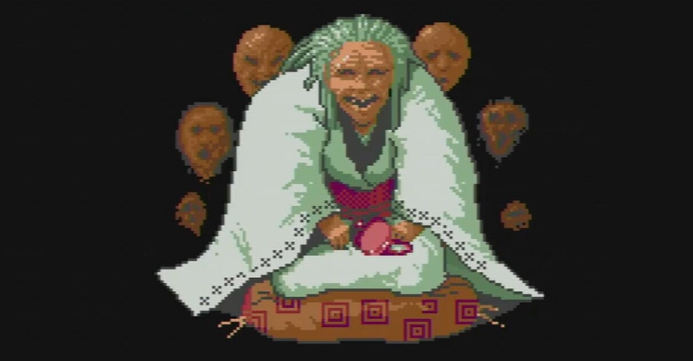

<figure>

</figure>

　アーケードアーカイブスで『ゼビウス』と『パックマン』が配信され、界隈が盛り上がっている。みんな『ゼビウス』と『パックマン』がやりたかったということではなく、ナムコがアーケードアーカイブスに参入したところに嬉しさがあるということだろう。

　しかし、これまでもナムコは過去のゲームをリリースすると言っては、『ゼビウス』『ギャラガ』『パックマン』辺りを出してはい、終わりみたいなことが多かった。

　かつてプレイステーションでナムコミュージアムという偉大な復刻作品を出しておきながら、それ以降ビジネスにならないのか、根気のあるディレクターがいないのか、とにかく有名タイトルをいくつかリリースしてお茶を濁して終了という印象が強い。

　しかし今回は、かなりマニアックなラインナップまでディグすることで話題になっているアーケードアーカイブスだ。これは期待できるのではないだろうか。

　実際、『ゼビウス』と『パックマン』が任天堂スイッチ用にリリースされた直後に『源平討魔伝』のリリースが発表された。『源平討魔伝』の移植は全然初めてではないが、でもこれまでのいい加減なレトロタイトル復刻とは違って期待が持てる感じはある。

　あれ出してほしい、これ出してほしいって言い出すとキリがないのだが、個人的には『モトス』『バラデューク』にステージセレクトをつけて復刻してほしいところだ。期待して待とう。

[https://www.youtube.com/watch?v=QRCe373hlNw&list=PLRaOuSqti\_z9ZjYueeg\_IH1PMIp00VYjd&index=5](https://www.youtube.com/watch?v=QRCe373hlNw&list=PLRaOuSqti_z9ZjYueeg_IH1PMIp00VYjd&index=5)
