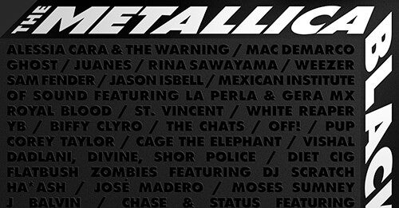

<figure>

</figure>

　今や名実ともに世界一のメタルバンド、いやロックバンドとなったメタリカ。つい先日、彼らの楽曲を様々なアーティストがカヴァーしているアルバムが発売された。

　その名も『METALLICA BLACKLIST』。そう、単にメタリカのカヴァーアルバムというだけでなく、メタリカのブラックアルバムこと『METALLICA』の楽曲に絞ってカヴァーしているのだ。

　単一アルバムをテーマにカヴァーなんて、もうそれだけでやりすぎじゃないかって感じがするのだが、それをなんと53組のアーティストが参加してカヴァーしているのだからすごいを通り越して呆れてしまう。

[https://open.spotify.com/album/7N32mF0BlA3BOhlSyCiHgf?si=gvGkfFkNT565DesZy6kK\_g&dl\_branch=1](https://open.spotify.com/album/7N32mF0BlA3BOhlSyCiHgf?si=gvGkfFkNT565DesZy6kK_g&dl_branch=1)

　元のアルバムに53曲も収録されているわけはなく、当然同じ曲を何組ものバンドがカヴァーする結果となっている。アルバムの1曲目から6曲目が全部"Enter Sandman"だ。何だこのアルバム。

　最早オールドスクールなメタルの範疇には収まらないメタリカ。それをカヴァーするバンドも多岐にわたっていて、正直音楽的嗜好の狭い僕なんか知らないバンドがいくつもある。

　それでも延々と"Enter Sandman"を聞いてみた。そして延々と"Sad But True"を聞いてみた。その辺で飽きた。確かにメタリカの『METALLICA』は歴史に残る名盤だと思う。しかしそれは、彼らがあの時代にあのサウンドでアルバムを発表したからこその名盤であり、それをみんなでこぞってカヴァーしても（多少の面白みはあるが）特段新発見があるようなカヴァーアルバムになるわけではないのだ。

　というか、そもそもカヴァーアルバム自体がそれほど魅力的な企画ではないな。あくまでお遊び。ファンアイテムだ。そうなってくると、この『METALLICA』のカヴァー集はちょっと退屈だ。興味のないバンドがみんなでこぞって同じ曲やっても正直どう反応すればいいの？　って感じではある。それを53組のバンドを集めてやってしまうとは……企画した方もよくぞこんなバカバカしいことを考えたものだ。

　まあ、アルバム『METALLICA』が30周年ということもあるので、そのお祭りとして考えればいいのだが、メタリカぐらいのバンドともなると、そんなお祭り、お遊びのスケールもデカいということだ。いやはや、まいったアルバムである。
