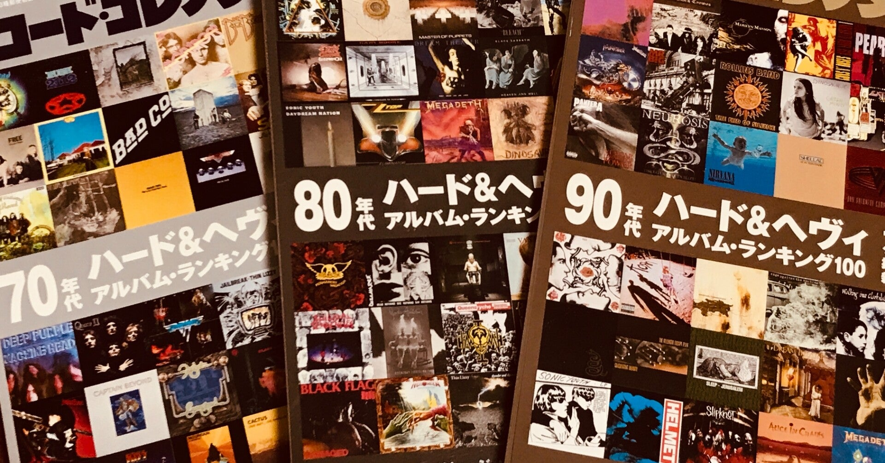

<figure>

</figure>

　雑誌『レコード・コレクターズ』は、同じネタを繰り返し特集する雑誌だ。古いロック、特にハードロックやプログレについて度々掲載されるのでときどき買う。

　何十年も代わり映えしない感じの『レコード・コレクターズ』だが、そんな感じなので、ディスクユニオンとかに行くと古本でいっぱい並んでいる。雑誌の背中に特集されているバンド名が書かれているので、それをみて100円とか200円で売られている『レコード・コレクターズ』を買ったりする。

　いつディスクユニオンへ行っても、必ず何冊かの『レコード・コレクターズ』が置いてあるので、きっとそれだけ買っている人も（売る人も）多い雑誌なのだろう。1冊あたりの値段がものすごく安くなっているのも納得できる。

　そんな『レコード・コレクターズ』が、ここ3ヶ月で持ち出してきたのが70年代、80年代、90年代のハード＆ヘヴィアルバムランキング100という企画である。

　だいたい、コレクター的に、マニア的に音楽を聞いている人はこの手の特集が好きだ。アーカイブされた過去の名作をたぐり、再発見と新発見を求めてカタログのように編集された誌面を追いながら過去の名作を聞くのである。

　リスナー側にしても、最近はストリーミングサービスで大量の音楽を好きなときに聞くことができるので、この手の数に物を言わせた特集に対応する態勢はできている。雑誌片手につまみ食いのように過去の名曲を聞けばいいのだ。

　ある意味、今という時代の音楽聴視環境と、半世紀を数えるハードロックの歴史が合致したいいタイミングとも言える。昔ながらの人に言わせれば、レコードのジャケットが……、音楽の聞き方が……といろいろ物申したいところもあるだろうが、まずはたくさんの音楽に触れるということが大事なんじゃないだろうか。そう思っている。

　さて、これまでの同じようなバンドのネタを繰り返してきた『レコード・コレクターズ』だが、ここへ来て過去作のカタログ的特集という新たな一手を打ってきた。果たしてこういう形の特集自体が、また繰り返すネタと化すに違いない。今後が楽しみである。

　ところで来月は00年代ハード＆ヘヴィの特集なのだろうか。それも楽しみだ。
