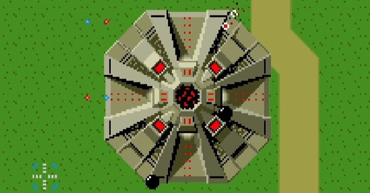
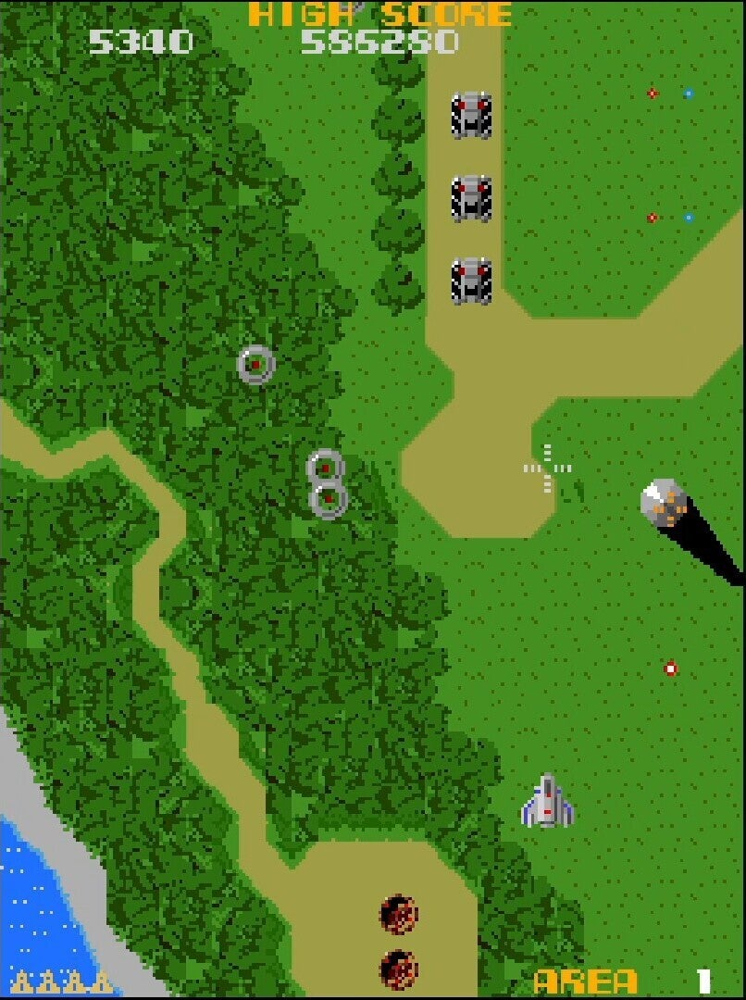

<figure>

</figure>

　任天堂スイッチのアーケードアーカイブスで『ゼビウス』が発売になったので、久々に遊んでいた。本当はPS5で買おうと思っていたのだが、わずかな発売日の差が待てずに買ってしまった。実を言えばそれだけ『ゼビウス』好きだということだ。

　プレイしてみて、発売から40年が経つこの作品の持つ色褪せぬ未来感のようなものに再び感心していた。

　僕が『ゼビウス』に感じるこの未来感の根拠は自分ではわかっているつもりだ。ひとつは、透明感あふれるサウンドで奏でられるミニマルなBGM。細野晴臣がこのサウンドを使って世界初のゲームミュージックサントラを作り上げたのは言うまでもないが、なるほど、テクノと『ゼビウス』の幾何学を音楽に仕立て上げたようなサウンドは実に親和性が高い。

　もうひとつは、シルバーとグリーン、それから明滅する赤いインジケータを基調とした硬質感あふれるグラフィックの妙だ。そして、これらのグラフィックは小さいながらも精緻なアニメーションを施すことで、そこにあるオブジェクトが実在するマシンのように胎動しているのが伝わってくる。

　こういうものが合わさって、『ゼビウス』は僕に果てしない未来感を与えてくれるのだ。

　おそらく40年経っても同じ思いが沸き起こってくるということは、この『ゼビウス』に触れたときの鮮烈な印象は永遠のものであるに違いない。本当にインパクトのあるゲーム体験だ。

　長い間、『ゼビウス』の作者として語られた遠藤雅伸は、とある事件以降すっかりネットで見かけなくなってしまったが、彼のデザインしたゲームのベースの部分はもちろんあるだろう。しかしそれ以上に、このゲームのサウンドとグラフィックが我々にアピールしてくる要素には力強いものがある。

　単に『ゼビウス』がSF的なバックボーンを持っていたからここまで歴史に残る記念碑的作品になったというわけではなく、それを視覚と聴覚の両面から支えている、デザイナーとコンポーザーの力が大きいことは言うまでもないだろう。

　久々に遊んでみただけでそんなことを感じられるゲーム『ゼビウス』。今でもものすごいポテンシャルを秘めていることは間違いない。その重みに、いちゲーマーとして圧倒されるばかりである。

[https://www.youtube.com/watch?v=lqf8V9I8Wyw](https://www.youtube.com/watch?v=lqf8V9I8Wyw)
