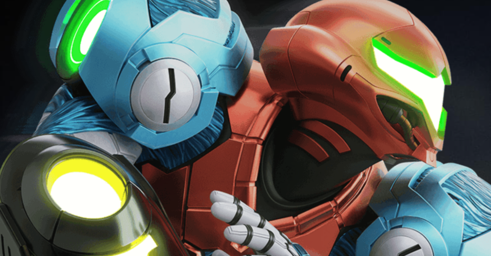

<figure>

</figure>

　あと数日で任天堂スイッチ用の新作『メトロイドドレッド』が発売となる。ドレッドの名の通り、恐怖を軸とした演出が強化された『メトロイド』ということのようだ。

　『メトロイド』は好きなゲームであるが、個人的にはその後TPS、FPSに進化したGC〜Wiiの頃の『メトロイドプライム』シリーズも好きだった。それが任天堂スイッチの新作では、再び2D作品に戻ってしまうような印象を持ってちょっと戸惑った。

　しかし、心配することはない。思い返してみれば数年前に任天堂は『メトロイドプライム4』の開発を発表している。おそらく3Dの『メトロイド』も同時にシリーズ進行していくのだろう。

　さて、『メトロイドドレッド』だ。ゲームの紹介動画を見る限りでは、かなりスピード感のあるアクションが取り入れられ、パワーアップした武器はド派手な演出とともに並み居る敵を殲滅している。果たしてこれは自分の手に負える操作なのか心配になるぐらいだ。

　それよりも、狭い通路を進み、特殊な鍵でロックされた扉を開き、待ち受けるボスと戦うサイドビューの画面になんだか懐かしさを覚える。ファミコンの『メトロイド』に始まり、スーファミの名作『スーパーメトロイド』、GBAの『メトロイドフュージョン』や『メトロイドゼロミッション』など、『メトロイド』シリーズの中核をなしていたのはおしなべてサイドビューの迷路探索型ゲームだ。

　任天堂が新作で後年展開されたプライムシリーズではなく、伝統のサイドビュー、迷路探索型の作品をリリースしてきたことにちょっと驚いた。正直に言えば、今更という気持ちがないでもない。

　というのも、この手の迷路探索型ゲームは、今やインディーズを中心に世の中にあふれかえっている。俗に言う「メトロイドヴァニア」というジャンルのゲームだ。

　メトロイドヴァニア系のゲームについて言えば、ジャンルとしてかなり成熟していて、アイデアもシステムもこなれたものが多い。要するに（実際にどこが開発しているかは別にしても）任天堂のような大メーカーが作っていなくてもかなり遊べる、クォリティの高いゲームが多く見られる。

　そういう中で、あえて任天堂が2D『メトロイド』の新作を出すのは非常に興味深い。本家本元がどういう面白さを見せてくれるのか、それをしっかり見極めようではないか。今から発売が楽しみである。

[https://www.youtube.com/watch?v=72ptWMiGQSc](https://www.youtube.com/watch?v=72ptWMiGQSc)
