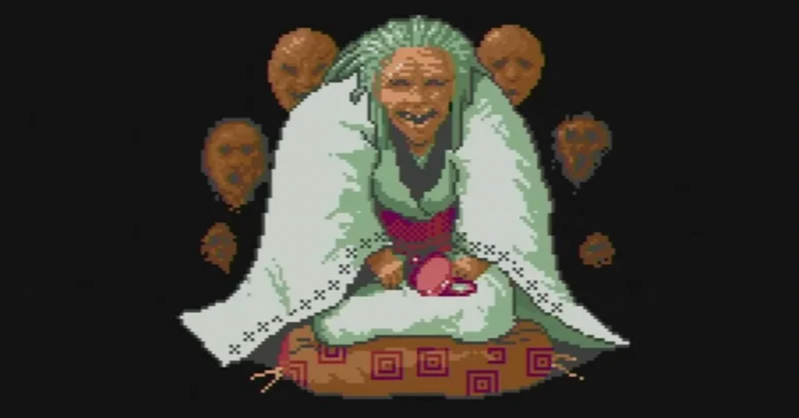

<figure>

</figure>

　気づいたらアーケードアーカイブス『源平討魔伝』の発売日が明日と迫っていた。

　『源平討魔伝』のことを思い出してみると、ゲーセンで稼動当時僕はこのゲームにあまり興味がなかった。あまり明確な理由はないのだが、日本的な装いを持ったアクションゲーム全体において興味を持っていなかった、というぐらいの理由からかもしれない。

　しかし、とある日気まぐれから遊んでみると、これが意外に先に進めるゲームであることがわかった。当時のゲームセンターのゲームというのは難易度の高いものが多く、少ない小遣いからゲーム代を捻出する身としては、ゲームが長持ちする（長時間プレイできる）というのは、ゲームを遊ぶ上で大切な要素のひとつだったのだ。

　『源平討魔伝』は、一見してなんの変哲もない和風アクションゲームに見えたのだが、遊んでみると同じことをやっているようでバラエティに富んだステージ、ビッグモードでのキャラクターの豪快な動き、多彩なルートを通って三種の神器を入手しなければならない展開の豊富さと、様々な要素が絡み合い、なかなか攻略しがいのあるゲームであった。

　しかも弾に当たって即死のシューティングゲームと違い、体力ゲージ制のゲームシステムのおかげで、それなりに遊べるのが魅力だった。そんな理由もあって、すごく熱を入れていたというわけではないが、なんとなく毎日１プレイぐらいしながら、攻略をしていく日々が始まった。

　遊んでみると、三種の神器を入手してラスボスにたどり着くには、いくつかあるルートの分岐を正しく選択しなければならないことがわかった。また、攻略上必ず通らなければならないステージが存在することも見えてきた。

　そうなってくると、やはりゲーマーとしての血が騒ぐのか、攻略のギアが一段アップする。当時ゲームセンターで遊んでいたゲームに、攻略サイトもマップもないが、脳内で記憶しながら正しいルートを絞り込んでいく。その絞り込んだルートの中でも難易度の高いステージは、イメージトレーニングで攻略を練り込んでいく。

　そんな感じで、あるとき三種の神器が揃った状態で、僕の操作する平景清はラスボスである源頼朝の前に立っていた。どんな怒涛の攻撃が繰り出されるのか。果たしてこのラスボスに立ち向かえる攻略が自分に思いつくのか。様々な感情が入り混じって最後の戦いは始まった。

　終わりはあっけなく訪れた。三種の神器が揃った平景清の前にあって、ラスボスの源頼朝は朽ちかけた石膏像よりも脆かった。ほんの数秒の後に砕け散る源頼朝。そして驚く間もなく同様に砕け散る自キャラ平景清。え！？　何が起こったの？　と思う間もなく始まるエンディング。すべてが唐突すぎた。

　道中の攻略に反してあまりにラスボスが弱かった。それが『源平討魔伝』の強烈なイメージである。逆に三種の神器がなければラスボスは倒せない。その辺の演出を強調したかったゆえの結果なのかもしれない。

　いずれにしても、一回クリアできると、その後何回かはコストパフォーマンスの高いゲームと認定されて、繰り返し遊ばれるようになるのが当時のゲームセンターのゲームである。こうして『源平討魔伝』はすっかり僕のお気に入りゲームとなったのだ。

　その後何十年かして『源平討魔伝』の基板も手に入れたが、同様にバーチャルコンソールなど各機種の移植作品も欠かさずに買っている。明日のアーケードアーカイブス版の発売も、あの少年の日々を思い出しながら、ひっそりと期待して待っているのである。

[https://www.youtube.com/watch?v=cY-ViZlkkmM](https://www.youtube.com/watch?v=cY-ViZlkkmM)
