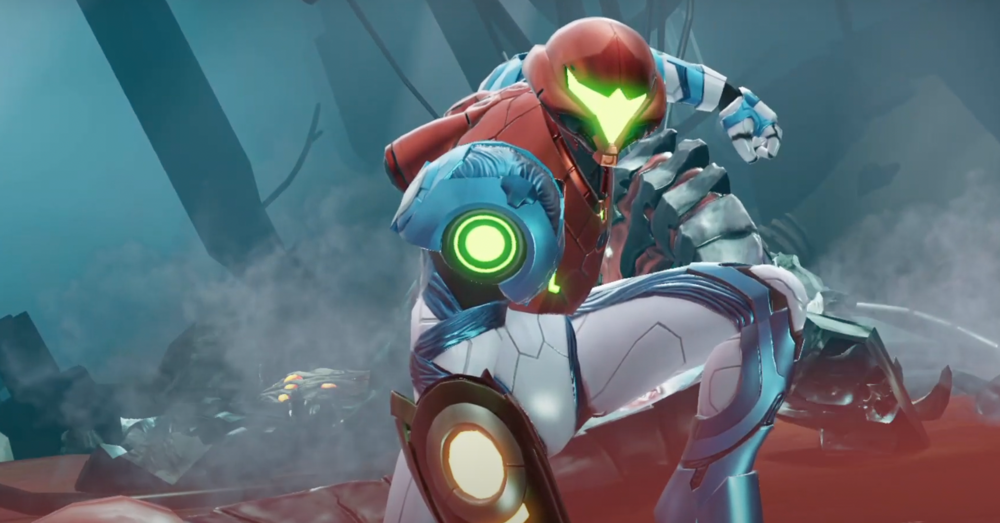

<figure>

</figure>

　先日、noteに新作メトロイドこと『メトロイドドレッド』に対する期待と不安を書いた。

[https://note.com/keigox68000/n/n47f003def23f](https://note.com/keigox68000/n/n47f003def23f)

　その『メトロイドドレッド』が発売になったため、早速購入。プレイしてみた。まだ1時間半ほどのプレイだが、その上での雑感を書いてみたい。

　まず、『メトロイド』シリーズとして積み重ねたバックボーンがあるため、よりしっかりとしたストーリーが語られるようになっている。Wiiの『メトロイド アザーエム』などは豊富なムービーが挿入され、ゲームのストーリーをかなり饒舌に語ってくれていたが、その流れにあると言ってもいい。

　好き嫌いはあるが、個人的には冒頭のムービーはもっと短くてもいい（ちなみにゲームスタートからプレイヤーが操作できるようになるまで8分弱）と思っているが、プレイヤーがゲームの背後にある設定をしっかり飲み込むための助けになっていると言える。

　ゲームがスタートすると気づくのが、プレイヤーキャラクターであるサムスの動きが非常に素早いことだ。通常移動からして、初代『メトロイド』から考えるとものすごい速さで動くサムスは、ゲーム展開をよりスピーディなものにしてくれる。

　今回の『メトロイドドレッド』の売りは、そのタイトルが表すように「恐怖（＝ドレッド）」を全面に押し出していることのようだ。この「ドレッド」が何を指しているか。全貌はまだ明らかになっていないが、その片鱗はゲーム序盤から見られる。

　ストーリーの展開で、広大なマップの各所にE.M.M.I.というロボットが配置される（詳細はゲームをプレイしてほしい）が、マップ上でこのロボットが活動するエリアにサムスが進入すると、E.M.M.I.はサムスの場所を音と姿で検知し、執拗に追跡してくる。

　しかも、サムスがE.M.M.I.に追いつかれると、ヒットポイントがどれだけ残っていてもほぼ確実にゲームオーバーになる。無機質な姿ながら生物的な動きで迫るE.M.M.I.は不気味なものがあり、マップに慣れていないプレイヤーにとっては確実な脅威となる。

　ホラーゲーム的な恐怖ではないが、プレイヤーに緊張感を強いる演出を仕掛けてきたゲームデザインをゲーム冒頭から出し惜しみなく挿入してくる作りには好感が持てる。

　ゲームの舞台となる惑星ZDRはかなり複雑かつ広大なマップを有している。あまりに巨大なマップは時としてプレイヤーにとってストレスであるが、前述したとおりサムスのスピード感あふれる移動によって、その懸念から解放されている。

　同時に、マップ画面は高精細なHD画質を生かして、一見してわかりやすいように作られている。アイコンやエリアの色分け、拡大縮小操作とカーソルの移動速度などUIに気を使い、とにかくマップを確認することが多いゲームで、マップそれ自体がストレスの原因にならないように工夫されているのだ。

　そんなマップ画面のUIなんかもう何十年も前から当たり前じゃないかと言われるかもしれないが、この手のものってユニバーサルデザイン的なわかりやすいデザインが当たり前になってきている今でも（名前は挙げないけど）信じられないぐらい使いにくい/見にくいゲームがあるから、洗練された域に到達するのはなかなか大変なことだと思う。

　さて、そんな操作性のよさと、好ましいゲームの世界観、そして探索しやすいゲーム内UIに恵まれた『メトロイドドレッド』。実のところ探索型は若干苦手で、度々挫折することが多い自分にも攻略しようという意欲が湧いてくる作品に仕上がっているようだ。先をプレイするのが楽しみである。

[https://www.youtube.com/watch?v=X1rTZ2GyhEk](https://www.youtube.com/watch?v=X1rTZ2GyhEk)
