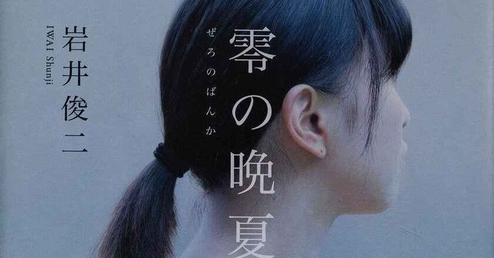

<figure>

</figure>

　夏ぐらいからの読んでいた本の感想を簡単に書いておこう。そのうち読書メーターに転記する予定。

[https://bookmeter.com/users/647235](https://bookmeter.com/users/647235)

## 零の晩夏 / 岩井 俊二 (著)

　一人の絵師を探すミステリー仕立てのアート小説。そのストーリーを通して自分の過去や内面と向き合う女性 八千草花音。その過程に見られる主人公の芸術に対する考え方や、美しいものを実感する姿が美しい。

[https://honto.jp/netstore/pd-book\_30979526.html](https://honto.jp/netstore/pd-book_30979526.html)

## 原因において自由な物語 / 五十嵐 律人 (著)

　主人公が小説家であり、その主人公自身の内面に向かっていく物語で、極めてメタ視点になりやすいプロットの作品。複雑な構造を理屈で説明していく過程が楽しいが、その理屈っぽさが楽しめればはまる小説だ。

[https://honto.jp/netstore/pd-book\_31037205.html](https://honto.jp/netstore/pd-book_31037205.html)

## 邪教の子 / 澤村 伊智 (著)

　平凡な日常に忍び寄る新興宗教の恐ろしさをテーマにした作品。と、思いきや多重構造になったギミックに引き込まれて読んでしまうところが澤村伊智作品らしいところ。意外にも単純なプロットではあるが、物語の仕掛けを楽しんでほしい。

[https://honto.jp/netstore/pd-book\_31075797.html](https://honto.jp/netstore/pd-book_31075797.html)

## 硝子の塔の殺人 / 知念 実希人 (著) 

　ギミック満載の館で起きる連続殺人。知念実希人による正統派本格ミステリながら、随所に実在の本格ミステリのタイトルや仕掛けが引用されるなどサービス精神旺盛な内容で、ミステリファンなら絶対楽しめる作品。ぜひ読んでほしい1冊。

[https://honto.jp/netstore/pd-book\_30924956.html](https://honto.jp/netstore/pd-book_30924956.html)

## テスカトリポカ / 佐藤 究 (著)

　第165回直木賞受賞作品。ずっと読もうと思ってたら直木賞受賞していた。麻薬密売カルテル、臓器ブローカーなど刺激的な登場人物。暗黒に包まれたアステカの神話。ダイナミズム溢れる設定が圧倒的な物量で語られる。こういう文章量で説得力を持たせる作品は嫌いではない。

[https://honto.jp/netstore/pd-book\_30767410.html](https://honto.jp/netstore/pd-book_30767410.html)

[https://note.com/keigox68000/n/ne95b11d1aa06](https://note.com/keigox68000/n/ne95b11d1aa06)

　つづきはそのうち。
