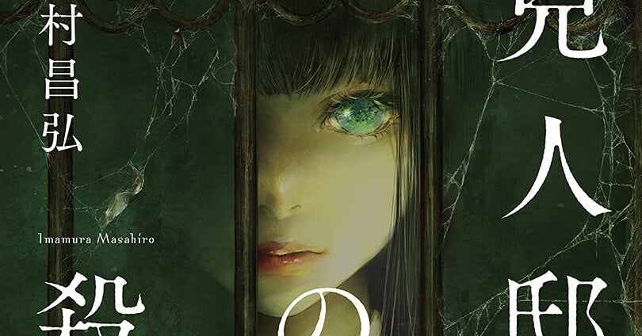

<figure>

</figure>

## 月下のサクラ (文芸書) / 柚月裕子 (著)

『朽ちないサクラ』に続く森口泉シリーズ。アクの強い男性警察官の中で孤軍奮闘する主人公が、組織の不祥事という極めて解決しにくい事件と対峙しながら、自分の有り様や正義に対する考え方を確立していくところが見どころ。

[https://honto.jp/ebook/pd\_30972330.html](https://honto.jp/ebook/pd_30972330.html)

## 大麻ヒステリー (光文社新書) / 武田 邦彦 (著)

現在は反ワクチンを主張している著者の、大麻やそれに関する法律の歴史を読み解いていく1冊。タイトルからもわかるように、著者は大麻に対して容認的な立場。科学的な分析の体をとってはいるが、肝心なところではかなり著者の主観が多めである。  

[https://honto.jp/ebook/pd\_26238073.html](https://honto.jp/ebook/pd_26238073.html)

## 兇人邸の殺人 / 今村 昌弘 (著)  

ミステリになり得ないような大胆な特殊設定が持ち味の今村昌弘の第3作。今作ではミステリと言うよりはもはやパニック映画さながらのジェットコースター的展開で度肝を抜いてくれる。単なる連続殺人とはまたひと味違う恐怖とスリルが抜群の緊張感を醸し出しているのが見事。

[https://honto.jp/ebook/pd\_31005822.html](https://honto.jp/ebook/pd_31005822.html)

## 虚魚 / 新名 智 (著)

怪談師 三咲が、「釣り上げた人が死ぬ魚がいる」といういかにも都市伝説めいた不可解さのある話を追ううちに、本物の怪異が見え隠れしてくるという演出の妙が上手い。ストーリーもミステリ風味のホラーになっていて、例えば小野不由美の『残穢』などもそうだが、この手の怪談話を収集・調査するうちに本物行き当たるという話は個人的に好みだ。

[https://honto.jp/ebook/pd\_31289147.html](https://honto.jp/ebook/pd_31289147.html)

## 北緯43度のコールドケース / 伏尾 美紀 (著)

大学院卒ながら中途採用でノンキャリアの美人刑事が主人公という割と変わり種の警察小説。現在起きている誘拐事件と過去の事件が関連してくる複雑な構造は手応えあって楽しめる。主人公 沢村依理子の警察官としての悩みなど人間の描写にも深みがある。

[https://honto.jp/ebook/pd\_31249479.html](https://honto.jp/ebook/pd_31249479.html)
