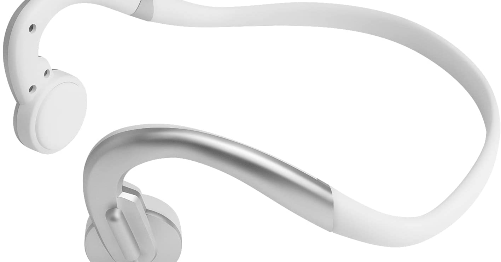

<figure>

</figure>

　以前ヘッドホン・イヤホンをつけながらゲームをプレイしていても、自分の周囲の音を聞きたいということで、耳たぶイヤホンを買った話をnoteに書いた。

[https://note.com/keigox68000/n/ne3a6ef98cfe1](https://note.com/keigox68000/n/ne3a6ef98cfe1)

　結論から言うとこのambieの耳たぶイヤホン、発想はよかったものの、製品の品質がいまひとつで満足できずに終わってしまった。具体的には、イヤホン先端の音の出る穴部分が交換できるように別パーツになっているのだが、これが緩すぎてすぐに外れてしまうこと、イヤホン全体がシリコンのような素材でできているのだが、ここが使っているうちに裂けてきてしまったことなどがある。

　それでいて6,000円という価格も高すぎた。この価格とこの品質では次の選択肢にはならないだろう。

　そこでambieの次は骨伝導イヤホンを買ってみることにした。骨伝導イヤホン自体は昔からあるものの、今の製品はどんなものか試してみたかったのだ。

　ただし、現在主流のBluetooth製品を避けて、あえて有線イヤホンを選択することにした。これはゲーム用に使うことを考えて、音の遅延を嫌った故の選択である。

　と言っても、非主流の有線骨伝導イヤホンなんてものは製品はAmazonで売っている中華製のものしか見当たらず、今回はお試しと割り切ってエイヤッとAmazonで買ってみることにした。

　具体的な製品名もよくわからない骨伝導イヤホンなので商品の紹介も書けないのだが、タイトル写真に掲載したようなイヤホンだ。後頭部にセットして、耳の前あたりに骨伝導ドライバが来るようなデザインをしている。

　装着感は悪くなく、耳の穴が完全に開放されているので、外の音もよく聞こえてくる。ボリューム部がちょっと邪魔なのだが、何しろ充電して電源オンにしないと音が聞こえてこないので、これは我慢するしかない。というか、骨伝導イヤホンって電源が必要だったことすら知らなかった。ちなみに延長ケーブルがついていて、1m+2mぐらいで使えるのは嬉しいところ。

　実際にゲームに使用してみた感じは悪くない。音質は低音がこもっていてよくないが、音楽を聞くためのものではないのでそこは気にならない。一番は、奥さんと二人でオンラインゲームを遊んでいるときにお互いが会話できるということが重要で、その役目は十分異常に果たしてくれている。今のところ満足できる製品だ。

　今回選択した骨伝導イヤホンは価格3,980円。高いような安いような微妙な値段だが、これですぐに壊れるようだとコストパフォーマンスは高くない。できれば長持ちしてほしいところだ。

[https://www.amazon.co.jp/gp/product/B096LQYCX1/ref=ppx\_yo\_dt\_b\_asin\_title\_o02\_s00?ie=UTF8&psc=1](https://www.amazon.co.jp/gp/product/B096LQYCX1/ref=ppx_yo_dt_b_asin_title_o02_s00?ie=UTF8&psc=1)
