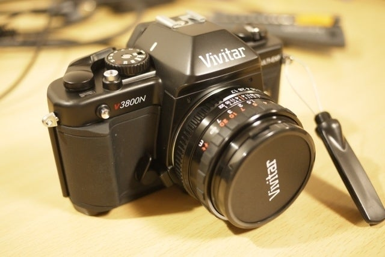

<figure>

</figure>

　その昔VivitarというメーカーのV3800Nというフィルムカメラを買った。立派な一眼レフだが、オートフォーカスがなくてアナログなカメラの楽しみを思いっきり味わえるカメラだ。

<figure>

<figcaption>

Vivitar V3800N

</figcaption>

</figure>

　当たり前だが、フィルムカメラなのでフィルムを入れないと写真が撮れない。今となってはフィルムを売っている店も少なくなってしまったが、それでもカメラ専門店などに行くと数種類のフィルムが売っている。

　フィルムカメラの楽しいところは、このフィルムの選択からすでに写真のテイストが決定される点だ。ISO感度はもちろんだが、そういう数字に表れる以外の要素がフィルムによって異なってくる。

<figure>

</figure>

　昔と比べてフィルムの種類も減っているが、その分フィルムごとにかなり違う味わいを出してきているので、フィルムを選ぶところからすでに楽しいのだ。デジタルカメラでは記憶媒体を選択するところにそこまでの楽しみはないだろう。

　また、これも当たり前のことだが、フィルムカメラでは撮影後にその画をすぐに確認することはできない。ファインダーを覗いたときに、自分の頭の中で写真の完成形をイメージする必要があるのだ。

<figure>

</figure>

　さらには、1本のフィルムは27枚とか36枚とか、とにかくそれぐらいの枚数しか撮れないのが普通である。デジタルカメラならば記憶媒体の容量によって何百枚、何千枚と撮影ができる。つまりフィルムカメラでは1枚1枚が真剣勝負になるのだ。失敗は許されない。そこまで言うと少し大げさか。

　ともかく、変わったフィルムを使って変わった雰囲気の写真を撮るのも悪くないなと思っているところだ。問題はこんな社会情勢の中、あまり観光にも出かけなくなっているところか。

　実は今回ここに書いたVivitar V3800N以外にもフィルムカメラはいくつかあるので、また機会があったら持ち出してみたい。
