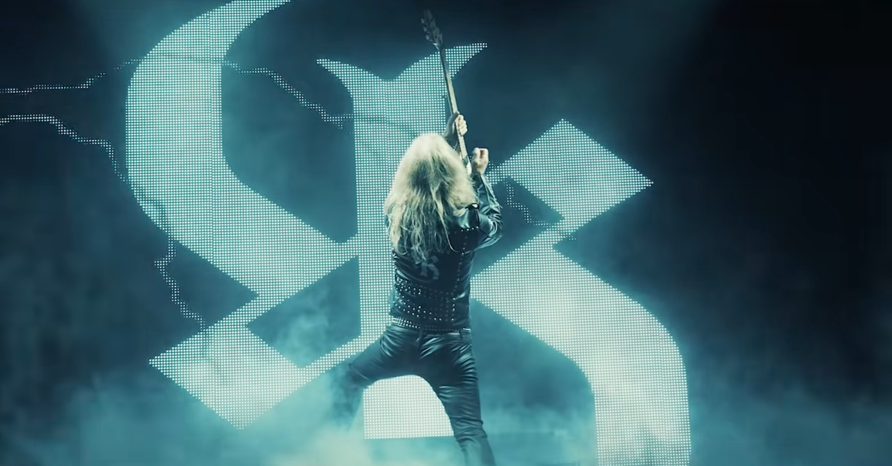

<figure>

</figure>

　なんで今頃になって9月の話題！？　それはまとめ忘れていたから。

## SENJUTSU / IRON MAIDEN

　時間をかけ、重厚かつ大作志向の方向性を打ち出してきたアルバム。それでいてアイアンメイデンらしい音楽的手法に溢れている聞き応え十分の作品に仕上がっている。

[https://open.spotify.com/album/3TymcPWXqsCRA5oSL0TkPU?si=3cucU\_4qQTGM\_Gk0\_INSLw](https://open.spotify.com/album/3TymcPWXqsCRA5oSL0TkPU?si=3cucU_4qQTGM_Gk0_INSLw)

## GOD IS PARTYING / ANDREW W.K.

　ヘヴィかつドラマティックな展開が美味しい。どの曲も憂いのあるメロディが聞く者を感動させる。十分な間を置いて語るように歌うヴォーカルが素晴らしい。

[https://open.spotify.com/album/7cTCyWY5cYeIi2jEC3udFu?si=DNPC3PP-SjmjcSgwnAbDEQ](https://open.spotify.com/album/7cTCyWY5cYeIi2jEC3udFu?si=DNPC3PP-SjmjcSgwnAbDEQ)

## STRONG / ANETTE OLZON

　元NIGHTWISHのアネット・オルゾン。パワフルなヴォーカルだが、NIGHTWISHとはひと味違う疾走メロディアスが楽しめる。

[https://open.spotify.com/album/0xIa7oSXgzJAERXQqa1r6f?si=buneOP3ZQ-WqbAyQvf7LZQ](https://open.spotify.com/album/0xIa7oSXgzJAERXQqa1r6f?si=buneOP3ZQ-WqbAyQvf7LZQ)

## APHELION / LEPROUS

　メタルというよりは、美しいメロディを主体としたアンビエントな雰囲気の音楽をプレイしている。荘厳かつ神秘的、宇宙的な空間美を醸し出す上質なバンド。

[https://open.spotify.com/album/1FqPZscG7gDH6utCpoWnkG?si=Bl1p72dOSvWvQatGzP9wBw](https://open.spotify.com/album/1FqPZscG7gDH6utCpoWnkG?si=Bl1p72dOSvWvQatGzP9wBw)

## AEROMATIC II / THE NIGHT FLIGHT ORCHESTRA

　ソイルワークやアーチエネミーなどエクストリームなバンドから集まった人たちが80年代っぽいハードロック/ポップをプレイするバンド。楽曲の完成度が高く、楽しく聞ける。

[https://open.spotify.com/album/2EruEBw8awLTVzwhSd4yqt?si=Zh\_OqmVPRdmuwlww5CUI2Q](https://open.spotify.com/album/2EruEBw8awLTVzwhSd4yqt?si=Zh_OqmVPRdmuwlww5CUI2Q)

## ROBIN RED

　北欧メロディックバンドDEGREEDのヴォーカルによるソロアルバム。これがソロ6枚目ということだが、ポップなメロディとエッジを失わない演奏でメロディアスハードとして完成されているところが魅力。

[https://open.spotify.com/album/11gJ1asVB6voe8XLLVE2nt?si=6di\_2nfsTPCp1UGUSexfpA](https://open.spotify.com/album/11gJ1asVB6voe8XLLVE2nt?si=6di_2nfsTPCp1UGUSexfpA)

## THE INNERMOST JOURNEY TO YOUR OUTERMOST MIND / SAMI YAFFA

　ハノイロックス等でベースを弾いていたサミ・ヤッファのソロアルバム。ロックンロールやメロウでしっとり系のロックをプレイしているが、サミの音楽の幅は広く、バラエティ豊かな楽曲が楽しめる。マイケル・モンローもゲスト参加。

[https://open.spotify.com/album/7GNy2piph90fff25eBWWeY?si=9rWYKeP6RpqbzoUdW8WhdA](https://open.spotify.com/album/7GNy2piph90fff25eBWWeY?si=9rWYKeP6RpqbzoUdW8WhdA)

## SERMONS OF SINNER / KK'S PRIEST

　今年の目玉と言うべき1枚。KKがついに自分のバンドを引き連れて帰ってきた。プロダクションのチープさは感じられるものの、そこも含めてKKの一矢報いようという執念が感じられるアルバムに仕上がった。いろいろ言い出せばきりがないが、これはこれで素晴らしい作品だ。

[https://open.spotify.com/album/2UsNPZEyu8sjbgo1Od1XWr?si=YG7wncXkRXKCl9kDOOsF8g](https://open.spotify.com/album/2UsNPZEyu8sjbgo1Od1XWr?si=YG7wncXkRXKCl9kDOOsF8g)
