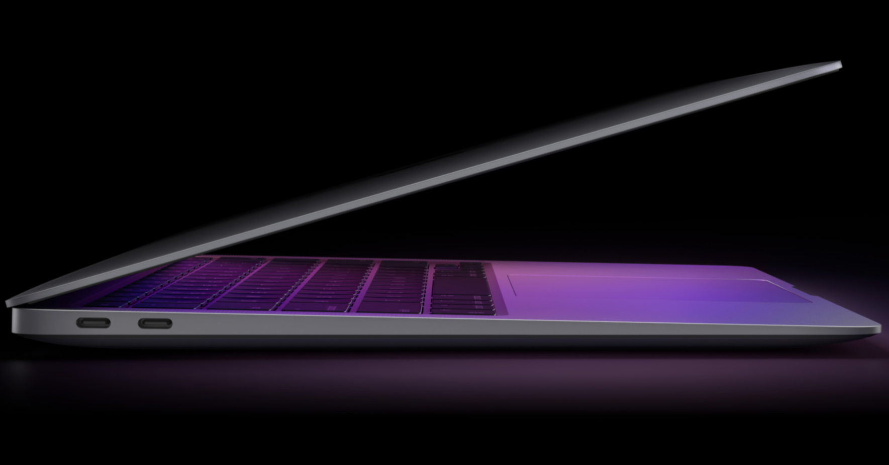

<figure>

</figure>

　今このnoteを、今年の夏に買ったMacBook Airで書いている。それまで6年間ぐらい使っていたMacBook Proに比べて薄型で、重量も大分軽い。ソファでリラックスしながらラップトップでものを書くにはもってこいのサイズ感である。

　ところで、このMacBook Airは左側面にUSB Type-Cのコネクタが二つついていて、周辺機器用と電源用とを兼ねている。個人的には汎用的なUSBを電源に使うことには賛成だが、この辺はUSBコネクタの搭載数の少なさと使用する際の利便性を天秤にかけてというところだろう。

　実は以前使っていたMacBook Proは、MagSafeの電源コネクタが採用されていた。USB Type-Cもあまり出回っていない頃の製品なので、本体にも普通のUSBコネクタが搭載されていた。

　実は個人的にはこのMagSafeが好きだったのだが、リビングのローテーブルに電源付きでMacBookを置いておくときなど、足を引っかけてもマグネットで簡単に外れてくれるMagSafeには安心感があった。

　とは言っても、実際に足を引っかけたことなどないのだが、それでもAppleの物理的な安全性の配慮をしている機構には感心したものである。

　今のMacBookはProでもMagSafeが廃止されていて、USB Type-Cが全面的に採用されている。できる限り汎用性のある部品を使用した方がコストダウンにもつながるし、あまり特殊なコネクタは廃していく方向なのだろう。妥当である。

　それでも、MacBookが徐々に汎用性を持っていくのを見ていると、何かApple製品の特別感は薄れていくような気がしてしまうのは、ずっとMacを使っている人間のバイアスがかかった見方だろうか。ちょっとそんなことを思ってしまう。

追記  
※最新のMBPにはMagSafeついているそうです。（Twitterで教えていただきました）
