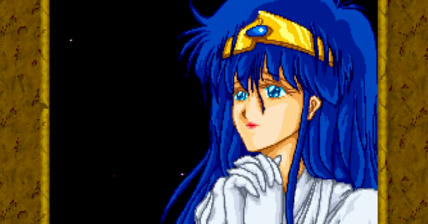
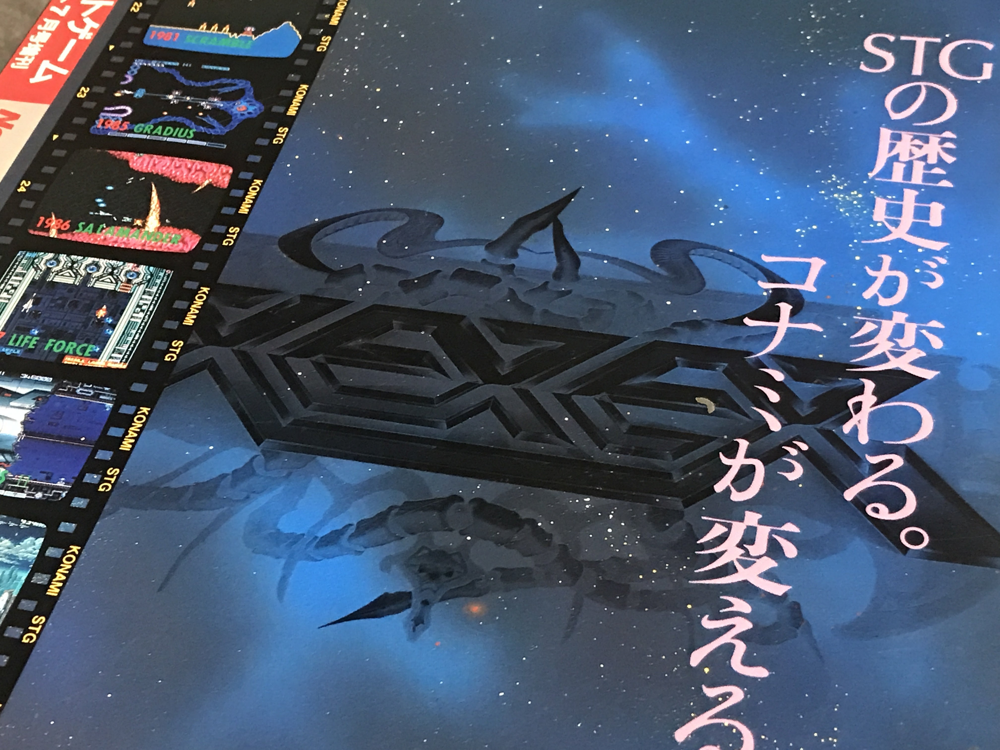
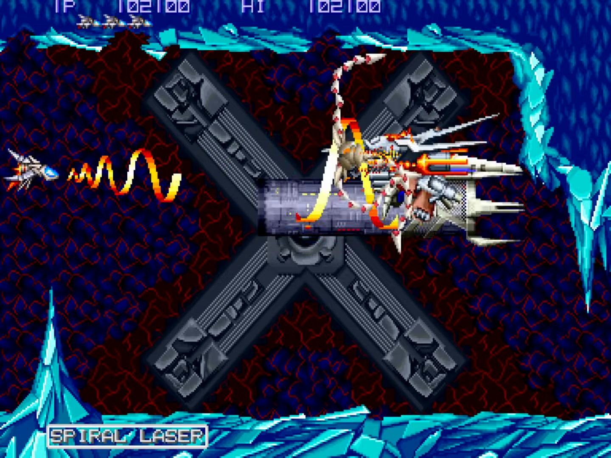

<figure>

</figure>

　『ゼクセクス』はコナミが1991年にコナミがリリースしたアーケード用シューティングである。

　当時、『ゲーメスト』などには「STGの歴史が変わる」などと大風呂敷を広げたようなキャッチコピーを伴った広告が掲載されていてそれ自体が話題になったものである。

<figure>

</figure>

　しかし、実際にはゲーセンの主力ジャンルが格闘ゲームに移行する頃に当たり、とてもSTGの歴史を変えるような存在にはなり得なかった不遇のゲームである。

　もちろん『ゼクセクス』が盛り上がらなかったのは、ゲーセンシーンにおけるムーブメントだけが原因ではない。いまひとつ思い通りに動かず、コントロールにストレスがたまる「フリント」というオプションの存在の微妙さが『ゼクセクス』というゲームに漂う残念感を象徴している。

　また、ステージ感にはこれまた絶妙な感じでヘタウマ感が漂うイラストによってストーリーが語られるのだが、硬質感ただようゲーム画面とは異なり、ユルユルファンタジーな香りに違和感を拭い去れずにプレイを続けるシューターたちの姿があったように思う。

　いずれにしても、コナミ全体でも『ゼクセクス』以降、アーケード用にシューティングゲームを開発しなくなってしまうということもあり、この頃はアーケードゲームからコンシューマーに開発の軸足は移行しつつあったのかもしれない。

　しかし、そんな不遇の『ゼクセクス』も今プレイしてみると、なかなか魅力あるギミックに溢れたシューティングゲームであったことが再確認できる。

　操りにくい「フリント」をどの場面で、どのパワーアップで生かしていくかという戦略性があり、そこにハードの特性を生かしたダイナミックなグラフィック描画によるボスの動きが実に楽しめる。

　さらに、フュージョン系の流れを汲むコナミらしいBGMはどの場面でもゲームの展開を盛り上げてくれて、これは昔からのコナミファンには嬉しい演出だろう。

　当時、ゲームセンターからも潮が引くかの如く撤退してしまった『ゼクセクス』だが、今回アーケードアーカイブスでリリースされるのであれば、上記のようなこのゲームの優れた点に注目しながらプレイし直してみるのも楽しいだろう。

　なお、『ゼクセクス』は2周エンドのゲームだ。2周目の強烈な打ち返し弾との戦いも思う存分味わってほしい。さて、今からプレイしてみるとしようか。

<figure>

</figure>
