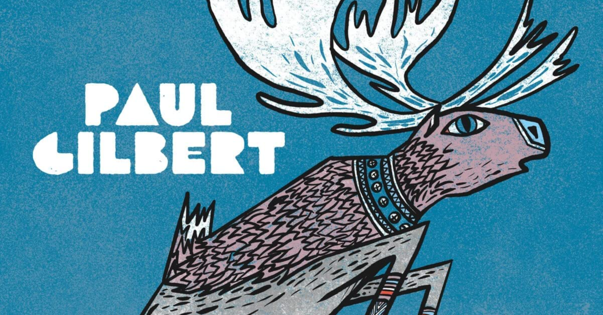

<figure>

</figure>

　年の瀬もいよいよ押し迫ってまいりました。書いてなかった11月に聞いていたアルバム行ってみよう。

### MOTOR HEART / THE DARKNESS

　ザ・ダークネスが今も定期的にアルバムをリリースしていて、しかもそれがきちんとハードロックしていて嬉しい。

[https://open.spotify.com/album/5F309zIYOpb8XIU01JBJ5V?si=1UsfPS8lSoqyAOxitAai\_g](https://open.spotify.com/album/5F309zIYOpb8XIU01JBJ5V?si=1UsfPS8lSoqyAOxitAai_g)

### FIRE IN THE SKY / ESCAPE

　英メロディアス・ハード。相変わらずのメロディに酔いしれる。

[https://open.spotify.com/album/4pCYGGrQfAod3buMI6RgMb?si=jElXj8H8SkCKEc6kHxmSpQ](https://open.spotify.com/album/4pCYGGrQfAod3buMI6RgMb?si=jElXj8H8SkCKEc6kHxmSpQ)

### PERSONA NON GRATA / EXODUS

　7年ぶりのアルバム。しっかりベイエリアスラッシュのサウンドが出てくるのがさすが。

[https://open.spotify.com/album/604klFpB4UfWrxeVaJQgL4?si=6B7X-m5AR3iq79adJ5LAzQ](https://open.spotify.com/album/604klFpB4UfWrxeVaJQgL4?si=6B7X-m5AR3iq79adJ5LAzQ)

### DOOM CREW INC. / BLACK LABEL SOCIETY

　これまで同様サザン・ロック的な完成をダーク＆ヘヴィで料理したような音を聞かせてくれる。その奥に潜む美しいメロディも秀逸。

[https://open.spotify.com/album/5j7daAyvVHbB4oNhJvsTX4?si=vha1tytkSrmjRL6an1o6eA](https://open.spotify.com/album/5j7daAyvVHbB4oNhJvsTX4?si=vha1tytkSrmjRL6an1o6eA)

### STREET LETHAL / CRAZY LIXX

　この手の80'sリスペクトなバンドが最近元気だ。メロディアスで元気印のハードロックはL.Aメタルの隆盛を思わせる勢い。

[https://open.spotify.com/album/13K2xZaSSEp9HdNJE0J4m3?si=H5GQnFKvRjyj0crMVEl78A](https://open.spotify.com/album/13K2xZaSSEp9HdNJE0J4m3?si=H5GQnFKvRjyj0crMVEl78A)

### SOUL TO SOUL / GROUNDBREAKER

　FMのヴォーカルによるプロジェクト。メロウでシンセを多用した穏やかなハードポップが聞ける。

[https://open.spotify.com/album/1NjZbU1aFzemFzOMO99ZMb?si=KrN40Cy3RYyWuJeioIKYmA](https://open.spotify.com/album/1NjZbU1aFzemFzOMO99ZMb?si=KrN40Cy3RYyWuJeioIKYmA)

### INTO THE FUTURE / HEARTLAND

　非常に落ち着いた雰囲気のメロディアス・ハード。英国をはじめとして、この手のメロディを大事にする良質のバンドが増えているのかもしれない。

[https://open.spotify.com/album/5jQQYeLlSLaODUhbsn9FIQ?si=qz85-MxbTjacjNIeW0Sqmg](https://open.spotify.com/album/5jQQYeLlSLaODUhbsn9FIQ?si=qz85-MxbTjacjNIeW0Sqmg)

### V(PREPARATUS SUPERVIVET) / INSANIA

　14年ぶりのニューアルバム。久しぶりだね、というよりまだいたのか！　という驚き。サウンドはデビュー当時のメロディックスピードメタルをさらに推し進めてより力強くなっている。

[https://open.spotify.com/album/6DjBQrACipS0vKlBIqUgzI?si=cE0sVI04Qb6RAwO2kyuS-g](https://open.spotify.com/album/6DjBQrACipS0vKlBIqUgzI?si=cE0sVI04Qb6RAwO2kyuS-g)

### TIGRES - WOMEN WHO ROCK THE WORLD / JIM PETERIK & WORLD STAGE

　タイトル通り（？）女性シンガーを多く集めて歌われるメロディアスで爽やかなロック楽曲群。

[https://open.spotify.com/album/2qBEXJQszCxxkg2s4e0aHW?si=eRqxYqA3SRu8lQGkeH6-wg](https://open.spotify.com/album/2qBEXJQszCxxkg2s4e0aHW?si=eRqxYqA3SRu8lQGkeH6-wg)

### KNIGHTS OF THE REALM

　これもメロディを主軸に置いた本格的なヘヴィメタル。力強く艶のあるヴォーカルと説得力あるギターサウンドがオーソドックスながら頼もしい。

[https://open.spotify.com/album/0s9Su9fyE1XayYeJRADG1f?si=G7-3zLr8SeiSJVI8kKqS9w](https://open.spotify.com/album/0s9Su9fyE1XayYeJRADG1f?si=G7-3zLr8SeiSJVI8kKqS9w)

### ALCHEMY OF SOULS PART II / LORDS OF BLACK

　ロニー・ロメロ旋風も落ち着いた頃にこういう説得力のあるアルバムを出してくるローズ・オブ・ブラック侮りがたし。

[https://open.spotify.com/album/21fvzPpqE9tITx6biERHis?si=tUmR1FSOSLSD00Isc9hvnA](https://open.spotify.com/album/21fvzPpqE9tITx6biERHis?si=tUmR1FSOSLSD00Isc9hvnA)

### MEMORIA AVENUE

　これはノルウェーのメロディアス・ハード。良質のサウンドがいっぱいである。AOR的な落ち着きが魅力。

[https://open.spotify.com/album/5lhrJuEiXB8Sjn5dBTCP65?si=gWmFzksRQf61KZgniyyBsQ](https://open.spotify.com/album/5lhrJuEiXB8Sjn5dBTCP65?si=gWmFzksRQf61KZgniyyBsQ)

### DIAMANTI / TEMPERANCE

　イタリア出身らしいシンフォニックな音もチラ見せしながら、重厚感あるヴォーカルとバンドサウンドが美しい。

[https://open.spotify.com/album/5lhrJuEiXB8Sjn5dBTCP65?si=gWmFzksRQf61KZgniyyBsQ](https://open.spotify.com/album/5lhrJuEiXB8Sjn5dBTCP65?si=gWmFzksRQf61KZgniyyBsQ)

### THE FRAGMENTS OF WONDER / WONDERS

　上記テンペランスでヴォーカルを担当しているマルコ・パストリアーノがヴォーカルを担当している。分厚いサウンドだがシンフォニック味は抑えてよりパワフルなメタルに。

[https://open.spotify.com/album/20esW6b0EXeTMLYvj0iynP?si=EBbs0se2Sw2KRNjN4UDUnQ](https://open.spotify.com/album/20esW6b0EXeTMLYvj0iynP?si=EBbs0se2Sw2KRNjN4UDUnQ)

### 'TWAS / PAUL GILBERT

　クリスマスアルバムはあまり聞かないが、ポール・ギルバートのポップセンスは聞いておくべきと思わされる。

[https://open.spotify.com/album/0OrLSd2SlyLkpvbcuAuWGi?si=nVj8puaCTKW9GKSALgDcdQ](https://open.spotify.com/album/0OrLSd2SlyLkpvbcuAuWGi?si=nVj8puaCTKW9GKSALgDcdQ)
