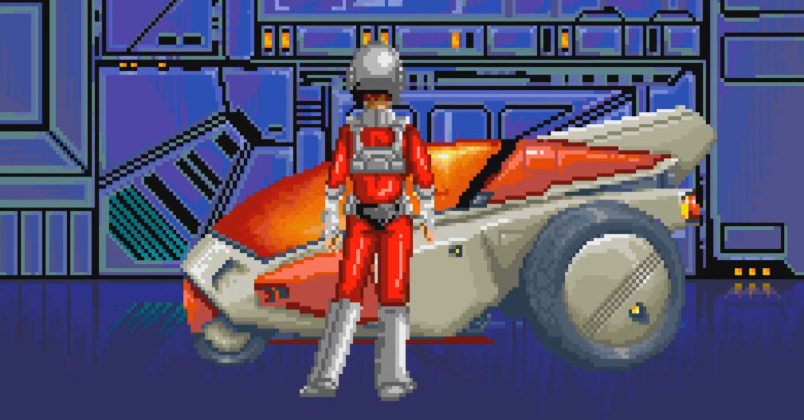

<figure>

</figure>

　2021年は新作ゲームとして印象に残っているのは『メトロイドドレッド』と『バイオハザードヴィレッジ』。この2作はよくプレイした。あとは相変わらず5周年を迎えた『デッドバイデイライト』ばかり遊んでいた印象。よく飽きずにやってるな。

[https://note.com/keigox68000/n/n3e42f3524a85](https://note.com/keigox68000/n/n3e42f3524a85)

[https://note.com/keigox68000/n/n00a78593061e](https://note.com/keigox68000/n/n00a78593061e)

　『デッドバイデイライト』では、『バイオハザード』とのコラボチャプターも登場して、レオンが大活躍。両方のゲームのファンとしては非常に嬉しい限りだ。

　また、ゲームそのものの話題ではないが、自分でプログラムを書いてゲームの統計を取り始めたのも新たな試みであった。

[https://note.com/keigox68000/n/ne05eb7370325](https://note.com/keigox68000/n/ne05eb7370325)

　一方で、アーケードゲームで『戦刃アレスタ』のような新作シューティングが登場したことは非常に明るいニュースだ。早く家庭でもプレイしたい。

[https://note.com/keigox68000/n/n98eeb50ed082](https://note.com/keigox68000/n/n98eeb50ed082)

　あとはなんだかんだ言ってレトロゲームもよく遊んだ。今になってアクトレイザーの新作『アクトレイザー・ルネサンス』なんてゲームが登場するとは思いもよらなかった。

[https://note.com/keigox68000/n/ne6baad6fa32c](https://note.com/keigox68000/n/ne6baad6fa32c)

　また、それとは別にアーケードアーカイブスが元気だったように思う。

　『ハレーズコメット』『サンダークロスII』『雷電』『ダーウィン4078』『ゼビウス』『源平討魔伝』『リブルラブル』『レイメイズ』『フォゾン』『ドラゴンバスター』『ゼクセクス』といった個人的に名作枠なゲームが目白押しだった。ナムコがアーケードアーカイブスに参入したのは僥倖。レトロゲームファンはみんな期待が大きいのではないだろうか。

　PCのインディーズゲームにも話題を振りたいところではあるが、長くなるのでこの辺りで。PCゲームについては気が向いたときにまたnoteにでも書いていこう。

　さて、2022年もさらに盛り上がるゲームの登場が待たれる。楽しみだ。

[https://note.com/keigox68000/n/nd9c1d83dcba0](https://note.com/keigox68000/n/nd9c1d83dcba0)

[https://note.com/keigox68000/n/n652e8c7fb864](https://note.com/keigox68000/n/n652e8c7fb864)

[https://note.com/keigox68000/n/n905307b94f89](https://note.com/keigox68000/n/n905307b94f89)

[https://note.com/keigox68000/n/nd08b88d37a45](https://note.com/keigox68000/n/nd08b88d37a45)

[https://note.com/keigox68000/n/nee5f7c310639](https://note.com/keigox68000/n/nee5f7c310639)

[https://note.com/keigox68000/n/n136bf0519dcd](https://note.com/keigox68000/n/n136bf0519dcd)
