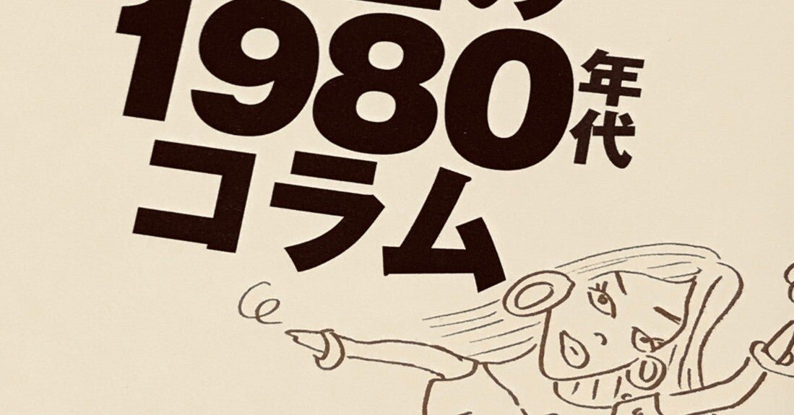

<figure>

</figure>

　最近はファミコンのカセットを買ってきたらSNSで画像を上げるのが流行りらしい。ますます盛り上がりを見せるレトロブーム。いや、いつの時代も一昔前のものに郷愁を覚えるのは常なることなのかもしれない。

　『泉 麻人 自選 黄金の1980年代コラム』は、コラムニスト泉麻人が、1980年頃から書いていたコラムから自選したものを集めた当時の空気を感じられるコラム集だ。

　最初期のコラムなど、いかにも80年代の雰囲気らしい文体で書かれていて、カタカナや長音を多用した軽薄な文章は今見ると懐かしさとともにこっ恥ずかしさすら蘇ってっくる。みんなこんな感じで文章書いていたよな。

　トレンディードラマをメタ視点で「自分はわかっている」感で冷めた目で笑ってみたり、中日ドラゴンズの選手の間でパンチパーマが流行っていたり、とんねるずの大ヒットとその周辺の「ミーハー」な若者文化を分析したり。そういうことあったねえ、という80年代から、そんなこともあったんだ！　という新しい発見まで、とにかくすべてが80年代あの頃のアトモスフィアなのである。

　もちろんゲーム文化もその中に登場する。爆発的なヒットをした『スーパーマリオブラザーズ』や『ドラゴンクエスト』はもちろん風のように表れて去っていくし、電話でゲームの音声が聞けるサービスなんてのがあったなんてことまで書かれている。後者はまったく知らなかった。

　足掛け10年のコラムが掲載されているが、後半は文体も落ち着き、時代とともにこの手のサブカルチャー、若者文化も成熟して徐々に落ち着いてくるのだなという実感さえある。

　今、レトロブームと言って当時のものがもてはやされているが、こういうコラムを読むと、モノだけ現代に持ってきても当時の空気感は到底再現されないことを痛感する。あの時代、あの文化を肌で感じ、その中で育ったものには、やっぱり当時の環境を含めた社会の動きそのものが80年代だったのだ。そんなことを思わせる1冊だった。

[https://honto.jp/netstore/pd-book\_31280343.html](https://honto.jp/netstore/pd-book_31280343.html)
