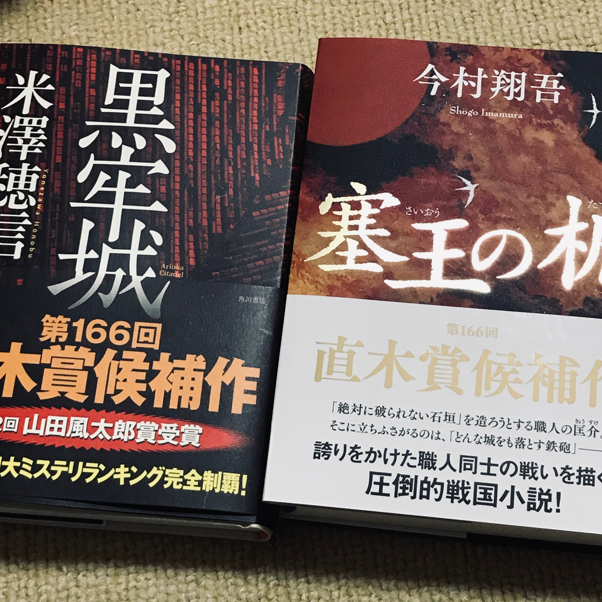

　第166回直木三十五賞の受賞は、今村翔吾『塞王の楯』と米澤穂信『黒牢城』であった。

　個人的には先日読んだばかりの柚月裕子『ミカエルの鼓動』もよかったと思うのだが、なんせ候補作を網羅していないのであまりいろいろ語れない。

　それより、受賞作が2作揃って歴史小説というのが問題だ。

　以前どこかで書いた気がするが、僕は歴史小説をあまり読まない。全然読まないというわけでもないし、嫌いというわけでもない。しかしどうにも歴史という学問に苦手意識があって避けて通ってしまう癖がある。

　これははるか昔、中学生ぐらいの頃に遡るのだが、その頃僕は本当に社会科が嫌いだった。特に歴史には興味がわかず、勉強もろくにしなかった。勉強しないと何を教わっても体系的に知識がつながらず、さらに興味を持つことができない。結果、今でも歴史の知識はものすごく貧弱である。

　それが読書のジャンルにも影響して、歴史小説をあまり読まないような人間になってしまったというわけだ。

　子どもの頃に勉強したことなんて大人になってから使わないなんて言う人もいるが、こうやって趣味に対して視野が狭くなってしまうことは非常に残念なことである。やはり大人になってから豊かな生活を送るには、できる限り広範の知識を蓄え、世の中の色々なことに興味を持ち、その中から自分の追究するものを選択していくということが必要だろう。

　そういうわけで、今頃になって自分には歴史への興味がちょっと乏しいと実感するのである。

　さて、そういう食わず嫌いはいけないと思い、直木賞受賞作の2冊を早速買ってきた。貧弱な歴史の知識ではあるが、果敢に普段読まない歴史小説にもチャレンジしてみることにしよう。

<figure>

</figure>
